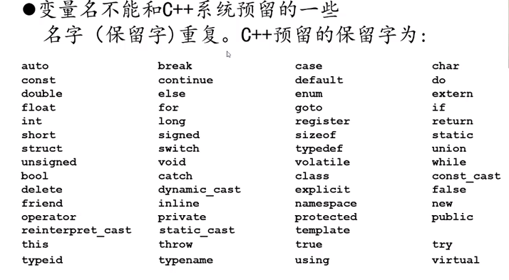
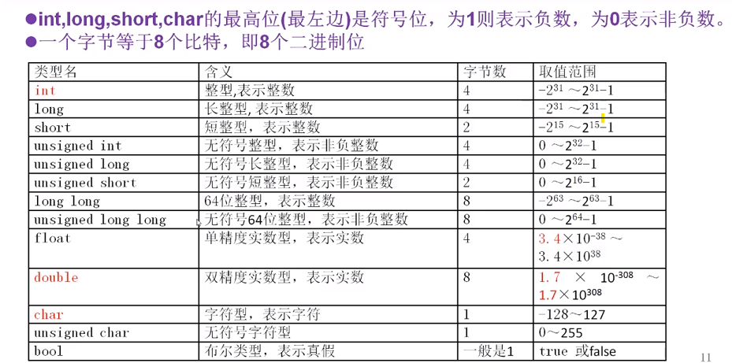
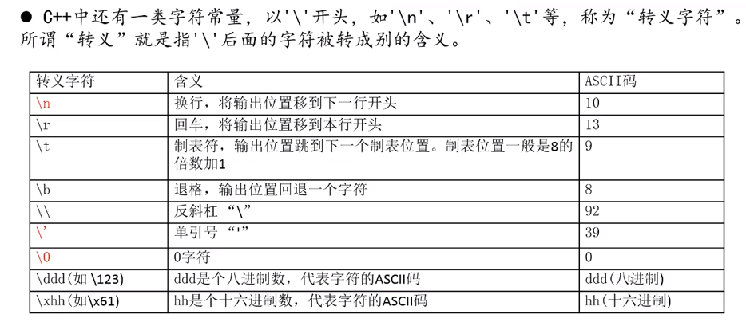
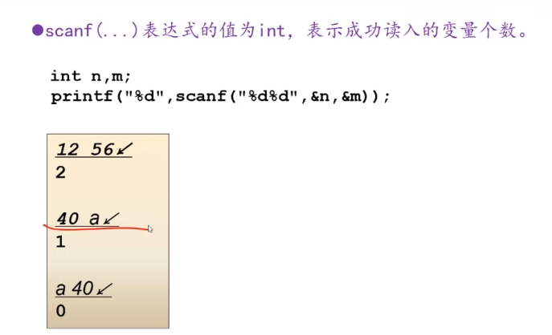

# c++的保留字




`此外要注意不要取名为begin end  next index  list link 等`


# c++数据类型的大小




# 常量


十六进制整形常量是以 0x 开头

 八进制整形常量是以 0 开头

`*ASCLL*`

'0' - '9' : 48-57

'A'-'Z' : 65 - 90

'a' - ‘z' : 97 - 122


`转义字符`




## 符号常量


定义： #define 常量名 常量值;

 			#define  MAX_NUM 1000;

​			#define UNIVERSITY_NAME "Peking University"

​			#define  MYINT i = 5;


尽量少使用数值常量，而用符号常量代替它，这样便于修改


# 格式控制符

**在printf和scanf中可以使用以"%"开头的控制符，指明要输入或输出的数据的类型以及格式。**

输入输出控制符

**常用格式控制符** 

**作 用** 

%d         										读入或输出int变量

％e   											  以指数形式输出实数

%c       										   读入或输出char变量

％s											 	用来输出一个字符串

%f       											读入或输出float变量，输出时保留小数点后面6位 

%lf    							    			 读入或输出double变量，输出时保留小数点后面6位 

%x 												 以十六进制读入或输出整型变量

%lld 											   读入或输出long long 变量(64位整数） 

%nd（如%4d,%12d）		 		以n字符宽度输出整数，宽度不足时用空格填充

%0nd （ 如 %04d,%012d ）  	以n字符宽度输出整数，宽度不足时用0填充

%.nf（如%.4f,%.3f） 			  	输出double或float值，精确到小数点后n位 

％g												根据大小自动选f格式或e格式，且不输出无意义的零。


# 输出、输出

## c++的cout输出、输出

cout <<  输出的内容 <<endl; 		//  endl 换行

**cout <<"n=" << n << ",f=" << f << endl; //endl换行**


cin >> 输入内容1 >>输入内容 2 ；

```
int n1,n2;
double f;
char c;
cin >> n1 >> n2 >> c >> f;
```


**用cin读入所有输入的字符，包括空格，回车**

```
int c;
while((c = cin.get()) != EOF) {
cout << (char)c ;
}
```


**cin,cout 速度比scanf,printf慢,输入输出数据量大时用后者**

 **一个程序里面不要同时用cin和scanf,不要同时用cout和printf**


## scanf 表达式




**scanf(...) 值为EOF(即-1)则说明输入数据已经结束**

```
int n,m;
while(scanf("%d%d",&n,&m) != EOF) { //EOF是直接能拿来用的符号常量
//while(scanf("%d%d",&n,&m) != 2) 
printf("%d",n+m);
}
```

**cin >> m >> n ... 表达式的值，在成功读入**
所有变量时为true，否则为false

```int n,m;
while(cin >> n >> m ) { 
printf("%d",n+m);
}
```


**Windows**系统下不停输入两个整数再敲回车，则不停输出它们的和，

**直到输 Ctrl+Z 然后 回车,程序结束**


# 算术运算

a+b、a-b、a*b这三个表达式的值，就是a和b做算术运算的结果。

表达式的值的类型，以操作数中精度高的类型为准。

精度：**double > long long > int > short > char**

​	

两个整数类型进行加、减、乘都可能导致计算结果超出了结果类型所能表示的范围，这种情况就叫做溢出。


```{ 
unsigned int n1 = 0xffffffff;
cout << n1 << endl; //输出4294967295
unsigned int n2 = n1 + 3; //导致溢出
cout << n2 << endl; //输出2
return 0;
} // 0xffffffff + 3 的结果，应该是 0x100000002， ->  2
```

有时计算的最终结果似乎不会溢出，但中间结果可能溢出，这也会导致程序出错

例：(a+b)/2 未必等于 a/2+b/2

```
printf("%d",(2147483646 + 6)/2); => -1073741822
printf("%d",2147483646/2 + 6/2); => 1073741826
```


# 强制类型转换运算符

类型名本身就是一个运算符，叫“强制类型转换运算符”用于将操作数转换为指定类型

```
double f = 9.14;
int n = (int) f; //n=9
f = n / 2; //f=4.0
f = double(n) / 2; //f=4.5
```


# 判断循环语句

**else 总是和离它最近的if配对**


# 用freopen重定向输入

●调试程序时，每次运行程序都要输入测试数据，太麻烦

●可以将测试数据存入文件，然后用freopen将输入由键盘重定向为文件，则运行程序时不再需要输入数据了


```
#include<iostream>
#include<cstdio> 
using namespace std;
int main(){
	freopen("E:\\c++ language\\程序设计与算法\\test.txt","r",stdin);
	int  n,mx = 0 ;
	while(cin>>n){
		if(n>mx)
			mx = n;
	}
	printf("%d",mx);
	return 0;
} 
```

