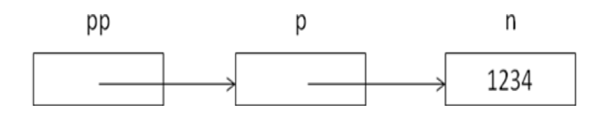
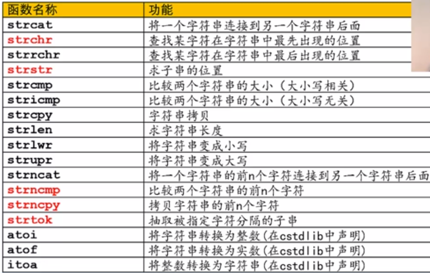
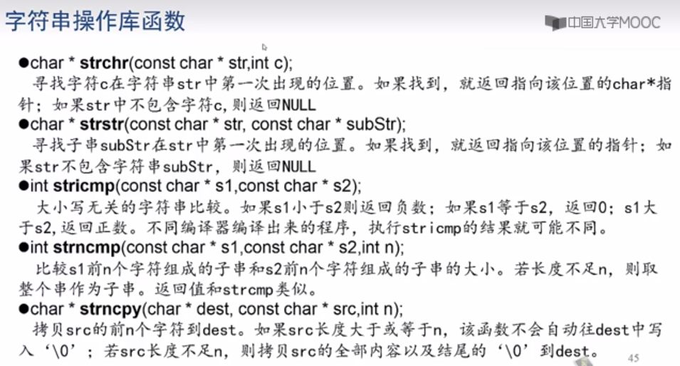
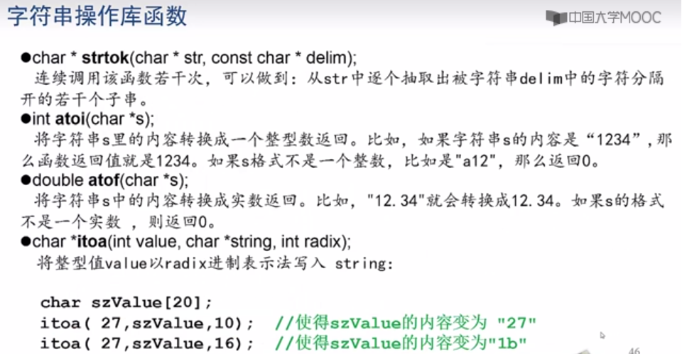
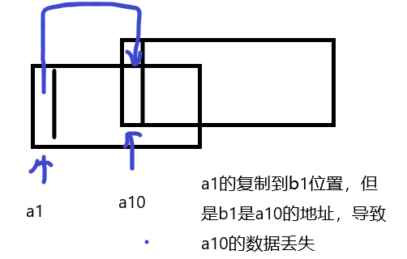
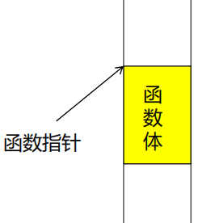
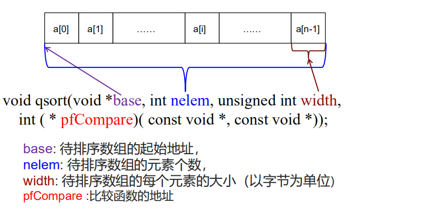
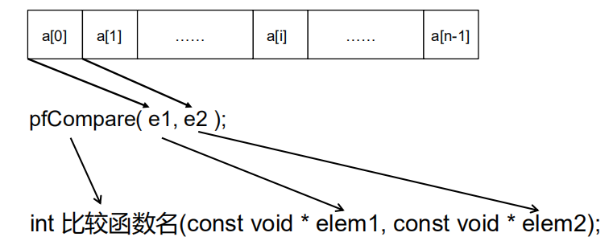

# 指针的基本概念

每个变量都被存放在从某个内存地址（以字节为单位）开始的若干个字节中。

“指针”，也称作“指针变量”，大小为4个字节（或8个字节）的变量， 其内容代表一个内存地址。


# 指针的用法

```c
char ch1 = 'A';

char * pc = &ch1; //使得pc指向变量ch1 

/* char *pc;
	pc = &ch1;
*/

*pc = 'B'        //使得ch1 = ‘B’
char ch2  = *pc; //使得ch2 = ch1

& : 取地址运算符
&x : 变量x的地址（即指向x的指针)
对于类型为 T 的变量 x，&x 表示变量 x 的地址(即指向x的指针)
&x 的类型是 T 。

```


# 指针的互相赋值

不同类型的指针，如果不经过强制类型转换，不能直接互相赋值 ,需要强转

```c

int * pn, char * pc, char c = 0x65;
pn = pc; //类型不匹配，编译出错
pn = & c; //类型不匹配，编译出错
pn = (int * ) & c;  //强转
int n = * pn; //n值不确定
* pn = 0x12345678; //编译能过但运行可能出错

```


# 指针的运算

**1) 两个  *同类型*   的指针变量，可以比较大小  **

地址p1<地址p2， p1< p2 值为真。

地址p1==地址p2，  p1== p2 值为真

地址p1>地址p2，  p1 > p2 值为真


减 **2) 两个**  *同类型*  **的指针变量，可以相减**  （求出两个地址之间可以存放多少个这个类型的变量）

两个T 类型的指针 p1和p2

p1 – p2 = ( 地址p1 – 地址 p2 ) / sizeof(T)

例：int * p1, * p2;

若 p1 指向地址 1000,p2 指向地址 600, 则

p1 – p2 = (1000 – 600)/sizeof(int) = (1000 – 600)/4 = 100


加  **3)指针变量加减一个整数的结果是指针**

**p** : T 类型的指针   **n** : 整数类型的变量或常量

**p+n** : T * 类型的指针，指向地址：

地址p + n × sizeof(T)

**n+p, p-n , \*(p+n), \*(p-n)** 含义自明


自增 自减 **4) 指针变量可以自增、自减**

T* 类型的指针p指向地址n 

**p++, ++p** : p指向 **n + sizeof(T)**

**p--, --p** : p指向 **n - sizeof(T)**


**5）指针可以用下标运算符“[ ]”进行运算**

p 是一个 T * 类型的指针，

n 是整数类型的变量或常量

**p[n]** 等价于 ***(p+n)**


# 空指针

**地址0不能访问。指向地址0的指针就是空指针**

可以用“NULL”关键字对任何类型的指针进行赋值。NULL实际上就是整数0,值为NULL的指针就是空指针：

**int \* pn = NULL; char \* pc = NULL; int \* p2 = 0;**

指针可以作为条件表达式使用。如果指针的值为NULL，则相当于为假，值不为NULL，就相当于为真

**if(p)** **if(p!=NULL)**

**if(!p)** **if( p==NULL )**


# 指针和数组

数组的名字是一个指针常量，指向数组的起始地址

**T a[N];**

1.  a的类型是 T *，可以用a给一个T * 类型的指针赋值 
2. a是编译时其值就确定了的常量，不能够对a进行赋值

```c
//作为函数形参时， T *p 和 T p[ ] 等价
void Func( int * p) { cout << sizeof(p);}

void Func( int p[]) { cout << sizeof(p);}
```


# 指针和二维数组

如果定义二维数组：

T a[M] [N];

1. a[i](i是整数)是一个一维数组,a[i]的类型是 T *
2. sizeof(a[i]) = sizeof(T) * N
3. a[i]指向的地址： 数组a的起始地址 + i×N×sizeof(T)


**定义：**

**T   \** p;**

**p是指向指针的指针，p指向的地方应该存放着一个类型为** **T \*** **的指针**

***p** **的类型是** **T \***


```c
#include <iostream>
using namespace std;
int main()
{
int **pp; //指向int*类型指针的指针
int * p; 
int n = 1234;
p = &n; // p指向n
pp = & p; //pp指向p
cout << *(*pp) << endl; // *pp就是指向了p, 所以*(*pp) == *p就是n
return 0;
}
=> 1234
```



# 指针和字符串

**字符串常量的类型就是 char ***

**字符数组名的类型也是 char ***

```c
#include <iostream>
using namespace std;
int main() 
{
char * p = "Please input your name:\n";     //p 指向了 “plealse . . . ”的地址
cout << p ; // 若不用**cout, printf(p)** 亦可   

char name[20];
char * pName = name;
cin >> pName;
cout << "Your name is " << pName;
return 0;
}												Please input your name:
												Jack↙
												Your name is Jack
```


# 字符串操作库函数

​	大多需要的是 char* 类型的 （字符串数组 字符串常量）




**注意返回值，返回的可能是指针类型（存放地址值）**







```c
#include <iostream>
#include <cstring> 
using namespace std;
int main() 
{
char s1[100] = "12345";
char s2[100] = "abcdefg";
char s3[100] = "ABCDE";
strncat(s1,s2,3); // s1 = "12345abc"
cout << "1) " << s1 << endl; //输出 1) 12345abc
    
strncpy(s1,s3,3); // s3的前三个字符拷贝到s1,s1="ABC45abc"
cout << "2) " << s1 << endl; //输出 2) ABC45abc
strncpy(s2,s3,6); // s2 = "ABCDE"
cout << "3) " << s2 << endl; //输出 3) ABCDE
cout << "4) " << strncmp(s1,s3,3) << endl; 
//比较s1和s3的前三个字符，比较结果是相等，输出 4) 0
char * p = strchr(s1,'B'); //在s1中查找 'B'第一次出现的位置

if( p ) // 等价于 if( p!= NULL) 
	cout << "5) " << p - s1 <<"," << *p << endl; //输出 5) 1,B
else
	cout << "5) Not Found" << endl;
p = strstr( s1,"45a"); //在s1中查找字串 "45a"。s1="ABC45abc"
if( p )
	cout << "6) " << p - s1 << "," << p << endl; //输出 6) 3,45abc
else
	cout << "6) Not Found" << endl;

	//以下演示strtok用法：
	cout << "strtok usage demo:" << endl;
	char str[] ="- This, a sample string, OK.";
	//下面要从str逐个抽取出被" ,.-"这几个字符分隔的字串
	p = strtok (str," ,.-"); //请注意，" ,.-"中的第一个字符是空格
	while ( p != NULL) { //只要p不为NULL，就说明找到了一个子串
		cout << p << endl;
		p = strtok(NULL, " ,.-"); //后续调用，第一个参数必须是NULL
	}
	return 0;													This
}																a
																sample
																string
																OK
```


# void 指针

void指针: **void \* p;**

可以用任何类型的指针对 void 指针进行赋值或初始化：

**double d = 1.54;**

**void \* p = & d;**

**void \* p1;**

**p1 = & d;**


因 sizeof(void) 没有定义，所以对于 void * 类型的指针p, 

*p 无定义

++p, --p, p += n, p+n，p-n 等均无定义


# 内存操作库函数memcpy

**头文件cstring中声明:**

**void \* memcpy(void \* dest, void \* src, int n);**

将地址src开始的n个字节，拷贝到地址dest。返回值是dest。

将数组a1的内容拷贝到数组a2中去，结果是a2[0] = a1[0], a2[1] = a1[1]……a2[9] = a1[9] ：

**int a1[10];**  **int a2[10];**

**memcpy( a2, a1, 10\*sizeof(int));**


```c
void * MyMemcpy( void * dest , const void * src, int n)
{
	char * pDest = (char * )dest;
	char * pSrc = ( char * ) src;
	for( int i = 0; i < n; ++i ) {//逐个字节拷贝源块的内容到目的块
        * (pDest + i) = * ( pSrc + i ); 
	}
	return dest;
}

```

**有缺陷，在dest区间和src区间有重叠时可能出问题!!!**





# 函数指针

​	程序运行期间，每个函数都会占用一段连续的内存空间。而函数名就是该函数所占内存区域的起始地址(也称“入口地址”)。我们可以将函数的入口地址赋给一个指针变量，使该指针变量指向该函数。然后通过指针变量就可以调用这个函数。这种指向函数的指针变量称为**“函数指针”**。




## 定义形式

类型名 (* 指针变量名)(参数类型1, 参数类型2,…);

例如：int (*pf)(int ,char);

表示pf是一个函数指针，它所指向的函数，返回值类型应是int，该函数应有两个参数，第一个是int 类型，第二个是char类型。


## 使用方法

可以用一个原型匹配的函数的名字给一个函数指针赋值。要通过函数指针调用它所指向的函数，写法为：

​    **函数指针名(实参表);**


```c
#include <stdio.h>
void PrintMin(int a,int b) {
if( a<b )
	printf("%d",a);
else
printf("%d",b);
}

int main() {
	void (* pf)(int ,int);
	int x = 4, y = 5;
	pf = PrintMin; 
	pf(x,y);
	return 0;
}
```


# 数组的排序函数 （qsort）

C语言快速排序库函数：

`void qsort(void *base, int nelem, unsigned int width, `

`int ( * pfCompare)( const void *, const void *));`




​		**pfCompare: 函数指针，它指向一个“比较函数”。该比较函数应为以下形式：**



```c
比较函数编写规则：
1) 如果 * elem1应该排在 * elem2前面，则函数返回值是负整数

2) 如果 * elem1和* elem2哪个排在前面都行，那么函数返回0

3) 如果 * elem1应该排在 * elem2后面，则函数返回值是正整数
```


```c
#include<cstdio>
#include<iostream>
#include<cstdlib>
#define  NUM 5     
int MyCompare(const void *elem1,const void *elem2){ //elem设定为void * 指针 
	int *p1=NULL,*p2=NULL;
	p1 = (int *)elem1;    // "* elem1 非法"  所以需要强转为 int* 类型 
	p2 = (int *)elem2;    // "elem2 非法"   
	return (*p1 % 10) - (*p2 % 10);
}

using namespace std;
int main(){
	int a[NUM] = {10,20,31,1,5};
	qsort(a,NUM,sizeof(int),MyCompare);
	for(int i=0;i<NUM; i++){
		cout<<a[i]<<"\t";
	}
	return 0;
}
```


