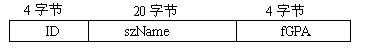
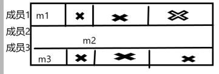

# 结构体(struct)

## 定义

用“struct”关键字来定义一个“结构”，也就定义了一个新的数据类型：

struct Student{

类型名 成员变量名；

};

1.先声明结构体模板，再定义结构体变量。

**c 语言语法 struct Student stu1; **

**c++语法 Student stu1； ** 

**关于C++结构体是否需要加typedef，加不加没关系。但C为了方便后面定义变量，还是加好**


* 例两个同类型的结构变量，可以互相赋值。但是结构变量之间不能用  “ ==”、“!=”、“<”、“>”、“<=”、“>=”进行比较运算。 

* 结构体名存在的是地址，如果进行“==” 比较的只是地址是否相同，但是对其中的某一个元素可以进行“==”运算。


## 内存空间

一般来说，一个结构变量所占的内存空间的大小，就是结构中所有成员变量大小之和。结构变量中的各个成员变量在内存中一般是连续存放的，但是存在不少的特殊情况。

```
struct Student1 {   //实际内存28个字节
unsigned int ID;
char szName[20];
float fGPA;                      
};    

struct Student2 {   //实际内存12和字节
	char m1;
	int  m2;
	char m3;                      
}; 
```





​	为了提高内存寻址的效率，很多处理器体系结构为特定的数据类型引入特殊的内存对齐需求。不同的系统和编译器，内存对齐的方式有所不同，为了满足处理器的对齐要求，可能会在较小的成员后加入补位。


**求结构体的内存字节数，一定要用sizeof 运算符**

```C
一个结构的成员变量可以是任何类型的，包括可以是另一个结构类型:
struct Date {
int year;
int month;
int day;
};
struct StudentEx {
unsigned ID;
char szName[20];
float fGPA;
Date birthday;
};


结构的成员变量可以是指向本结构类型的变量的指针
struct Employee {
string name;
int age;
int salary;
Employee * next; 
};

一个结构变量的成员变量，可以完全和一个普通变量一样来使用，也可以取得其地址。
    使用形式：StudentEx stu;
			cin >> stu.fGPA;
			stu.ID = 12345;
			strcpy(stu.szName, "Tom");
			cout << stu.fGPA;
			stu.birthday.year = 1984;
			unsigned int * p = & stu.ID; //p指向stu中的ID成员变量
```


**st2.studentName = stu1.studentName； 不能这样进行赋值，字符串数组的数组名代表字符型数组的首地址，是一个常量，不能作为赋值表达式的左值。对于字符数组的赋值需要使用到strcpy ()**


## 结构数组和指针

```c
StudentEx MyClass [50]; //定义一个五十个元素的结构体数组

StudentEx MyClass2[50] = { 
{ 1234,"Tom",3.78,{ 1984,12,28 }},
{ 1235,"Jack",3.25,{ 1985,12,23 }},
{ 1236,"Mary",4.00,{ 1984,12,21 }},
{ 1237,"Jone",2.78,{ 1985,2,28 }}
};

MyClass[1].ID = 1267;   
MyClass[2].birthday.year = 1986;
int n = MyClass[2].birthday.month;   //嵌套结构的使用
cin >> MyClass[0].szName;
```


## 指向结构变量的指针

```c
StudentEx * pStudent; // 定义指向结构变量的指针   
StudentEx Stu1;	      // 结构名 * 指针变量名;	
pStudent = & Stu1;
StudentEx Stu2 = * pStudent;

//通过指针，访问其指向的结构变量的成员变量：
//指针->成员变量名  或：  (* 指针).成员变量名
pStu->ID = 12345;
(*pStu).fGPA = 3.48;
```


