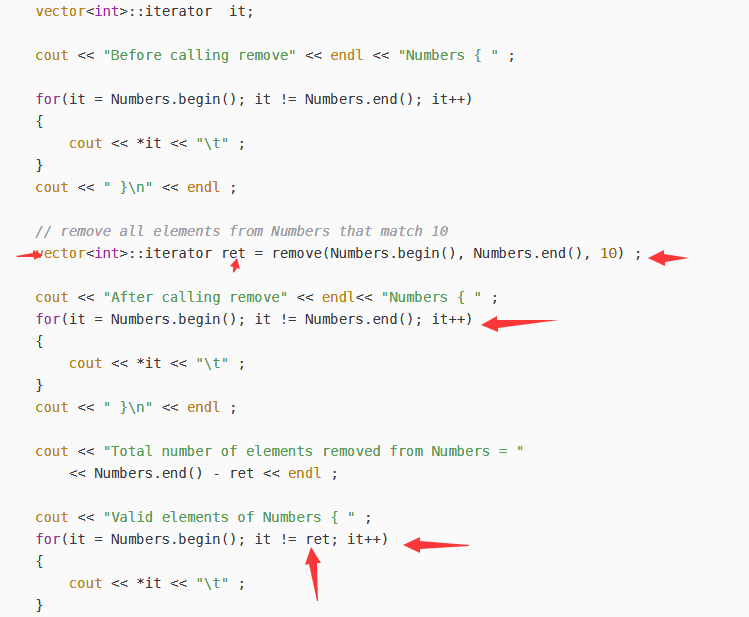

# STL：标准模板库 

 ` 要使用其中的算法，头文件是# include <algorithm>  `


# vector 数组

```c++
struct cmp{
	bool operator() (int x,int y){
		return x < y;
	}
}; 

vector<int> ve; 
sort(ve.begin(), ve.end(), cmp() );
```


## 删除元素


<font color='red'>**earse(): **</font>

函数原型： 

| *iterator erase(iterator position);*               |
| -------------------------------------------------- |
| **iterator erase(iterator first, iterator last);** |


erase( ) 可以用于删除vector容器中的**一个元素**或者**一段元素**。

| 在删除一个元素的时候，其参数为指向相应元素的迭代器。 <font color='red'>指向删除元素下一个元素;</font> |
| ------------------------------------------------------------ |
| **在删除一段元素的时候，参数为指向一段元素的开头的迭代器。<font color='red'>指向结尾元素的下一个元素的迭代器。</font>** |


其实vector还维持着一个last指针，开始的时候=end，随着删除，last前移，最终vector的size是last-begin，或者我们可以认为end值改变了，但最初传入的end没有变。

```c++
vector<int>::iterator itr = v.begin();
   while (itr!=v.end())
   {
    if (*v==1)
    {
          v.erase(itr);
     }
    itr++;//这里删除后迭代器会更新出错
   } 
```

（无法删除连续两个 1）

以上代码是错误的，因为删除一个元素之后，迭代器已经指向了被删除元素的下一个元素，再进行itr++会出现野

指针。**也就是说veci.erase(iter)后，iter的状态是不确定的，再进行++，岂有不崩溃的道理？！**


正确的代码：

```c++
vector<int>::iterator itr = v.begin();
   while (itr!=v.end())
   {
       if (*v==1)
    {
        itr=v.erase(itr);
    }
       else
        itr++;
   }
```


<font color='red'>**remove()**:</font >


`iterator remove(iterator first, iterator last，val);`

vector中的remove的作用是将等于value的元素放到vector的尾部，但并不减少vector的size。STL和vector这两句表达的意思一样。

<font color='red'>**remove的作用是将范围内为val的值都remove到后面，返回新的end()值（非val部分的end）,但传入的原vector的end并没有发生改变，因此size也就没有变化。**</font>

remove函数会将范围内所有等于val的值移动位置：

STL中remove( ) :将待删除元素之后的元素移动到vector的前端，而不是删除。若要真正移除，需要搭配使用erase()。




<font color='red'>**remove()和earase()结合:**</font>


**erase()和remove()**的区别在于执行函数之后返回值不同，被执行的vector的大小会不会改变。

```c++
svec.erase(remove(svec.begin(),svec.end(),"be"), svec.end());
这句的意思是，取得"be"的位置（位于结尾），然后删除"be"到原vector结尾的所有元素
```


# queue 队列


# starck 栈


# 排序算法sort（包头不包尾）

* 对基本类型的数组从小到大排序: **sort(数组名+n1，数组名+n2）;**

  n1和n2都是int类型的表达式，可以包含变量

  如果n1=0,则 + n1可以不写

将数组中下标范围为**[n1,n2)**的元素从小到大排序。下标为n2的元素不在排序区间内


## 用sort进行排序(用法一)

* 对数组元素从小到大排序：

```c
int a[] = {15,4,3,9,7,2,6};
sort(a,a+sizeof(a)/sizeof(int)); //对整个数组从小到大排序

int a[] = {15,4,3,9,7,2,6};
sort(a,a+3); // 结果：{3,4,15,9,7,2,6}

int a[] = {15,4,3,9,7,2,6};
sort(a+2,a+5); //结果：{15,4,3,7,9,2,6}

```


## 用sort进行排序(用法二)

* 对元素类型为T的基本类型数组从大到小排序：

```c
sort(数组名+n1，数组名+n2,greater<T>()）;
int a[] = {15,4,3,9,7,2,6};
sort(a+1,a+4,greater<int>()); // 结果：{15,9,4,3,7,2,6}
```


## 用sort进行排序(用法三)

* 用自定义的排序规则，对任何类型T的数组排序：**sort(数组名+n1，数组名+n2, 排序规则结构名() );**

  **排序规则结构的定义方式：**

```c
struct 结构名
{
bool operator()( const T & a1,const T & a2) const {
//若a1应该在a2前面，则返回true。
//否则返回false。 }
}; 
```


排序规则返回 true，意味着 a1 必须在 a2 前面，返回 false，意味着 a1 并非必须在 a2 前面。
排序规则的写法，不能造成比较 a1,a2 返回 true 比较 a2,a1 也返回 true ，否则sort会 runtime error
比较 a1,a2 返回 false 比较 a2,a1 也返回 false，则没有问题。

```c
#include<iostream>
#include<cstdio>
#include<cstring>
#include<algorithm>
using namespace std;
struct Student {
	char name[20];
	int id;
	double gpa;
};
struct StudentRule1 { //按姓名从小到大排
	bool operator() (const Student & s1,const Student & s2) const {
		if(_stricmp(s1.name,s2.name) < 0)
			return true;
		return false;
	}
};
struct StudentRule2 { //按id从小到大排
	bool operator() (const Student & s1,const Student & s2) const {
		return s1.id < s2.id;
	}
};
struct StudentRule3 {//按gpa从高到低排
	bool operator() (const Student & s1,const Student & s2) const {
		return s1.gpa > s2.gpa;
	}
};
void PrintStudents(Student s[],int size) {
	for(int i = 0; i < size; ++i)
		cout << "(" << s[i].name << "," << s[i].id <<"," << s[i].gpa << ") " ;
	cout << endl;
}
//全局变量 
Student students [] = {
	{"Jack",112,3.4},{"Mary",102,3.8},{"Mary",117,3.9},
	{"Ala",333,3.5},{"Zero",101,4.0}
};
```


```c
int main() {
	int n = sizeof(students) / sizeof(Student);
	sort(students,students+n,StudentRule1()); //按姓名从小到大排
	PrintStudents(students,n);
	sort(students,students+n,StudentRule2()); //按id从小到大排
	PrintStudents(students,n);
	sort(students,students+n,StudentRule3()); //按gpa从高到低排
	PrintStudents(students,n);
	return 0;
}
```


# 二分查找（包头不包尾）

STL提供在排好序的数组上进行二分查找的算法:

`binary_search		lower_bound			upper_bound`

**注意查找时的排序规则，必须和排序时的规则一致！**

## binary_search（用法一）

在从小到大排好序的基本类型数组上进行二分查找

```
binary_search(数组名+n1，数组名+n2,值); 
```

n1和n2都是int类型的表达式，可以包含变量,如果n1=0,则 + n1可以不写。
查找区间为下标范围为[n1,n2)的元素，下标为n2的元素不在查找区间内在该区间内查找"等于"值”的元素，返回值为true(找到）或false(没找到）。
"等于"的含义： a 等于 B  <=> **a < b和b < a都不成立**


## binary_search(用法二，自定义)

在用自定义排序规则排好序的、元素为任意的T类型的数组中进行二分查找

```c
binary_search(数组名+n1，数组名+n2,值，排序规则结构名());
```

查找区间为下标范围为**[n1,n2)**的元素，下标为n2的元素不在查找区间内在该区间内查找"等于"值的元素，返回值为true(找到）或false(没找到）。

"等于"的含义： a 等于 b <=>  **"a必须在b前面"和"b必须在a前面"都不成立  **

```c
struct Rule //按个位数从小到大排
{
	bool operator()( const int & a1,const int & a2) const {
		return a1%10 < a2%10;
	}
};

int main() {
	int a[] = { 12,45,3,98,21,7};
	sort(a,a+6,Rule()); //按个位数从小到大排
	Print(a,6);
	cout <<"result:"<< binary_search(a,a+6,7) << endl; //不一定找不到，但是结果没有意义，这个是顺序查找，但是排序是特定排序
	cout <<"result:"<< binary_search(a,a+6,8,Rule()) << endl;
	return 0;
}
```


 ` 结构体中的 binary_search  自定义查找

```c
int main(){
	Student s;
	strcpy(s.name,"Mary");
	s.id= 117;
	s.gpa = 0;
	int n = sizeof(students) / sizeof(Student);
	sort(students,students+n,StudentRule1()); //按姓名从小到大排
	cout << binary_search( students , students+n,s,StudentRule1()) << endl;
	strcpy(s.name,"Bob");
	cout << binary_search( students , students+n,s,StudentRule1()) << endl;
	sort(students,students+n,StudentRule2()); //按id从小到大排
	cout << binary_search( students , students+n,s,StudentRule2()) << endl;
return 0;
}						//输出: 1  0  1
```


## lower_bound下界(用法一)

`在对元素类型为T的从小到大排好序的基本类型的数组中进行查找`

定义：T * lower_bound(数组名+n1,数组名+n2,值);
返回一个指针 T * p;

*p 是查找区间里下标最小的，**大于等于**"值" 的元素。如果找不到，p指向下标为n2的元素。


## lower_bound下界(用法二)

`在元素为任意的T类型、按照自定义排序规则排好序的数组中进行查找`

定义：T * lower_bound(数组名+n1,数组名+n2,值,排序规则结构名());
返回一个指针 T * p;

*p 是查找区间里下标最小的，按自定义排序规则，**可以排在"值"后面**的元素。如果找不到，p指向下标为n2的元素。


## upper_bound(用法一) 

`在元素类型为T的从小到大排好序的基本类型的数组中进行查找`
定义 ：T * upper_bound(数组名+n1,数组名+n2,值);
返回一个指针 T * p;

*p 是查找区间里下标最小的，**大于"值"**的元素。如果找不到，p指向下标为n2的元素


## upper_bound(用法二) 

`在元素为任意的T类型、按照自定义排序规则排好序的数组中进行查找`
定义：T * upper_bound(数组名+n1,数组名+n2,值,排序规则结构名());
返回一个指针 T * p;

*p 是查找区间里下标最小的，按自定义排序规则，**必须排在"值"后面**的元素。如果找
不到，p指向下标为n2的元素

```c
#define NUM 7 
int main()
{
	int a[NUM] = { 12,5,3,5,98,21,7};
	sort(a,a+NUM);
	Print(a,NUM); // => 3,5,5,7,12,21,98,
	int * p = lower_bound(a,a+NUM,5);
	cout << *p << "," << p-a << endl; //=> 5,1 （指针相减是下标的个数）
	p = upper_bound(a,a+NUM,5);
	cout << *p << endl; //=>7
	cout << * upper_bound(a,a+NUM,13) << endl; //=>21
	sort(a,a+NUM,Rule());
	Print(a,NUM); //=>21,12,3,5,5,7,98,
	cout << * lower_bound(a,a+NUM,16,Rule()) << endl; // => 7
	cout << lower_bound(a,a+NUM,25,Rule()) - a<< endl; // => 3
	cout << upper_bound(a,a+NUM,18,Rule()) - a << endl; // => 7
	
	cout << * upper_bound(a,a+NUM,5,Rule()) << endl; // =>7
	cout << * upper_bound(a,a+NUM,4,Rule()) << endl; // =>5
	return 0;
}
```

```c
//important,用于判断是否存在这样一个元素 

if( upper_bound(a,a+NUM,18,Rule()) == a+NUM)
		cout << "not found" << endl; //=> not found
```

