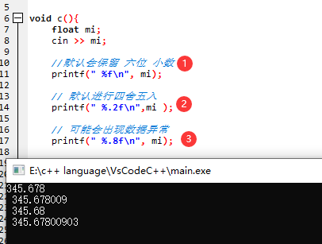
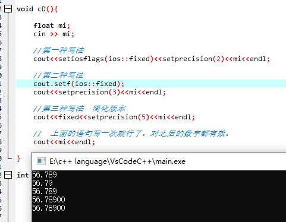
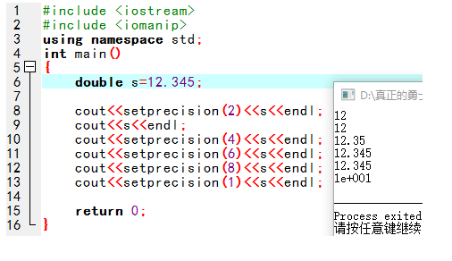
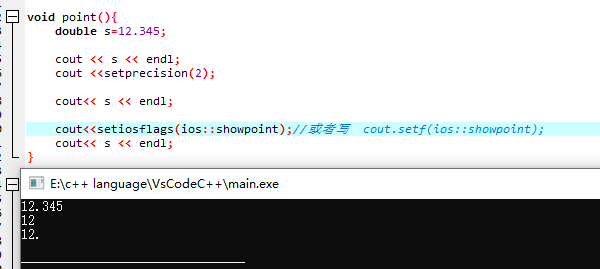

# 保留小数位 


## c

```c
void c(){
	float mi;
	cin >> mi;
	
	//默认会保留 六位 小数 
	printf(" %f\n", mi);   
	
	// 默认进行四舍五入 
	printf(" %.2f\n",mi ); 
	
	// 可能会出现数据异常 
	printf(" %.8f\n", mi); 
} 
```





## c++

```c++
#include <iomanip>  //不要忘了头文件
```

使用 ：`setprecision(n)  ` **//默认六位数 包括前面的整数**

```c++
void cD(){
	
	float mi;
	cin >> mi;
	
	//第一种写法 
	cout<<setiosflags(ios::fixed)<<setprecision(2)<<mi<<endl;
	
	//第二种写法
	cout.setf(ios::fixed);
	cout<<setprecision(3)<<mi<<endl;
	
	//第三种写法  简化版本	
	cout<<fixed<<setprecision(5)<<mi<<endl;
	
	//  上面的语句写一次就行了，对之后的数字都有效。
	cout<<mi<<endl;
} 
```





<font color='red'> **去除setprecision的效果**</font>


* cout<< fixed<<setprecision(6); 
* cout.unsetf(ios_base::floatfield);


**setprecision(n)  ** 

 **功能**：控制浮点数**显示的**有效数字个数。（不包括小数点）


* 由8-9两行代码可以看出，也是只写一次就可以。
* 8-10行可以看出，只是四舍五入修改了数字的显示方法，并不是修改原数字。从常识我们可以知道，如12.345数字本身改变，那就是两位有效数字变为 12，那从两位有效数字改为四位有效数字会变为 12.00，而不是12.34。
* 11-12行可以看出如果要保留的太多，是不会补上0的（往下看有补0的方法）。
* 13行中可以看出，如果小数点前的位数多于你要保留位数，则会使用科学计数法。





**fixed**

　setprecision(n)和fixed合用的话可以控制小数点后有几位。
　只要加上以下**任意一个**语句就可以。


**showpoint**


保留小数点的函数： `setiosflags(ios::showpoint); || showpoint`



   


