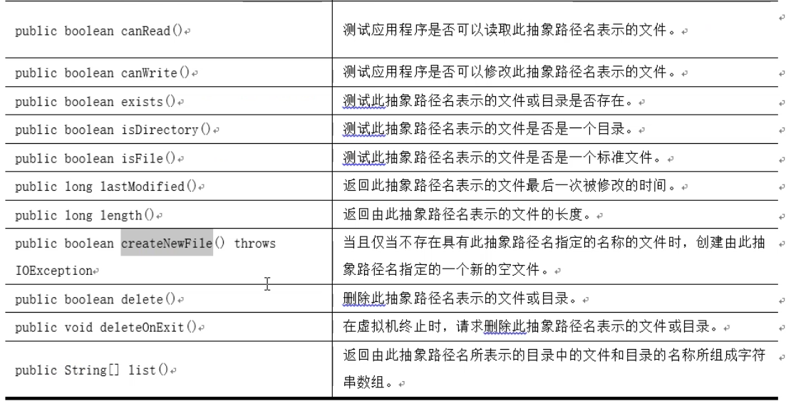
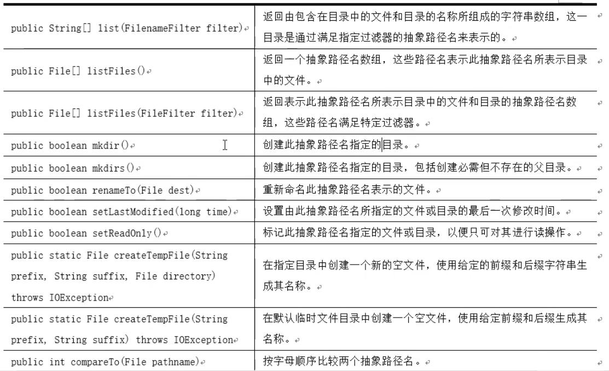
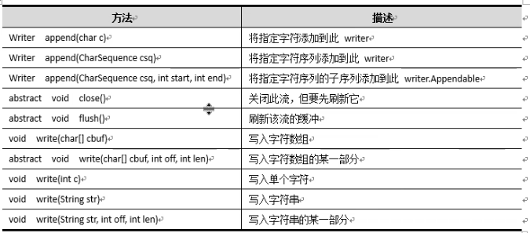
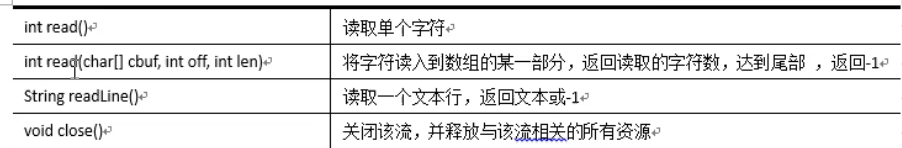
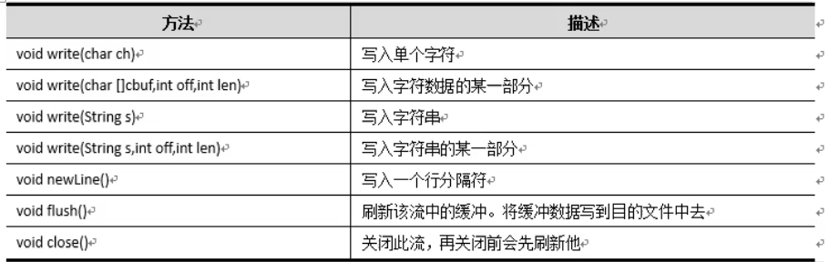

#枚举类型

​	现实世界中,有的类的对象是有限而且固定的,比如季节类,它只有春夏秋冬4个对象，这种实例有限且固定的类，在Java中被称为枚举类。在Java中使用enum 关键字来定义枚举类，其地位与class、 interface 相同;枚举类是-种特殊的类，它和普通的类一-样，有自己的成员变量、成员方法、构造方法(只能使用private 访问修饰符，所以无法从外部调用构造方法，构造方法只在构造枚举值时被调用);

​	一个Java源文件中最多只能有一个public类型的枚举类，且该Java源文件的名字也必须和该枚举类的类名相同，这点和类是相同的;使用enum 定义的枚举类默认继承了java.lang.Enum类，并实现了java.lang Seriablizable和java.lang.Comparable两个接口;

​	所有的枚举值都是public static final的，且非抽象的枚举类不能再派生子类;枚举类的所有实例(枚举值)必须在枚举类的第--行显式地列出，否则这个枚举类将永远不能产生实例。列出这些实例(枚举值)时，系统会自动添加public static final修饰，无需程序员显式添加。


```
public enum Gender {
    MALE,FEMALE
}
```

```
public static void main(String[] args) {
    Gender gender = Gender.FEMALE;
    System.out.println("性别：" + gender);
    System.out.println("性别：" + Gender.MALE);
}
```


# File类

​	存储在程序中的数据是临时的，当程序运行结束后，这一部分数据的内存将被回收，数据会丢失。Java提供File类可以帮助我们永久保存程序中数据，将它们存储到电脑的磁盘中。File 类以抽象的方式代表文件名和目录路径名，主要用于文件和目录的创建、文件的查找和文件的删除等。File 对象代表磁盘中实际存在的文件或目录。


## File对象的创建

​	File对象的创建可通过以下构造方法:
1.通过将给定路径名字符串转换成抽象路径名来创建一个新File 实例。
	File(String pathname)
2.根据parent 路径名字符串和child 路径名字符串创建一个新File 实例。
	File(String parent, String child)
3.通过给定的父抽象路径名和子路径名字符串创建一个新的File实例。
	File(File parent, String child)
4.通过将给定的URI对象转换成--个抽象路径名来创建一个新的File实例。
	File(URI uri)


```
public static void main(String[] args) throws Exception{
FileDome03();
}
public static void FileDome01() throws  Exception{
    File file =  new File("E:\\test1.txt"); //文件可以是存在也可以是不存在

   System.out.println(file.createNewFile());
}
public static void FileDome02() {
    File file =  new File("E:\\aa","teset2.txt"); //文件可以是存在也可以是不存在

    try {
        System.out.println(file.createNewFile());
    } catch (IOException e) {
        System.out.println(e);
    }
    System.out.println("dsd");
}
public static void FileDome03() throws  Exception{
    File file =  new File("e:\\a\\c");
    System.out.println(file.mkdir());
    File file2 =  new File(file,"est1.txt"); //文件可以是存在也可以是不存在
    try {
        System.out.println(file2.createNewFile());
    } catch (IOException e) {
        System.out.println(e);
    }
}
```


##File对象的常用方法






# 字节流

​	Java程序与源文件之间需要-一个数据传输的通道，我们可以想象这个通道一个管道，我们知道这些源文件在计算机中都以二进制字节的形式存在的，则这些二进制字节需要通过这个管道才能到达另一方，Java对于这种情况提供了字节流，对应上述的装载了二进制字节的管道 .

​	根据数据的传输方向，字节流又分为字节输入流InputStream和字节输出流OutputStream。

​	如果数据的传输方向是从源文件到Java程序，则使用字节输入流InputStream,反之使用字节输出OutputStream。InputStream 和OutputStream的作用如图所示。


## 字节输入流InputStream

​	InputStream是Java 标准库提供的最基本的输入流，位于java.io 包里。
	InputStream 并不是一个具体类和接口，而是一个抽象类,它是所有字节输入流的父类,其定义最重要的方法就是read(),方法如下:

​                                **public abstract int read() throws lOException; **

这个方法会读取输入流的下一个字节，并返回字节表示的int值(0~255)。 如果已读到末尾，返回-1表示不能继续读取了。
FileInputStream是InputStream的一个子类。顾名思义，FileInputStream就是从文件流中读取数据。FileInputStream 的构造方法。

**public FileInputStream(String name)**:将name路径代表的文件创建为字节输入流。

**public FileInputStream(File file)**:根据file对象代表的文件创建为字节输入流。


## 字节输入流OutputStream

​	OutputStream是Java标准库提供的最基础的输出流.0utputStream也是抽象类,是所有输出流的父类。其抽象类最重要方法为void write (int b),方法签名如下:。
		**public abstract void write(int b) throws lOException;**
	这个方法会写入一个字节到输出流。要注意的是，虽然传入的是int参数，但只会写入
一个字节，即只写入int最低8位表示字节的部分。和InputStream类似，OutputStream 也提供了close()方法关闭输出流，以便释放系统资源。

​	要特别注意: OutputStream还提供了一个flush()方法，它的目的是将缓冲区的内容真正输出到目的地。

​	为什么要有flush()?因为向磁盘、网络写入数据的时候，出于效率的考虑，操作系统并不是输出-一个字节就立刻写入到文件或者发送到网络,而是把输出的字节先放到内存的一个缓冲区 。


# 编码与解码

​	编码就是把人能识别的字符串转换成为计算机能识别的二进制字节序列，反之解码就是把计算机能识别的二进制字节序列转换为人能识别的字符串。

​	在Java编程中，String 类的getBytes()方法可以实现将字符串按默认的字符码表编码成字节数组，中文Windows 操作系统默认的字符码表是GBK，String 类的getBytes(String charset Name)方法则可以将字符串按指定的字符码表(字符集)编码成字节数组。String类的构造方法String(byte[] bytes)可以实现将字节数组按默认的字符码表解码成字符串，String 类的构造方法String(byte[] bytes, String charset Name)可以实现将字节数组按
指定的字符码表解码成字符串。

​	一般情况下，编码与解码要使用同一字符码表:如果编码与解码采用不同的字符码表则很可以会产乱码。

```
String school = "你爹";
byte[] bytes1 =school.getBytes();//默认字符集进行编码
byte[] bytes2 =school.getBytes("GBK");
byte[] bytes3 =school.getBytes("utf-8");
byte[] bytes4 =school.getBytes("unicode");
System.out.println("--------------比较四种编码格式----------------");

System.out.println(Arrays.toString(bytes1));
System.out.println(Arrays.toString(bytes2));
System.out.println(Arrays.toString(bytes3));
System.out.println(Arrays.toString(bytes4));

System.out.println("--------------解码--------------");
System.out.println(new String(bytes1));
System.out.println(new String((bytes1),"utf-8"));

System.out.println(new String(bytes2));
System.out.println(new String((bytes2),"gbk"));

System.out.println(new String((bytes3),"utf-8"));
System.out.println(new String((bytes4),"unicode"));
```


**输出**

```
--------------比较四种编码格式----------------
[-28, -67, -96, -25, -120, -71]  
[-60, -29, -75, -7]
[-28, -67, -96, -25, -120, -71]
[-2, -1, 79, 96, 114, 57]
--------------解码--------------
你爹
你爹
���
你爹
你爹
你爹
```


#字符流


## Reader

​	Reader 是java的 IO 库提供的另一个输入流，也是个抽象类。

​	Reader是字符流，以char为单位读取。

```
public static void demo01()throws Exception{
    Reader reader = new FileReader("e:\\poem.txt");
    int data;
    while((data = reader.read())!=-1){
        System.out.print((char)data);
    }
}


public static void demo02()throws Exception{
    Reader reader = new FileReader("e:\\poem.txt");
    char []chars = new char[3];
    while(reader.read(chars)!=-1){
        System.out.print(new String(chars));
        chars = new char[3];
    }
}
```


## Writer

​	与Reader 对应的字符输出流是Writer， 也是个抽象类，其子类包括BufferedWriter、PrintWriter、InputStreamWriter 和FileWriter等。


Writer的主要方法基本与OutputStream类似，只是基于char。

```
Writer writer = new FileWriter("e:\\test3.txt",false);  //默认为false为新建 true 为追加

writer.write("春眠不觉晓\n");
writer.write(48); //整型被装换为字符型
writer.flush();
```




## 带缓冲区的字符流


### 1.BufferedReader




###2.BufferedWriter




```
public static void demo01()throws  Exception{
    Writer writer = new FileWriter("e:\\test4.txt");
    BufferedWriter bw = new BufferedWriter(writer);
    bw.write("春眠不觉晓");
    bw.newLine();
    bw.write("处处闻啼鸟");
    bw.newLine();
    bw.write("夜来风雨声");
    bw.newLine();
    bw.flush();
}
public static void demo02()throws  Exception {
    Reader reader = new FileReader("e:\\test3.txt");
    BufferedReader br = new BufferedReader(reader);
    String line;
    while((line = br.readLine())!=null){
        System.out.println(line);
    }
}
```


# 转换流


## InputStreamReader字节输入转换为字符输入流。

​	InputStreamReader用于将字节输入流转换成字符输入流。除了特殊的CharArrayReader
和StringReader， 普通的Reader 实际上是基于InputStream 构造的，因为Reader 需要从InputStream中读入字节流(byte),然后,根据编码设置,再转换为char就可以实现字符流。如果查看FileReader的源码，它在内部实际上是有一个FileInputStream.。

​	既然Reader本质上是-一个基于InputStream 的byte到char的转换器，那么，如果我们已经有一个InputStream，想把它转换为Reader,是完全可行的。InputStreamReader 就是这样一个转换器，它可以把任何InputStream 转换为Reader。


```
 public static void main(String[] args)throws  Exception {
    demo02();
    }
    public static void demo01() throws  Exception{
        FileInputStream inputStream = new FileInputStream("e:\\test3.txt"); //创建一个字节输入流
        InputStreamReader reader  =new InputStreamReader(inputStream,"gbk");//将字节输入流作为参数，创建一个字节输入转换流
       //第二个参数是解码规则
        int data;
        while((data= reader.read())!=-1){
            System.out.print((char)data);
        }
    }

    public static void demo02() throws  Exception{
        InputStream inputStream = new FileInputStream("e:\\test3.txt");
        Reader reader  =new InputStreamReader(inputStream);
        BufferedReader bufferedReader = new BufferedReader(reader);

        String line;
        while((line = bufferedReader.readLine())!=null){
            System.out.println(line);
        }
    }
```


## OutputStreamWriter字节输出转换为字符输出流。

​	OutputStreamWriter用于将字节输入转换为字符输入流。

```
public static void main(String[] args) throws  Exception{
    demo01();
}
public static void demo01()throws  Exception{
    OutputStream  outputStream = new FileOutputStream("e:\\vivijie.txt");//创建一个字节输出流对象
    Writer writer = new OutputStreamWriter(outputStream,"gbk"); //第二个参数是编码规则

    writer.write("大乱斗"); //以字符输出流的方式写入数据
    writer.flush();  //刷新缓冲区

}
```


#对象流

## 对象输入流


```
  1.InputStream is = new FileInputStream("doc//person.txt");    //创建一个字节输入流
  2.ObjectInputStream ois = new ObjectInputStream(is);          //给对象流传一个字节流的参数
    
  3.List<Person> persons=(List<Person>)ois.readObject();//从对象流读数据到 一个泛型为person类的list   
  //使用 foreach 循环，循环输出对象
    for(Person p:persons) {
  	   System.out.println(p);
    }
```


​	**如果报错  java.io.EOFException，出现错误着是 2 出错了，is的文件为空，无法读取 。 **

​	

​			

