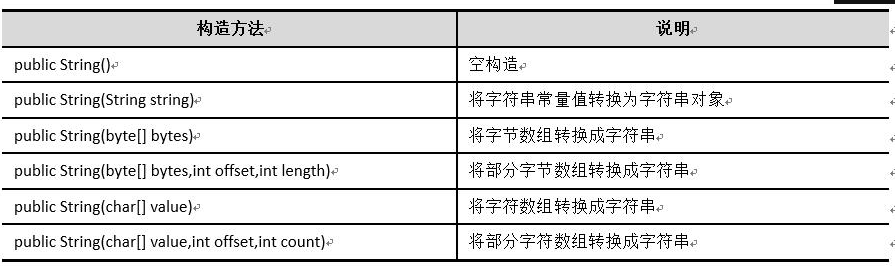
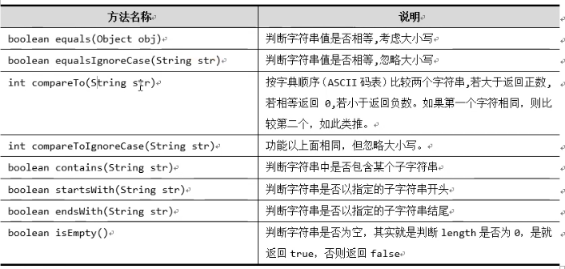
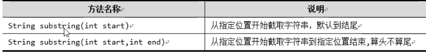
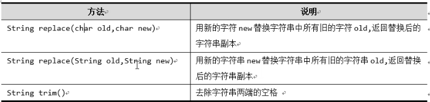
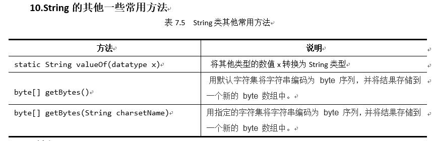
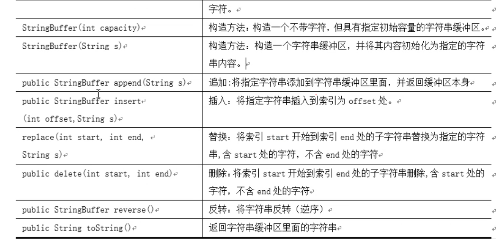
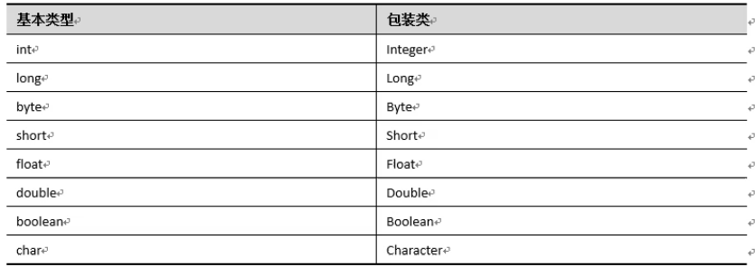
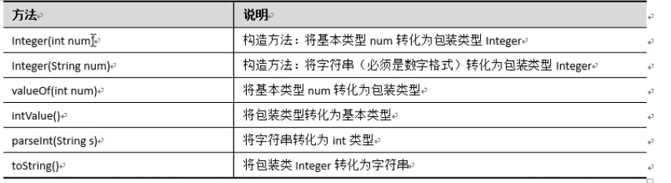

# String

## String类

​	String类是Java提供给我们用于对字符串进行处理的类，它位于Java.lang包中。

##1.构造方法




  **String构造方法**


##2.length 方法

语法： int length( )

说明：该方法返回String 字符串长度。


## 3.charAt 方法

方法：char charAt(int i)

说明：该方法返回字符串中索引为 i 的字符，返回值类型为char。

比如 str = ”abcde“，该方法在调用charAt(2)，返回字符 ’c' 。注意字符串第一个下标的索引为0。


## 4.charArray方法

方法：char[ ] toCharArray( )

说明：字符串调用该方法，会创建一个char类型的数组，数组元素就是字符串中的所有字符。


##5.indexOf 与 lastInexOf

方法：in indexOf(char c) 或 int indexOf(String c) 

in indexOf(char c ，开始的下标) 或  int indexOf(String c, 开始的下标)

说明：该方法会根据参数c 在字符串的中找到 c 最后一次出现的索引（位置），并返回 int 类型的索引值。如果找不到则返回 -1。


```Java
String a1 = "提取字符串的单个字符";
for(int i = 0 ; i<a1.length(); i++){
    System.out.print(a1.charAt(i) + "\t");
}
System.out.println();

String A1 =  "字符串转化为数组";
char []A2 = A1.toCharArray();
for(int i=0; i< A2.length; i++){
    System.out.print(A2[i] + "\t");
}

String o1 = "HolleWorld";
System.out.println(o1.indexOf('o',5));
System.out.println(o1.indexOf('l'));
System.out.println(o1.lastIndexOf('o'));
System.out.println(o1.lastIndexOf('l'));
System.out.println(o1.lastIndexOf("hello"));
System.out.println(o1.lastIndexOf("Hello"));

String poem = "长亭外,古道边,芳草碧连天,晚风";
String []p = poem.split(",");
for(int i=0; i< p.length; i++){
    System.out.print(p[i] + "\t");
}
```


## 6.split方法

方法： String[ ] split(String s)

说明：该方法通过分隔符 s 来拆分字符串，并将拆分出来的 字符串放入String数组，返回这个数组的引用。


## 7Stirng的判断与比较功能




```Java
String s1 = "helloworld";
String s2 = "Helloworld";
String s3 = "HelloWorld";
System.out.println("-------------判断两个字符串是否相等,考虑大小写--------------");
System.out.println(s1.equals(s2));
System.out.println(s2.equals(s3));
System.out.println("-------------判断两个字符串是否相等,忽略大小写-------------");
System.out.println(s1.equalsIgnoreCase(s2));
System.out.println(s2.equalsIgnoreCase(s3));
System.out.println("-------------判断字符串是否包含指定的子字符串---------------");
System.out.println(s1.contains("hello"));
System.out.println(s2.contains("world"));
System.out.println(s3.contains("hello"));
System.out.println("-------------判断字符串是否以指定的子字符串开头--------------");
System.out.println(s1.startsWith("h"));
System.out.println(s1.startsWith("he"));
System.out.println(s1.startsWith("hello"));
System.out.println(s3.startsWith("hello"));
System.out.println("-------------判断字符串是否以指定的子字符串结尾--------------");
System.out.println(s1.endsWith("d"));
System.out.println(s1.endsWith("ld"));
System.out.println(s1.endsWith("world"));
System.out.println(s3.endsWith("world"));
System.out.println("-----------------判断字符串是否为空----------------");
String s4 = "";
String s5 = " ";
System.out.println(s4.isEmpty());
System.out.println(s5.isEmpty());
System.out.println("----------compare比较字符串------------");
String s6="abc";
String s7="cbc";
System.out.println(s6.compareTo(s7));
System.out.println(s7.compareTo(s6));
```


## 8.字符串截取功能



```Java
String str = "HelloWorld";
String s8 = str.substring(5);
System.out.println(s8);
```


## 9.字符串的替换



```Java
String s1 = "good morning";
String s2 = s1.replace('g','G');
System.out.println(s2);
String s3 = s1.replace("go","GG");
System.out.println(s3);
String s4 = "  helloworld   ";
System.out.println("/" + s4 + "/");
String s5 = s4.trim();
System.out.println(s5);
```

## 10.字符串的特殊功能




# StringBuffer

​	单纯使用字符串进行截取，替换等修改操作的过程，会产生字符串副本，而原始的字符串并未发生改变。如果对字符串进行频繁的修改操作，不断产生的副本让人觉得不凡便。使用StringBuffer意为字符串缓冲区，所有对该对象的操作会直接修改到它本身，而不产生副本。




```Java
public class StringBufferDome {
    public static void main(String[] args){
        System.out.println("---------无参构造方法---------");
        StringBuffer sb = new StringBuffer();
        System.out.println(sb.capacity());
        System.out.println(sb.length());
        System.out.println("----------带int参数构造方法--------");
        StringBuffer sb2 = new StringBuffer(50);
        System.out.println(sb2.capacity());
        System.out.println(sb2.length());
        System.out.println("---------带String参数构造方法----------");
        StringBuffer sb3 = new StringBuffer("hello");
        System.out.println(sb3.capacity());  //计算容器大小
        System.out.println(sb3.length());
        System.out.println();
        System.out.println("----------append方法---------------");
        StringBuffer sb4 = new StringBuffer();
        //一步一步添加数据
//        sb4.append("中国");
//        System.out.println(sb4);
//        sb4.append("广州市");
//        System.out.println(sb4);
//        sb4.append("天河区");
//        System.out.println(sb4);

        //也可以一步完成，称为链式编程
        sb4.append("中国").append("广州市").append("天河区");
        System.out.println(sb4);

        System.out.println("-------------insert方法----------------");
        sb4.insert(2,"广东省");
        System.out.println("--------------reverse方法-----------------");
        StringBuffer sb5 = new StringBuffer();
        sb5.append("avaj");
        System.out.println(sb5);
        sb5.reverse();
        System.out.println(sb5);
        System.out.println("------------replace方法---------------------");
        sb5.append(",string");
        sb5.replace(5,11,"pyhton");
        System.out.println(sb5);
        System.out.println("---------------delete方法---------------------");
        sb5.delete(0,5);
        System.out.println("----------------toString方法------------------");
        String s6 = sb5.toString();
        System.out.println(s6);
        System.out.println(sb5);
        System.out.println(sb5.toString());
    }
}

```


# String StringBuffer StringBuilder区别 

 	1.String的内容是不了变的，而StringBuffer和StringBuilder是内容可变的。String的每次修改操作都是在内存中重新new一个对象出来，而StringBuffer、StringBuilder则不用，并且提供了一定的缓存功能，默认16个字节数组的大小，超过默认的数组长度时，则扩容为原来字节数组的长度*2+2。

  	2.StringBuffer是线程安全的，多线程，所以效率比较低。            

  	3.StringBuilder是线程不安全的，单线程，所以效率比较高。


# 包装类

​	基本类型无法用面向对象编程，于是Java提供了包装类，可以将基本类型的数据“包装” 成对象，

可以调用Object类的所有方法。






​	通过表中的有关方法， 实现将基本类型转化为包装类型，称为“装箱”，将包装类型转化为基本类型称为拆箱。 

```
System.out.println("--------手动装箱int--àInteger---------");
//方式1
Integer i1=new Integer(100);
//方式2
System.out.println("i1:"+i1);
Integer i2=Integer.valueOf(200);
System.out.println("i2:"+i2);

System.out.println("--------手动拆箱Integer--àint---------");
int num=i1.intValue();
System.out.println("num:"+num);

System.out.println("--------自动装箱---------");
Integer i3 = 100; //直接把int 赋值给Integer
System.out.println("i3:" + i3);

System.out.println("--------自动拆箱---------");
int num3=i3;//直接把Integer赋值给int类型或参与运算
//int num3=i3+200;
System.out.println("num3:" + num3);
```


int 与 String 的相互转换

```
System.out.println("-----int ---->String-----");
System.out.println("----------方式1-------");
int number = 100;
String s1 = "" + number;
System.out.println("s1:" + s1);

System.out.println("----------方式2--------");
String s2 = String.valueOf(number);
System.out.println("s2 " + s2);

System.out.println("----------方式3--------");
// int -> Integer -> String
Integer I = new Integer(number);
String s3 = I.toString();
System.out.println("s3 " + s3);

System.out.println("----------方式4--------");
String s4 = Integer.toHexString(number);
System.out.println("s4 " + s4);

System.out.println("-----------String ------> int -----------");
System.out.println("----------方式1---------");
String s = "100";
int y1 = Integer.parseInt(s);
System.out.println("y1 = " + y1);
System.out.println("----------方式2---------");
//String -> Integer ->int
Integer y2 = new Integer(s);
int i = y2.intValue();
System.out.println("i = " + i);
```


