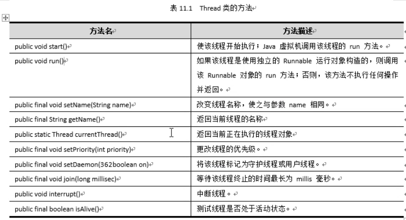

# 多线程

​	操作系统通常提供两种机制实现多任务的同时执行:多线程和多进程。

​	多线程的应用主要分为两个方面:提高运算速度、缩短响应时间。

​	对于计算量比较大的任务，可以把任务分解成多个可以并行运算的小任务，每个小任务由一个线程执行运算，以提高运算速度。


# 进程与线程


### 进程

​	在早期面向进程设计的计算机结构中，进程是程序的基本执行实体;在当代面向线程设计的计算机结构中，进程是线程的容器。程序是指令、数据及其组织形式的描述，进程是程序的实体。

### 线程

*  线程(thread)是操作系统能够进行运算调度的最小单位。它被包含在进程之中，是进程中的实际运作单位。

* 一条线程指的是进程中一个单一顺序的控制流,一个进程中可以并发多个线程，每条线程并行执行不同的任务。

* 在Unix System V及SunOS中也被称为轻量进程（lightweight processes），但轻量进程更多指内核线程（kernel thread），而把用户线程（user thread）称为线程。

  

  

  进程和线程的区别在于进程拥有独立的内存空间，而线程通常与其他线程共享内存空间，共享内存空间有利于线程之间的通信、协调配合，但共享内存空间可能导致多个线程在读写内存时数据不一-致, 这是使用多线程必须面对的风险。相对于进程来说，线程是一种更轻量级的多任务实现方式，创建、销毁一个线程消耗的计算资源比运行要小得多。


### 并发与并行

​	并行就是两个或以上任务同时运行，就是A任务运行的同时，B任务也在运行。这需要多核的电脑，比如你的电脑是双核的，假如有两个任务要并行，则两个任务各占用一个CPU即可实现并行。
​	并发是指处理器不足够的情况下两个或以上任务都请求运行，而处理器同--时间只能执行一个任务，就把这两个或以上的任务安排轮流执行，由于**轮流执行的时间间隔(时间片)非常短**，较长时间来看使人感觉两个或以上的任务都在运行。


# 实现多线程的方式

​	在Java中，创建线程有三种方式，一种是实现Runnable接口，另外一种是继承Thread类，以及Callable接口(了解)。线程是驱动任务运行的载体，在Java中，要执行的任务定义在run()方法中，线程启动后将执行run()方法，方法执行完后任务就执行完成。


## Thread

```java
public class ThreadTest02 extends Thread{
    String url;
    String name;
    public ThreadTest02(String url, String name) {
        this.url = url;
        this.name = name;
    }

    public void run() {
        WeDownLoad weDownLoad = new WeDownLoad();
        weDownLoad.downloader(url,name);
        System.out.println("正在下载" + name);
    }

    public static void main(String[] args) {
        ThreadTest02  threadTest021 = new ThreadTest02("https://pics1.baidu.com/feed/a8773912b31bb05137a7cf7dbb1ebfbc4bede055.jpeg?token=cc48e9b0a7bcf6642d322eb8d9444aa6","图片01");
        ThreadTest02  threadTest022 = new ThreadTest02("https://pics5.baidu.com/feed/267f9e2f07082838fd9d00c651f4cc094e08f1c3.jpeg?token=3a1357d995dc5440920ea5efc879d9fa","图片02");
        ThreadTest02  threadTest023 = new ThreadTest02("https://pics4.baidu.com/feed/b58f8c5494eef01f8dfa7720ffd0fc2dbd317d1b.jpeg?token=a50202f25943025ad8aa1c2fae759797","图片03");
        threadTest021.start();
        threadTest022.start();
        threadTest023.start();
    }


}
// download utils
class WeDownLoad{
    // download way
    public void downloader(String url,String name) {
        try {
            FileUtils.copyURLToFile(new URL(url),new File(name));
        } catch (IOException e) {
            e.printStackTrace();
        }
    }
}
```


## Runnable


## Callable

```java
public static void main(String[] args) throws ExecutionException, InterruptedException {
    CallableTest threadTest021 = new CallableTest("https://pics1.baidu.com/feed/a8773912b31bb05137a7cf7dbb1ebfbc4bede055.jpeg?token=cc48e9b0a7bcf6642d322eb8d9444aa6","图片01");
    CallableTest threadTest022 = new CallableTest("https://pics5.baidu.com/feed/267f9e2f07082838fd9d00c651f4cc094e08f1c3.jpeg?token=3a1357d995dc5440920ea5efc879d9fa","图片02");
    CallableTest threadTest023 = new CallableTest("https://pics4.baidu.com/feed/b58f8c5494eef01f8dfa7720ffd0fc2dbd317d1b.jpeg?token=a50202f25943025ad8aa1c2fae759797","图片03");

    // 1. create 执行服务
    ExecutorService executorService = Executors.newFixedThreadPool(3);
    // 2. 提交执行
    Future<Boolean> submit = executorService.submit(threadTest021);
    Future<Boolean> submit1 = executorService.submit(threadTest022);
    Future<Boolean> submit2 = executorService.submit(threadTest023);

    // 3.获得执行结果
    Boolean aBoolean = submit.get();
    Boolean aBoolean1 = submit1.get();
    Boolean aBoolean2 = submit2.get();
    System.out.println(aBoolean);
    System.out.println(aBoolean1);
    System.out.println(aBoolean2);
    // 4.关闭连接
    executorService.shutdown();

}
```


## 线程的生命周期


➢新建状态:
	使用new关键字和Thread 类或其子类建立-一个线程对象后，该线程对象就处于新建
状态。它保持这个状态直到程序start() 这个线程。
➢就绪状态:
	当线程对象调用了start()方法之后，该线程就进入就绪状态。就绪状态的线程处于就绪
队列中，要等待JVM里线程调度器的调度。
➢运行状态:
	如果就绪状态的线程获取CPU资源，就可以执行run(), 此时线程便处于运行状态。处
于运行状态的线程最为复杂，它可以变为阻塞状态、就绪状态和死亡状态。
➢阻塞状态:
	如果一个线程执行了sleep (睡眠)、suspend (挂起)等方法，失去所占用资源之后，该
线程就从运行状态进入阻塞状态。在睡眠时间已到或获得设备资源后可以重新进入就绪状
态。可以分为三种:
	等待阻塞:运行状态中的线程执行wait() 方法，使线程进入到等待阻塞状态。
	同步阻塞:线程在获取synchronized 同步锁失败 (因为同步锁被其他线程占用)。
	其他阻塞:通过调用线程的sleep() 或join() 发出了/0请求时，线程就会进入到阻塞状态。当sleep() 状态超时，join() 等待线程终止或超时，或者1/0 处理完毕，线程重新转入就绪状态。
➢死亡状态:

​	一个运行状态的线程完成任务或者其他终止条件发生时，该线程就切换到终止状态。。


## 操作线程的方法

**Thread类的方法使用技巧**




### 线程的名字

​	使用 getName( ) 或者Thread.currentThread().getName()  返回当前线程的名称

​	使用setName（）改写当前线程的名称


### 线程的优先级

​	每一个Java 线程都有-一个优先级，这样有助于操作系统确定线程的调度顺序。Java线程的优先级是一个整数，其取值范围是1    ( Thread.MIN_ PRIORITY )  - 10(Thread.MAX_ PRIORITY )。 

​	默认情况下，每一个线程都会分配一个优先级NORM_ PRIORITY (5)。 。
​	public static final int MIN_ PRIORITY = 1;
​	public static final int NORM_ PRIORITY= 5;
​	public static final int MAX_ PRIORITY= 10;

​	具有较高优先级的线程对程序更重要,并且应该在低优先级的线程之前分配处理器资源。
​	但是，线程优先级不能保证线程执行的顺序，而且非常依赖于平台。可以通过setPriority方法(final 的，不能被子类重载)更改优先级。优先级不能超出1-10的取值范围，否则抛出Exception。


### 线程的停止

stop()

* 1.建议线程正常停止--->利用次数,不建议死循环。
* 2.建议使用标志位--->设置一个标志位
* 3.不要使用stop或者destroy等过时或者JDK不建议使用的方法


### 线程的休眠


* sleep(时间)指定当前线程阻塞的毫秒数;
* sleep存在异常Interrupted Exception,需要抛出异常或者抓取异常;
* sleep时间达到后线程进入就绪状态;
* sleep可以模拟网络延时，倒计时等。
* 每一个对象都有一个锁，sleep不会释放锁;


### 线程的让步

​	线程让步用于正在执行的线程，在某些情况下让出CPU资源，让给其它线程执行。

​	yield()的作用是让步。它能让当前线程由“运行状态”进入到“就绪状态”，从而让其它具有相同或更高优先级的等待线程获取执行权;但是，并不能保证在当前线程调用yield()之后，其它具有相同或更高优先级的线程就一定能获得执行权; 也有可能是当前线程又进入到“运行状态”继续运行。

**让步不一定成功，可能礼让的线程继续执行**


### 线程的插队

​	在日常生活中，有遇到因为紧急情况不得已插队的事情。

​	在多线程中，也会遇到让一个线程优先于其他线程运行的情况，此时除了可以通过设置其优先级高于其他线程外，更直接的方法是使用Thread类的join()方法。
​	使用join方法,可实现“插队”效果。当插队的线程运行结束后，其他线程将继续执行。join()方法是Thread类的一个静态方法，它有三种形式:
​	join(); 等待调用该方法的线程终止，只有当指定的线程结束后当前线程才能继续。
​	join(long millisecond):等待调用该方法的线程终止的时间最长为millisecond毫秒。
​	join(long millisecond,int nanosecond );等待调用该方法的线程终止的时间最长为millisecond毫秒加纳秒。
​	

​	如果有线程中断了运行join()方法的线程，则抛出Interrupted Exception异常。


### 线程的状态


### 线程的守护

* 线程分为用户线程和守护线程
* 虚拟机必须确保用户线程执行完毕
* 虚拟机不用等待守护线程执行完毕
  


​	守护线程如： 后台记录操作日志,监控内存,垃圾回收等待..


## 线程的同步机制

* 由于同一进程的多个线程共享同一块存储空间，在带来方便的同时,也带来了访问冲突问题﹐为了保证数据在方法中被访问时的正确性。在访问时加入锁机制**synchronized** ,当一个线程获得对象的排它锁,独占资源，其他线程必须等待，使用后释放锁即可,存在以下问题:

  * 一个线程持有锁会导致其他所有需要此锁的线程挂起;
  * 在多线程竞争下,加锁,释放锁会导致比较多的上下文切换和调度延时,引起性能问题;
  * 如果一个优先级高的线程等待一个优先级低的线程释放锁会导致优先级倒置，引起性能问题


* 由于我们可以通过private关键字来保证数据对象只能被方法访问。

* 这套机制就是synchronized关键字，它包括两种用法:**synchronized方法和synchronized块。**
  由于我们可以通过专用关键字来保证数据对象只能被方法访问，所以我们只需要针对方法提出一套机制，这套机制就是同步关键字，它包括两种用法：同步方法和同步块。

  

synchronized是Java中的关键字，是一种同步锁。它修饰的对象有以下几种：

| 修饰范围 | 作用范围                                                     |
| -------- | ------------------------------------------------------------ |
| 代码块   | 大括号{}括起来的代码，作用的对象是调用这个代码块的对象       |
| 方法     | 整个方法，作用的对象是调用这个方法的对象                     |
| 静态方法 | 整个静态方法，作用的对象是这个类的所有对象                   |
| 类       | synchronized后面括号括起来的部分，作用主的对象是这个类的所有对象 |


### 1.同步块

* 同步块: synchronized (Obj ){}

* **Obj **称之为**同步监视器**
  
  * Obj可以是任何对象，但是推荐使用共享资源作为同步监视器
  * 同步方法中无需指定同步监视器﹐因为同步方法的同步监视器就是this ,就是这个对象本身,或者是class[反射中讲解]
  * **同步静态方法：就是同步代码块，同步锁对象是类的class对象**
  
* 同步监视器的执行过程
  
  * 1．第一个线程访问，锁定同步监视器﹐执行其中代码．
  
  * 2．第二个线程访问，发现同步监视器被锁定﹐无法访问．
  * 3．第一个线程访问完毕,解锁同步监视器．
  * 4．第二个线程访问,发现同步监视器没有锁﹐然后锁定并访问

* **synchronized (Obj ){} 锁的是变化的量，既需要增删改的**
* 丅 锁的是类，因为类（银行）是变化的量


### 2.同步方法

* 同步方法: `public synchronized void method(int args){}`

* synchronized方法控制对“对象”的访问, 每个对象对应一把锁,每个同步方法控制对“对象”的访问，每个对象对应一把锁，每个synchronized方法都必须获得调用该方法的对象的锁才能执行,否则线程会阻塞，方法一旦执行,就独占该锁，直到该方法返回才释放锁﹐后面被阻塞的线程才能获得这个锁，继续执行
  
  

**缺陷:若将一个大的方法申明为synchronized将会影响效率**


**资料参考 **

http://www.blogjava.net/tscfengkui/archive/2010/11/10/337709.html 

https://blog.csdn.net/yudianxiaoxiao/article/details/107592447?utm_medium=distribute.pc_relevant.none-task-blog-baidujs_baidulandingword-1&spm=1001.2101.3001.4242 


### 4.Lock

* Lock是显式锁（手动开启和关闭锁，别忘记关闭锁) synchronized是隐式锁，出了作用域自动释放

* Lock只有代码块锁，synchronized有代码块锁和方法锁

* 使用Lock锁，JVM将花费较少的时间来调度线程，性能更好。并且具有更好的扩展性(提供更多的子类)

  

  **优先使用顺序：**

  * Lock >同步代码块（已经进入了方法体，分配了相应资源)>同步方法（在方法体之外)


## 线程的死锁


​	死锁是指两个或两个以上的线程在执行过程中，因争夺资源而造成的一种互相等待的现象，若无外力作用，它们都将无法推进下去。


死锁避免方法


产生死锁的四个必要条件:

* 1.互斥条件:一个资源每次只能被一个进程使用.

* 2．请求与保持条件:一个进程因请求资源而阻塞时，对已获得的资源保持不放。

* 3．不剥夺条件:进程已获得的资源，在末使用完之前，不能强行剥夺。

* 4.循环等待条件:若干进程之间形成一种头尾相接的循环等待资源关系.


上面列出了死锁的四个必要条件，我们只要想办法破其中的任意一个或多个条件就可以避免死锁发生


## 线程的等待与唤醒

**不同线程之间的通信，使用等待和唤醒**

**1.wait方法**

​	wait方法使当前线程放弃同步锁转换为阻塞状态，直到被其他线程进入此同步锁唤醒为止。
**2.notify方法。**
​	随机唤醒一个些同步锁上等待中的线程。

**3.notifyAll 方法**
	唤醒此同步锁上所有等待中的线程。


## 线程池


* 背景:经常创建和销毁、使用革特别大的资源，比如并发情况下的线程，对性能影响很大。
* 思路:提前创建好多个线程，放入线程池中，使用时直接获取，使用完放回池中。可以避免频繁创建销毁、实现重复利用。类似生活中的公共交通工具。
* 好处:
  * 提高响应速度（减少了创建新线程的时间)
  * 降低资源消耗（重复利用线程池中线程，不需要每次都创建)
  * 便于线程管理(....)
    * `corePoolSize`:核心池的大小
    * `maximumPoolSize`:最大线程数
    * `keepAliveTime`:线程没有任务时最多保持多长时间后会终止


**使用**

* JDK 5.0起提供了线程池相关API:

​		 `Executor Service`和`Executors Executor Service`:真正的线程池接口。

​												常见子类`Thread Pool Executor`

* void execute(Runnable command)∶执行任务/命令，没有返回值，一般用来执行Runnable

* <T> Future<T> submit(Callable<T> task):执行任务，有返回值，一般又来执行Callable

* void shutdown()︰关闭连接池

  

* Executors:工具类、线程池的工厂类，用于创建并返回不同类型的线程池


## Lamda表达式


### 函数式接口

* 理解Functional Interface(函数式接口）是学习Java8 lambda表达式的关键所在。

* 函数式接口的定义:
  任何接口，如果只包含唯一一个抽象方法，那么它就是一个函数式接口。

  ```java
  public interface Runnable {
  	public abstract void run(); 
  }
  ```

* 对于函数式接口，我们可以通过lambda表达式来创建该接口的对象。