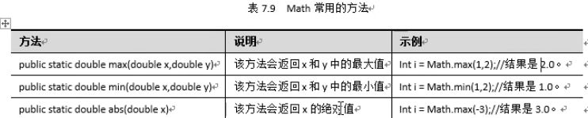
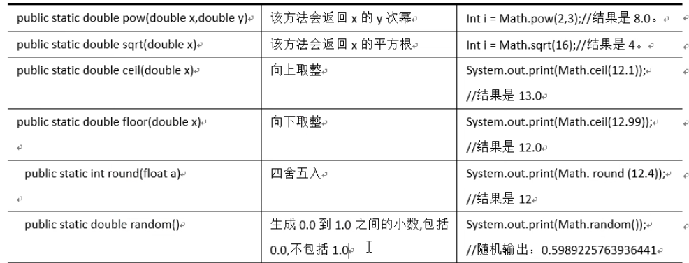
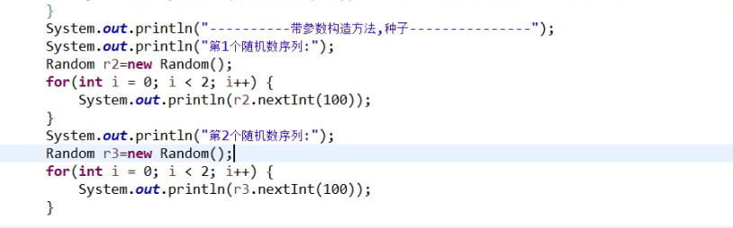
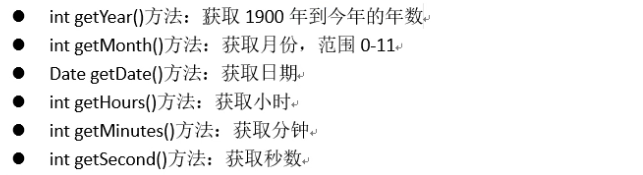

# object

​	Java中，Object 是所有类的父类，所有的类都默认继承自object类。


## 1.hashCode 

```
 public static  void main(String[] args){
        Student s1 = new Student();
        Student s2 = new Student();
        Student s3 = s1;
        System.out.println("测试hashcode：" + s1.hashCode());
        System.out.println("测试hashcode：" + s2.hashCode());
        System.out.println("测试hashcode：" + s3.hashCode());
    }
```

```输出
测试hashcode：22307196
测试hashcode：10568834
测试hashcode：22307196
```

方法：public  int  hashCode( );

作用：返回该对象的int类型的哈希码值。 根据对象的地址进行计算，不同对象地址返回不同的值，同一个对象返回相同的值。

## 2.getClass

```
package day11.Object;

public static void main(String[] args){
        Student stu  = new Student();
        String test = stu.getClass().getName();
        System.out.println(test);
    }
```

```输出
day11.Object.Student
```

方法：public final Class getClass( )

作用：返回对象运行时的Class实例。可以再同Class类中的getName 方法获得对象所属类的全名称。

getName 方法： public String getName( )


## 3.toString

```
    public static void main(String[] args){
        Student stu = new Student();
        System.out.println("stu的地址 " + stu);
        System.out.println("stu的地址 " + stu.toString());
        System.out.println("stu的地址 " + stu.getClass().getName() + "@" + Integer.toHexString(stu.hashCode()));
    }
```

```输出
方法 ：public String toString()

作用：返回该对象的字符串表示。默认情况下，返回值是：getClass( ).getName( ) +"@" +Integer.toHexString(hashCode())
stu的地址 day11.Object.Student@154617c
stu的地址 day11.Object.Student@154617c
stu的地址 day11.Object.Student@154617c
```

方法 ：public String toString()

作用：返回该对象的字符串表示。默认情况下，返回值是：

getClass( ).getName( ) +"@" +Integer.toHexString(hashCode())


**toString用于重写 **

返回进行测试


## 4.equals  与 == 的区别

​	Object类的equals 方法和“==” 操作符，都是用来比较两个引用类型（如对象）是否相等,默认情况下比较的都是引用类型的地址是否相同。

（1）在没有重写equals方法的类中，equals 与 ” == “ 是等价的，都是通过地址来判断两个对象是否相等

（2）有些类重写了equals方法，使equals判断的是两个类的内容是否一致，比如String类。

（3）”==“ 还可以用于比较基本类型，比较他们的值，如比较两个整数是否相等。


##5.hashCode 与 equals 方法的重写

​	上面示例中，new 两个对象，拥有相同的属性，但是因为地址不同，所以hashCode返回值也不同，无论是用equals 还是 == 进行比较，返回的结果都是false ，但是在业务上，这两个对象的属性全部相同。

​	重写hash 与 equals 可以equals的比较结果为true

**使用快捷方式**

generate hashCode( ) and equals( )


# Math类

​	Math类来帮助我们更简单地实现数学操作，该类存在许多计算的方法，并且这些方法可以通过类名直接调用。

​	Math存在两个常量E 和 PI,用法: Math.E 、Math.PI 。 代表数学中的e 和 Π 







# Random类

1.Random 类的构造方法：

​	1 不带参的构造方法：public Random（）

​	2 带参的构造方法：public Random（long seed），如果两个Random对象的种子相同，那么他们将产生相同的随机数序列。不带参的构造方法相当与每次使用的种子都是随机的，所有每次产生的随机数都不同。

2.Random类的常用方法：

（1）nextInt() 方法：生成一个最大值为2的32次方的随机数，可能是正数也可能是负数。

（2）nextInt(int bound) 方法：生成0到bound之间的随机数，不包括bound。




# Date类



```
Date d1 = new Date();
System.out.println("今天：" + d1.toString());
System.out.println("今天：" + d1.toLocaleString());
System.out.println("毫秒数1 " + d1.getTime());
System.out.println("毫秒数2 " + System.currentTimeMillis());
System.out.println(d1.getYear() + 1990 + "年份");
System.out.println(d1.getMonth() + 1 + "月份");
System.out.println(d1.getDate() + "日");
System.out.println(d1.getHours() + ":" + d1.getMinutes() + ":" + d1.getSeconds());

long num1 =  System.currentTimeMillis();
long num2  = num1 + 1*24*60*60*1000;
//获得明天的data类型
Date d2 = new Date(num2);
System.out.println(d2.getYear() +"," + d2.getMonth() + "," + d2.getDay());
System.out.println(d2.getDate() + " " +d2.getHours() + ":" + d2.getMinutes() + ":" + d2.getSeconds());

//获取明天date类型 （setTime 方法）
Date d3 = new Date();
System.out.println(d3.getYear() +"," + d3.getMonth() + "," + d3.getDay());
d3.setTime(num2);
System.out.println(d3.getYear() +"," + d3.getMonth() + "," + d3.getDay());
```


## Date转化为字符串

```
Date  date  = new Date();
System.out.println("默认格式:" + date.toLocaleString());
SimpleDateFormat  sdf  = new SimpleDateFormat("yyyy/MM/dd hh:mm:ss");
String date1 = sdf.format(date);
System.out.println("自定义格式1: " + date1);

sdf = new SimpleDateFormat("yyyy年MM月dd日 hh时mm分ss秒");
String date2 = sdf.format(date);
System.out.println("自定义格式2 " + date2);
```

**输出**

```
默认格式:2020-7-30 20:39:22
自定义格式1: 2020/07/30 08:39:22
自定义格式2 2020年07月30日 08时39分22秒
```


## 字符串转化为Date

```
Scanner sc = new Scanner(System.in);
System.out.print("输入（格式 yyyy/MM/dd hh:mm:ss）;");
String dateStr1 = sc.nextLine();
SimpleDateFormat sdf  = new SimpleDateFormat("yyyy/MM/dd hh:mm:ss");
Date date = sdf.parse(dateStr1);
System.out.println(date.toLocaleString());
```

**输出**

``` 
输入（格式 yyyy/MM/dd hh:mm:ss）;2000/10/33 10:10:10
2000-11-2 10:10:10
```


# Calendar类

​	 Calendar 日历类的实现

```
//        Calendar cal  = new Calendar(); //不可以， Calender是抽象类
//        Calendar cal  = new GregorianCalendar();  //实例化一个日历
        Calendar cal = Calendar.getInstance();
```