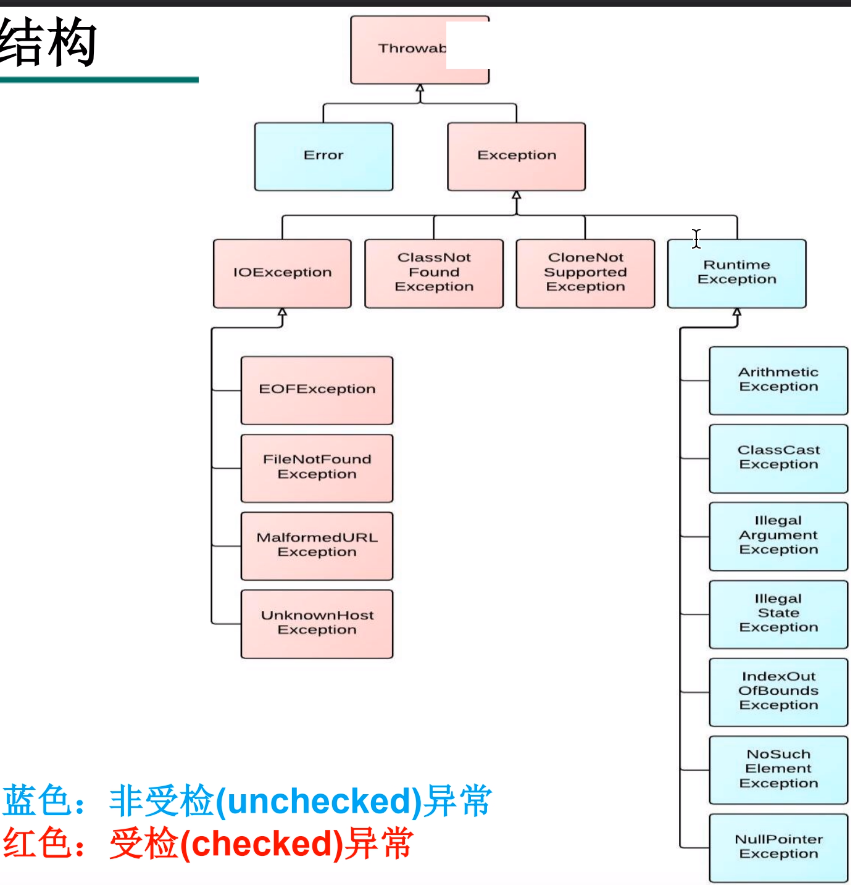

# 异常

​	指程序发生的错误，导致程序无法继续编译或运行中止。在程序中准确判断以及处理异常情况，以使程序能正常运行，叫异常处理机制 。

```
异常：在Java语言中，将程序执行中发生的不正常情况称为“异常”。(开发过程中的语法错误和逻辑错误不是异常)
 Java程序在执行过程中所发生的异常事件可分为两类：
    Error：Java虚拟机无法解决的严重问题。如：JVM系统内部错误、资源耗尽等严重情况。比如：StackOverflowError和OOM。一般不编写针对性的代码进行处理。
    Exception: 其它因编程错误或偶然的外在因素导致的一般性问题，可以使用针对性的代码进行处理。例如：
    空指针访问
    试图读取不存在的文件
    网络连接中断
    数组角标越界
```




``异常处理``

  **在程序运行的时候，需要先对可能产生异常的代码区间进行设置监控区域（guarded region），并在监控区域后面紧跟进行处理的区域。**


## try.......catch处理异常


```
try {
    int  a  = 10/0;
} catch (Exception e) {
    e.printStackTrace();
    System.out.println("test");
}
```


##    try搭配多个catch

```
int x = 6;
int arr[] = new int[] { 1, 2, 3, 4 };
try {
    arr = null;
    System.out.println(arr[0]);
    x = x / 0;
    arr[0] = 5;
    arr[4] = 10;

} catch (ArithmeticException e) {
    System.out.println("算术异常ArithmeticException");
    //e.printStackTrace();
}catch (ArrayIndexOutOfBoundsException e) {
    System.out.println("下标越界异常ArrayIndexOutOfBoundsException");
    e.printStackTrace();
}catch (NullPointerException e) {
    System.out.println("空指针异常NullPointerException");
    e.printStackTrace();
}catch (NegativeArraySizeException e) {
    System.out.println("数组下标负数异常NegativeArraySizeException");
    e.printStackTrace();
}catch (Exception e) {
    System.out.println("其他异常Exception");
    e.printStackTrace();
}
```


## try....catch..finally处理异常


```
int num=0;
try {
    num = 10/0;
} catch (Exception e) {
    e.printStackTrace();
} finally {
    System.out.println("无法在此输出num");
}
System.out.println(num);
```


## 手动抛出异常

​	异常也是一种类，所以可以通过new来构造它，Exception构造方法可以带String类型的参数，在发现到该异常时可以通过Exception对象的 getMessage 方法获取到该参数信息。再通过关键字throw抛出新建的这个异常


```
     try {   //手动抛出异常，传递参数时，传递是地址
                // 两者命名可以不一样
            int age = 1000;
            if(age>120){
                Exception e1 = new Exception("年龄不合理");
                throw  e1; //手动抛出异常
//                throw new Exception("年龄不合理....") ;
            }
            System.out.println("测试");
        } catch (Exception e) {
            e.printStackTrace();
            System.err.println(e.getMessage());
            System.out.println(e.getMessage());
        }
```


## 自定义异常

​	在实际编码中总是会出现一些意想不到的情况，毕竟java不可能自己预测了可能出现的所有异常。可以通过继承已知的异常类来自定义异常。

``继承异常类Exception``

```
public class AgeException extends  Exception {
    public AgeException(String msg){
        super(msg);
    }
}
```

```
public class GenderException extends  Exception{
    public GenderException(String msg) {
        super(msg); //super
    }
}

```

``创建一个学生类来，来使用自定义异常``


```
public class Student {
    private  String name;
    private  int age;
    private  String gender;

    public String getName() {
        return name;
    }

    public void setName(String name) {
        this.name = name;
    }

    public int getAge() {
        return age;
    }

    public void setAge(int age)  AgeException {
        if (age>0 && age <=100) {
            this.age = age;
        } else {
            throw  new AgeException("年龄范围在0-100之间");
        }
    }

    public String getGender() {
        return gender;
    }

    public void setGender(String gender) throws GenderException {
        if (gender.equals("男")| gender.equals("女")) {
            this.gender = gender;
        }
        else{
            throw new GenderException("性别只能是男或者女");
        }
    }

    @Override
    public String toString() {
        return "Student{" +
                "name='" + name + '\'' +
                ", age=" + age +
                ", gender='" + gender + '\'' +
                '}';
    }
}
```
``测试类，测试学生类``

```
public class TestStudent {
    public static void main(String[] args) {
        Scanner sc = new Scanner(System.in);
        Student s1 = new Student();
        System.out.print("请输入学生性别:");
        String gender = sc.next();
        System.out.print("请输学生年龄:");
        int age = sc.nextInt();

        try {
            s1.setAge(age);
        } catch (Exception e) {
            System.out.println(e.getMessage());
        }
        try {
            s1.setGender(gender);
        } catch (GenderException e) {
            System.out.println(e.getMessage());
        }
        s1.setName("张无忌");
        System.out.println(s1.toString());
    }
}
```
#  try、catch、finally 执行顺序

- 假设代码顺序书写如下：try → catch → finally → 其他代码
- 则：
  - 1、正常执行顺序：try → catch → finally → 其他代码
  - 2、try，catch和finally和其他代码的执行条件：
    - 先执行try。
    - 只要try中有异常，catch就会执行；
    - finally总会执行；
    - 其他代码：
      - 如果finally中没有return：其他代码会执行；
      - 如果finally中有return：其他代码不会执行；
  - 3、方法的返回结果确定：
    - finally 有return：（finally中的return）
      - 返回结果为 finally 中的值，try（+catch，+ 其他代码）的 return 值会被覆盖掉。
        注：有return，其他代码不会执行。所以finally就是最终执行的代码。故返回结果为 finally 中的值。
    - finally 没有return：（正常执行顺序返回结果）
      - 返回结果就是正常代码执行顺序的返回结果。try（+catch，+ 其他代码）的 return 会被寄存起来。一般 finally 不会修改返回值，除非 finally 修改了该引用指向的实际内存内容。
        注：没有return，其他代码会执行，finally不是最终执行的代码。返回结果为正常执行顺序的返回结果