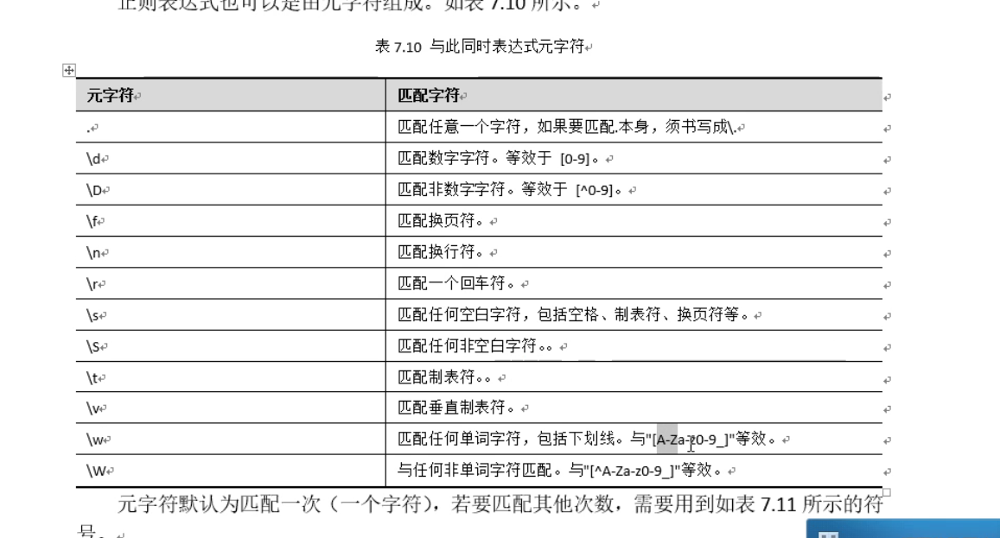
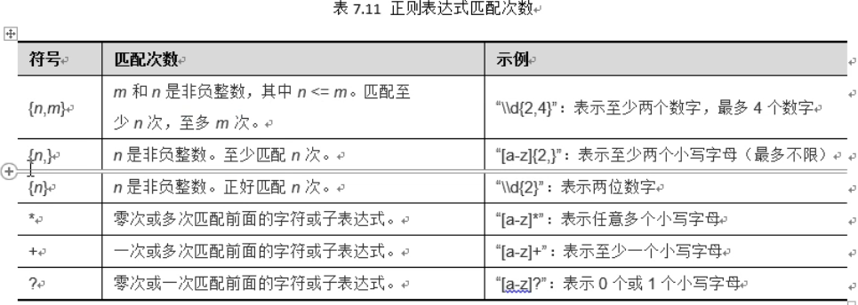

# 正则表达式

## 说明

​	正则表达式是一种特殊的字符串，在正则表达式中含有一些特殊的字符，可以用于搜索，编辑，匹配和处理文本。正则表达式就是通过特定的字符组成一个”规则字符串“，可以用这字符串来对目标字符串进行过滤。

## 正则表达式语法

​	正则表达式可以包含由[ ]括起来的字符，例如[abc]则匹配 a-c 中任意一个字符。可以在字符前面加个 ^ 来表示这些字符以外，例如[ ^a] 就代表了除了a 以为的任意字符。也可以通过“-”来选择范围，例如[a-z] 代表a-z的字符。可以使用 “[a-zA-Z]”表示匹配任意一个英文字母。如果只是匹配一个字符，可以不加[ ] 号都可以。








## 验证功能

使用方法   字符串.matches(正则验证) 进行验证 


`筛选1990 - 2021年`

```
String birthday = "1998-01";
String regex = "(199\\d|20[01]\\d|202[01])-((0?[1-9])|1[0-2])";
System.out.println(birthday.matches(regex));
```

`true`


## 分割功能

利用 split() 方法进行分割，使用字符串进行接收

```
String s = "长亭外8古道边77芳草碧连天23456788765432晚风吹";
String []arr  = s.split("\\w+");
for (int i = 0; i <arr.length ; i++) {
   System.out.println(arr[i]);
}
```


## 替换功能

​	java的String 类提供了replaceAll 方法进行字符串替换。

​	语法：public String replaceAll (String regex, String replacement)

​	使用该方法我们需要传入两个参数，第一参数regex是原字符中需要被替换的部分，即所有匹配正则表达式，regex的字符串，第二个参数将字符串中所含有第一个参数的地方被替换掉，并返回一个新字符串，原有的字符串不修改。

```
String s2 = "today18 we are 65going to7 outside";
String regex = "[0-9]+";
String new_str = s2.replaceAll(regex," "); //替换为空格
System.out.println(new_str);
```

```today  we are  going to  outside
today  we are  going to  outside
```

## 分组功能

​	使用括号来对字符串进行分组，比如"(\\\d+)(abc)" 就是将字符串分成两组。在进行分组了之后，若还需要再次用到前面的分组，可以使用\\\1 和 \\\2 表示第一组和第二组

​	

```
String s3 = "123abc123abcabc";
String regex2 = "(\\ +)(abc)\\1(abc)\\3";
System.out.println(s3.matches(regex2));
```

**分组还可以使用” | " 表示逻辑或 **


```
String  str2  = "我我我98765987爱爱爱爱kujyjjhkh中中中中中HGHV H国国国89709";
String regex2  = "\\w+| ";
str2  = str2.replaceAll(regex2,"");
str2  = str2.replaceAll("(.)\\1+","$1");
System.out.println(str2);
```

`输出 ： 我爱中国`


## 正则表达式的获取功能

​	获取字符串中的部分字符，使用Pattern类获取正则表达式，并且通过matcher方法获取匹配器。

```
String num ="我的手机是18988888888,我曾3456用过18987654321,还用过15912345678";
String regex = "1\\d{10}"; //手机号码的正则表达式
Pattern p = Pattern.compile((regex)); //获取到正则表达式
Matcher m = p.matcher(num);  //获取匹配器
while (m.find()){            // 遍历Matcher 对象
    System.out.println(m.group());   //循环输出
}
```

```
18988888888
18987654321
15912345678
```


# 内部类

​	在类中定义的类就是内部类，也可以理解为类的嵌套，内部类通常仅提供其外嵌类（外部类）调用。根据内部类出现在类中的位置和修饰符不同，可以分成为四种内部类：成员内部类、静态内部类、局部内部类、匿名内部类。

## 成员内部类

​	在类中方法以外定义的内部类，跟类的成员变量,成员方法级别相同，地位相同，相当于类的一个成员，称为成员内部类。

特点：1、成员内部类可以无条件访问外部类的的成员变量和方法，包括私有的成员变量和方法。

​	    2、外部类想要去访问内部类属性或方法进行操作时，必须先创建一个内部类对象，然后通过该对象访问内部类的属性或方法。私有也可以访问。

 	    3、其他类要访问内部类：外部类名.内部类名 对象名 = 外部类对象.内部类对象   


```
public class 成员内部类 {
    public static void main(String[] args) {
        System.out.println("-----------测试外部类调用内部类-----------");
        Outer outer=new Outer();
        outer.method();
        System.out.println("-----------测试其他类访问内部类-----------");
        Outer.Inner inner=new Outer().new Inner();
        System.out.println("其他类访问内部类的成员变量num:"+inner.num);
        System.out.println("------");
        System.out.println("其他类访问内部类的成员方法:");
        System.out.println("------");
        inner.method();
    }
}
class Outer{
    private int num=10;
    private String name="tom";
    public void method() {
        System.out.println("这是外部类的method()方法");
        System.out.println("---外部类要使用内部类的属性与方法---");

        Inner inner=new Inner();
        System.out.println("外部类访问内部类的成员变量(公有):"+inner.num);
        System.out.println("外部类访问内部类的成员变量(私有):"+inner.num2);
        System.out.println("------");
        System.out.println("外部类访问内部类的成员方法:");
        inner.method2();

    }
    class Inner{
        int num=20;
        private int num2=40;
        public void method() {
            int num=30;
            System.out.println("这是内部类的method()方法");
            System.out.println("局部变量num:"+num);
            System.out.println("内部类的成员变量num(公有私有均可):"+this.num);
            System.out.println("内部类访问外部类的成员变量num:"+Outer.this.num);
        }
        public void method2() {
            System.out.println("这是内部类的method2()方法");
            System.out.println("内部类的method2()方法调用 外部类的name属性"+name);
        }
    }
}
```


## 静态内部类

​	在成员内部类的基础上，内部类添加static 修饰符，就成了静态内部类。

特征：静态内部类只能访问外部的静态成员。

​	外部类名.内部类名 对象名 = new 外部类名.内部类名();

​	如果需要调用静态方法： 外部类.内部类.静态方法


```
public class 静态内部类 {
    public static void main(String[] args) {
        System.out.println("-----------测试外部类调用内部类-----------");
        Outer2 outer2=new Outer2();
        outer2.show();
        System.out.println("-----------测试其他类访问内部类-----------");
        //外部类名.内部类名 对象名 = new 外部类名.内部类名();
        Outer2.Inner1 inner1 = new Outer2.Inner1();
        System.out.println("------访问普通方法------");
        inner1.method();
        System.out.println("------访问静态方法------");
        Outer2.Inner1.print();
    }
}
class Outer2 {
    int num=10;
    static int num2=20;
    public void show() {
        System.out.println("这是外部类的show()方法");
        Inner1 inner1=new Inner1();
        System.out.println("外部类访问内部类的成员变量:");
        System.out.println(inner1.num3);
        System.out.println(inner1.num4);
        System.out.println("外部类访问内部类的成员方法:");
        inner1.print();
    }
    public static void show2() {
        System.out.println("这是外部类的静态show2()方法");
    }
    static class Inner1 {
        int num3=40;
        private static int num4=80;
        public void method() {
            System.out.println("这是内部类的普通方法method");
//       System.out.println(num); //访问失败
//             show();
            show2(); //静态内部类只能访问外部类的静态成员
            System.out.println(num2);
        }
        public static void print() {//静态方法
            System.out.println("这是内部类的静态方法print");
        }
    }
}
```


## 局部内部类

​	也叫方法内部类，是在类中方法内定义的类，其地位相当与局部变量，只能在定义它的方法中调用。


```
public class 局部内部类 {
    public static void main(String[] args) {
        Outer3 o = new Outer3();
        o.method();
    }
}

class Outer3 {
    public void method() {
        int num = 10;
        class Inner {
            public void print() {
                System.out.println("内部类的print方法访问外部的局部变量："+num);
            }
        }
        Inner i = new Inner();//局部内部类,只能在其所在的方法中访问
        i.print();
    }
    public void run() {
//    Inner i = new Inner();    //这里报错，局部内部类只能在其所在的方法中访问
//    i.print();
    }
}
```


## 匿名内部类

​	匿名内部类本质是一个继承了该类或者实现了该接口的子类匿名对象，匿名内部类的前提是存在一个抽象类或者接口，匿名内部类只针对重写一个方法时候使用。

语法：

new 类名或者接口名(){

​		重写方法；

}；

​	若需要调用的方法只用一次，则用匿名内部类比较方便，就在上面语法的代码基础上再继续加符号 ’.' 来访问内部类的方法。若要调用多次就赋值给一个有名的对象再多次调用即可。 


```
package day13.内部类;

public class 匿名内部类 {
    public static void main(String[] args) {
        Outer4 o = new Outer4();
        o.method();
    }
}
abstract class innerInterface{
    public abstract void print1();
    public abstract void print2();
}
class Outer4{
    String name;
    int age;
    public void method() {
        new innerInterface() {
            @Override
            public void print1() {
                System.out.println("这是print1方法");
            }
            @Override
            public void print2() {
                System.out.println("这是print2方法");
            }
        }.print1();

        new innerInterface() {
            @Override
            public void print1() {
                System.out.println("这是print1方法");
            }
            @Override
            public void print2() {
                System.out.println("这是print2方法");
            }
        }.print2();


        System.out.println("------------如果接口有多个抽象方法就用有名内部类--------------");
        innerInterface i= new innerInterface() {
            @Override
            public void print1() {
                System.out.println("这是print1方法");
            }
            @Override
            public void print2() {
                System.out.println("这是print2方法");
            }
        };
        i.print1();
        i.print2();
    }
}
```