# 注解和反射


# 反射（reflection） 


## 动态语言

- **是一类在运行时可以改变其结构的语言：例如新的函数、对象、甚至代码可以被引进，已有的函数可以被删除或是其他结构上的变化。通俗点说就是在运行时代码可以根据某些条件改变自身结构**
- **主要动态语言：Object-C、JavaScript、PHP、Python等**


## 静态语言

- **与动态语言相对应的，运行时结构不可变的语言就是静态语言。如Java、C、C++、C#**
- **Java不是动态语言，但Java可以称之为 “准动态语言” 。即Java有一定的动态性，我们可以利用反射机制获得类似动态语言的特性。Java的动态性让编程的时候更加灵活！**


**定义：Reflection（反射）是Java被视为动态语言的关键，反射机制允许程序在执行期借助于Reflection API取的任何类的内部信息，并能直接操作任意对象的内部属性及方法**

​                                    `Class c = Class.forName("java.lang.String")`

- **加载完类之后，在堆内存的方法区中就产生了一个Class类型的对象（一个类只有一个Class对象），这个对象就包含了完整的类的结构信息。我们可以通过这个对象看到类的结构。这个对象就像一面镜子，透过这个镜子看到类的结构，所以，我们形象的称之为：反射**


**Java反射机制提供的功能**

- **在运行时判断任意一个对象所属的类**
- **在运行时构造任意一个类的对象**
- **在运行时判断任意一个类所具有的成员变量和方法**
- **在运行时获取泛型信息**
- **在运行时调用任意一个对象的成员变量和方法**
- **在运行时处理注解**
- **生成动态代理**
- **…**

### Java反射优点和缺点

**优点：**

- **可以实现动态创建对象和编译，体现出很大的灵活性**

**缺点：**

- **对性能有影响。使用反射基本上是一种解释操作，我们可以告诉JVM，我们希望做什么并且它满足我们的要求。这类操作总是慢于直接执行相同的操作**

   

### 反射相关的主要API

- **java.lang.Class：代表一个类**
- **java.lang.reflect.Method：代表类的方法**
- **java.lang.reflect.Field：代表类的成员变量**
- **java.lang.reflect.Constructor：代表类的构造器**
- **…**


### Class类


**在Object类中定义了以下的方法，此方法还将被所有子类继承**

```java
public final Class getClass()
```

- **以上的方法返回值的类型是一个Class类，此类是Java反射的源头，实际上所谓反射从程序的运行结果来看也很好理解，即：可以通过对象反射求出类的名称**

  

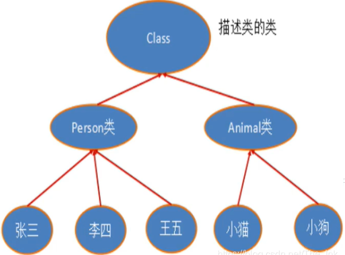


**对象照镜子后可以得到的信息：某个类的属性、方法和构造器、某个类到底实现了哪些接口。对于每个类而言，JRE都为其保留一个不变的 Class 类型的对象。一个 Class 对象包含了特定某个结构（class/interface/enum/annotation/primitive/type/void/[]）的有关信息。**


- **Class 本身也是一个类**
- **Class 对象只能有系统建立对象**
- **一个加载的类在 JVM 中只会有一个 Class 实例**
- **一个 Class 对象对应的是一个加载到JVM中的一个 .class文件**
- **每个类的实例都会记得自己是由哪个 Class 实例所生成**
- **通过 Class 可以完整地得到一个类中的所有被加载的结构**
- **Class 类是Reflection的根源，针对任何你想动态加载、运行的类，唯有先获得相应的 Class 对象**


|                **方法名**                 |                         **功能说明**                         |
| :---------------------------------------: | :----------------------------------------------------------: |
|   **static ClassforName(String name)**    |               **返回指定类名name的Class对象**                |
|         **Object newInstance()**          |        **调用缺省构造函数，返回Class对象的一个实例**         |
|               **getName()**               | **返回此Class对象所表示的实体（类，接口，数组类或void）的名称** |
|         **Class getSuperClass()**         |            **返回当前Class对象的父类的Class对象**            |
|        **Class[] getinterfaces()**        |                 **获取当前Class对象的接口**                  |
|     **ClassLoader getClassLoader()**      |                  **返回eee该类的类加载器**                   |
|    **Constructor[] getConstructors()**    |           **返回一个包含某些Construtor对象的数组**           |
| **Method getMethod(String name,Class…T)** |     **返回一个Method对象，此对象的形参类型为param Type**     |
|      **Field[] getDeclaredFields()**      |                 **返回Field对象的一个数组**                  |


#### 获取Class类的实例

1. **若已知具体的类，通过类的class属性获取，该方法最为安全可靠，程序性能最高**

   ​									`Class clazz = Person.class;`

2. **已知某个类的实例，调用该实例的getClass()方法获取Class对象**

   ​									`Class clazz = person.getClass();`

3. **已知一个类的全名，且该类在类路径下，可通过Class类的静态方法forName()获取**

   ​								`Class clazz = Class.forName("demo01.Student");`

   

4. **内置基本数据类型可以直接用类名 .Type**

5. **还可以利用ClassLoader**

   

```java
public class Test03 {
    public static void main(String[] args) throws ClassNotFoundException {
        Person person = new Student();
        System.out.println("这个人是" + person.name);

        //方式一 ：通过对象获得
        Class c1 = person.getClass();
        System.out.println(c1.hashCode());
        //方式二 ：forname获得
        Class c2 = Class.forName("reflectionStudy.Student");
        System.out.println(c2.hashCode());

        //方式三 ：具体的类
        Class c3 = Student.class;
        System.out.println(c3.hashCode());

        //内置基本数据类型可以直接用类名 .Type
        Class c4 = Integer.TYPE;
        System.out.println(c4.hashCode());
        Class c5 = Integer.TYPE;
        System.out.println(c5.hashCode());
        System.out.println(c4);

        //获得父类的类型
        Class c6 = c1.getSuperclass();
        System.out.println(c6.hashCode());
        System.out.println(c6);

    }
}
```


#### 哪些类型可以有Class对象

- **class：外部类，成员（成员内部类，静态内部类），局部内部类，匿名内部类**
- **interface：接口**
- **[]：数组**
- **enum：枚举**
- **annotation：注解@interface**
- **primitive type：基本数据类型**
- **void**


```java
public class Test04 {
    public static void main(String[] args) {
        Class c1  = Object.class; //类
        Class c2 = Comparable.class; //接口
        Class c3 = String[].class;  //一维数组
        Class c4 = int[][].class;   //二维数组
        Class c5 = Override.class;  // 注解
        Class c6 = ElementType.class; //枚举
        Class c7 = Integer.class;   //基本数据类型
        Class c8 = void.class;    //void
        Class c9 = Class.class;   //Class

        System.out.println(c1);
        System.out.println(c2);
        System.out.println(c3);
        System.out.println(c4);
        System.out.println(c5);
        System.out.println(c6);
        System.out.println(c7);
        System.out.println(c8);
        System.out.println(c9);

        int[] a = new int[10];
        int[] b = new int[100];
        System.out.println(a.getClass().hashCode());
        System.out.println(b.getClass().hashCode());
    }
}
```


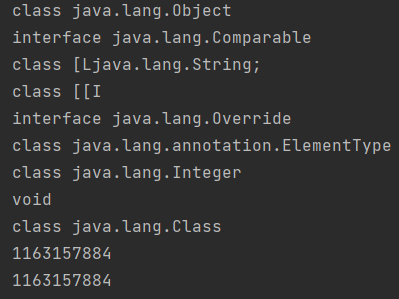


#### Java内存分析

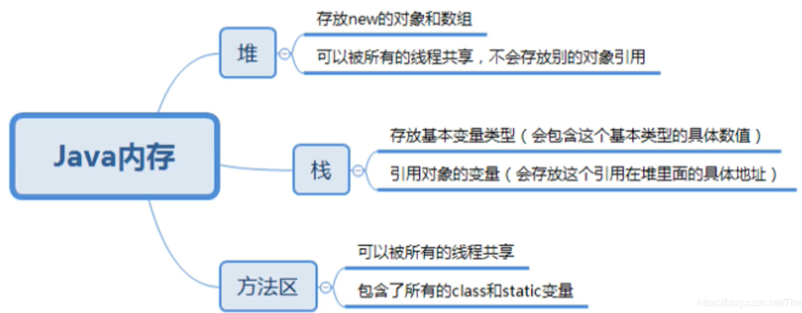


#### 类的加载过程

**当程序主动使用某个类时，如果该类还未被加载到内存中，则系统会通过如下三个步骤来对该类进行初始化。**


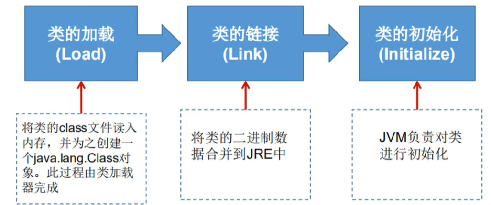

****


## 类的加载与 ClassLoader 的理解

- 加载：将 class 文件字节码内容加载到内存中，并将这些静态数据转换成方法区的运行时数据结构，然后生成一个代表这个类的 java.lang.Class 对象
- 链接：将 Java 类的二进制代码合并到 JVM 的运行状态之中的过程
  - 验证：确保加载的类信息符合 JVM 规范，没有安全方面的问题
  - 准备：正式为类变量（static）分配内存并设置类变量**默认初始值**的阶段，这些内存都将在方法区中进行分配
  - 解析：虚拟机常量池内的符号引用（常量名）替换为直接引用（地址）的过程
- 初始化：
  - 执行类构造器< clint>() 方法的过程，类构造器< clint>() 方法是由编译期自动收集类中所有类变量的赋值动作和静态代码块中的语句合并产生的（类构造器是构造类信息的，不是构造该类对象的构造器）
  - 当初始化一个类的时候，如果发现其父类还没有进行初始化，则需要先触发其父类的初始化
  - 虚拟机会保证一个类的< clint>() 方法在多线程环境中被正确加锁和同步

```java
public class Test05 {
    public static void main(String[] args) {
        /**
         * 1、加载到内存，会产生一个类对应的 Class 对象
         * 2、链接，链接结束后 m = 0
         * 3、初始化
         <clint>() {
         System.out.println("A 类静态代码块初始化");
         m = 300;
         m = 100;
         }
         m = 100;
         */
        A a = new A();
        System.out.println(A.m);
    }
}
class A{
    static {
        System.out.println("静态代码块");
        m = 300;
    }
    static  int m = 100;
    public A() {
        System.out.println("A类的无参构造初始化");
    }
}
```

```java
静态代码块
A类的无参构造初始化
100
```


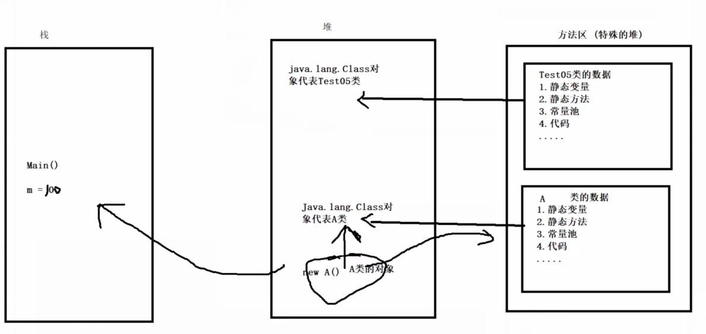


#### 什么时候会发生类初始化

- **类的主动引用（一定会发生类的初始化）**
  - **当虚拟机启动，先初始化main方法所在的类**
  - **new一个类的对象**
  - **调用类的静态成员（除了final常量）和静态方法**
  - **使用java.lang.refect包的方法对类进行反射调用**
  - **当初始化一个类，如果其父类没有被初始化，则先会初始化它的父类**
- **类的被动引用（不会发生类的初始化）**
  - **当访问一个静态域时，只有真正声明这个域的类才会被初始化。如：当通过子类引用父类的静态变量，不会导致子类初始化**
  - **通过数组定义类引用，不会触发此类的初始化**
  - **引用常量不会触发此类的初始化（常量在连接阶段就存入调用类的常量池中了）**


```java
public class Test06 {
    static {
        System.out.println("main类被加载");
    }
    public static void main(String[] args) throws ClassNotFoundException {
        // 1. 主动引用
        // Son son = new Son();

        // 反射也会产生主动引用
         Class.forName("reflectionStudy.Son");

        // 不会产生类的引用的方法
        // System.out.println(Son.b); // 子类不会被加载

        // Son[] array = new Son[5]; // 只有main类被加载

     //   System.out.println(Son.M);// 父类子类都不会被加载
    }
}

class Father {

    static int b = 2;
    static {

        System.out.println("父类被加载");
    }
}

class Son extends Father {
    static {
        System.out.println("子类被加载");
        m = 300;
    }
    static int m = 100;
    static final int M = 1;

}
```


#### 类加载器的作用

- **类加载器的作用：将class文件字节码内容加载到内存中，并将这些静态数据转换成方法区的运行时数据结构，然后在堆中生成一个代表这个类的java.lang.Class对象，作为方法区中数据的访问入口**
- **类缓存：标准的JavaSE类加载器可以按要求查找类，但一旦某个类被加载到类加载器中，它将维持加载（缓存）一段时间。不过JVM垃圾回收机制可以回收这些Class对象**


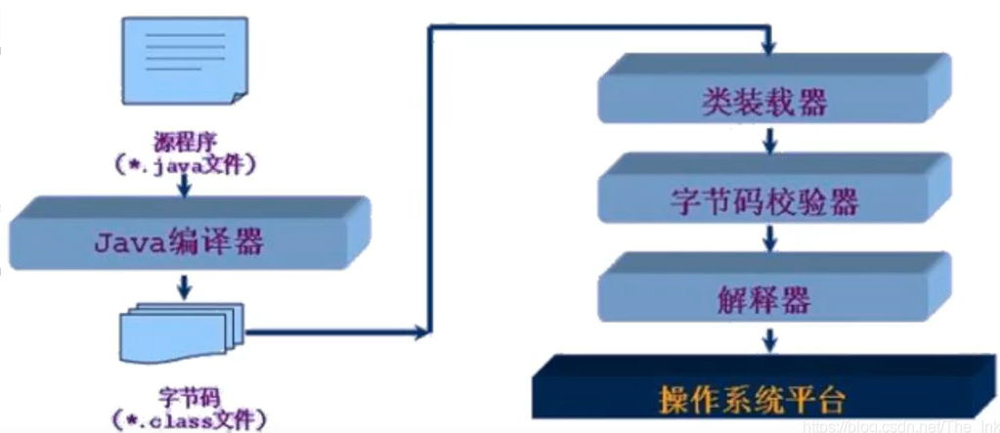


**类加载器作用是用来把类(class)装载进内存的。JVM规范定义了如下类型的类的加载器**

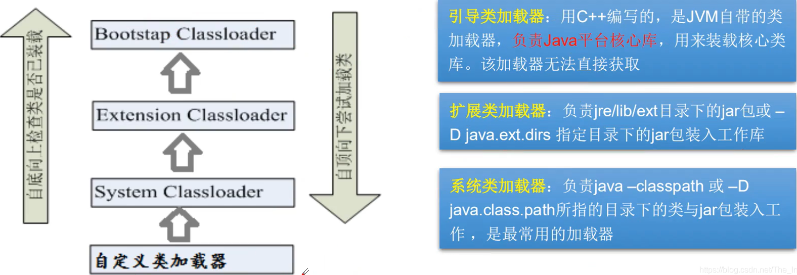


**负责java平台核心类库，D:\Java\jre\lib\rt.jar中**


```java
public class Test07 {
    public static void main(String[] args) throws ClassNotFoundException {
        //获取系统类加载器的父类加载器 --> 根加载器（c/c++）
        ClassLoader parent1 = ClassLoader.getSystemClassLoader().getParent().getParent();
        System.out.println("获取系统类加载器的父类加载器 --> 根加载器(c/c++):"+parent1);
        //获取系统类加载器的父类加载器 --> 扩展类加载器
        ClassLoader parent = ClassLoader.getSystemClassLoader().getParent();
        System.out.println("获取系统类加载器的父类加载器 --> 扩展类加载器:" + parent);

        //获取系统类的加载器
        ClassLoader systemClassLoader = ClassLoader.getSystemClassLoader();
        System.out.println("获取系统类的加载器:"+systemClassLoader);

        //测试当前是哪个类加载器加载的
        ClassLoader c1 = Class.forName("reflectionStudy.Test07").getClassLoader();
        System.out.println("测试当前是哪个类加载器加载的:"+c1);

        //测试jdk内置类是哪个加载器加载的
        ClassLoader c2 = Class.forName("java.lang.Object").getClassLoader();
        System.out.println("测试jdk内置类是哪个加载器加载的:"+c2);

        //获取系统类加载器可以加载的路劲
        String property = System.getProperty("java.class.path");
        System.out.println(property);
        /*
         D:\Java\jre\lib\charsets.jar;
         D:\Java\jre\lib\deploy.jar;
         D:\Java\jre\lib\ext\access-bridge-64.jar;
         D:\Java\jre\lib\ext\cldrdata.jar;
         D:\Java\jre\lib\ext\dnsns.jar;
         D:\Java\jre\lib\ext\jaccess.jar;
         D:\Java\jre\lib\ext\jfxrt.jar;
         D:\Java\jre\lib\ext\localedata.jar;
         D:\Java\jre\lib\ext\nashorn.jar;
         D:\Java\jre\lib\ext\sunec.jar;
         D:\Java\jre\lib\ext\sunjce_provider.jar;
         D:\Java\jre\lib\ext\sunmscapi.jar;
         D:\Java\jre\lib\ext\sunpkcs11.jar;
         D:\Java\jre\lib\ext\zipfs.jar;
         D:\Java\jre\lib\javaws.jar;
         D:\Java\jre\lib\jce.jar;
         D:\Java\jre\lib\jfr.jar;
         D:\Java\jre\lib\jfxswt.jar;
         D:\Java\jre\lib\jsse.jar;
         D:\Java\jre\lib\management-agent.jar;
         D:\Java\jre\lib\plugin.jar;
         D:\Java\jre\lib\resources.jar;
         D:\Java\jre\lib\rt.jar;
         D:\StudyJava\AnnotationAndReflection\out\production\AnnotationAndReflection;
         D:\IDEA\IntelliJ IDEA 2021.1\lib\idea_rt.jar
         * */
        
         // 双亲委派机制
        // java.lang.String-->
    }
}
```


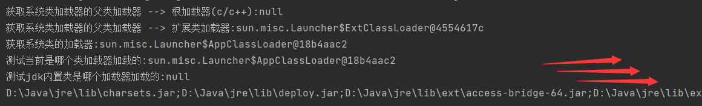


### 创建运行时类的对象

#### 获取运行时类的完整结构

**通过反射获取运行时类的完整结构**

**Field、Method、Constructor、Superclass、Interface、Annotation**

- **实现的全部接口**
- **所继承的父类**
- **全部的构造器**
- **全部的方法**
- **全部的Field**
- **注解**


```java
public class Test08 {
    public static void main(String[] args) throws ClassNotFoundException, NoSuchFieldException, NoSuchMethodException {
        Class c1 = Class.forName("reflectionStudy.User");

        //获得类的名字
        System.out.println("---------------获得类的名字----------------");
        System.out.println(c1.getName());
        System.out.println(c1.getSimpleName());

        //获得类的属性
        System.out.println("---------------获得类的属性----------------");
        Field[] fields = c1.getFields();  //只能找到public属性
        for (Field field : fields) {
            System.out.println(field);
        }
        System.out.println("=======================================");
        fields = c1.getDeclaredFields(); //可以找到所有属性
        for (Field field : fields) {
            System.out.println(field);
        }
        System.out.println("获得指定属性 " + c1.getDeclaredField("name"));

        System.out.println("=======================================");
        Method[] methods = c1.getMethods(); //获得本类的所有方法
        for (Method method : methods) {
            System.out.println("正常的 " + method);
        }
        methods = c1.getDeclaredMethods();//获得本类以及父类的所有方法
        for (Method method : methods) {
            System.out.println("Declared的 " + method);
        }
        System.out.println("获得指定方法 " + c1.getMethod("getName", null));
        System.out.println("获得指定方法 " + c1.getMethod("setName", String.class));
        System.out.println("=================构造方法======================");
        Constructor[] constructors = c1.getConstructors();
        for (Constructor constructor : constructors) {
            System.out.println(constructor);
        }
        Constructor[] declaredConstructor = c1.getDeclaredConstructors();
        for (Constructor constructor : declaredConstructor) {
            System.out.println("#" + constructor);
        }
        System.out.println("===" + c1.getDeclaredConstructor(String.class,int.class,int.class));
    }
}
```


##### 小结

- **在实际的操作中，取得类的信息的操作代码，并不会经常开发**
- **一定要熟悉java.lang.reflect包的作用，反射机制**
- **如何取得属性、方法、构造器的名称，修饰符等**


### 有了Class对象，能做什么

- 创建类的对象：调用Class对象的newInstance()方法
  - **类必须有一个无参数的构造器**
  - **类的构造器的访问权限需要足够**


**思考？难道没有无参的构造器就不能创建对象了嘛？**

**只要在操作的时候明确的调用类中的构造器，并将参数传递进去之后，才可以实例化操作**


**步骤如下：**

1. **通过Class类的getDeclaredConstructor(Class…parameterTypes)取得本类的指定形参类型的构造器**
2. **向构造器的形象中传递一个对象数组进去，里面包含了构造器中所需的各个参数**
3. **通过Constructor实例化对象**


#### 调用指定的方法

**通过反射，调用类中的方法，通过Method类完成**

- **通过Class类的getMethod(String name,Class…parameterTypes)方法取得一个Method对象，并设置此方法操作时所需要的参数类型**
- **之后使用Object invoke(Object obj,Object[] age)进行调用，并向方法中传递要设置的obj对象的参数信息**


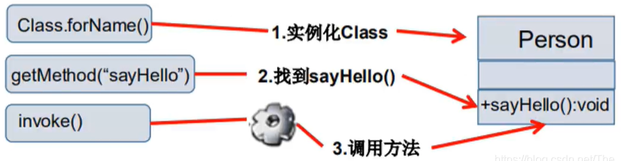

**Object invoke(Object obj,Object…args)**

- **Object 对应原方法的返回值，若原方法无返回值，此时返回null**
- **若原方法为静态方法，此时形参Object obj可为null**
- **若原方法形参列表为空，则Object[] args 为null**
- **若原方法声明为private，则需要在调用此invoke()方法前，显式调用方法对象的setAccessible(true)方法，将可访问private的方法**


#### setAccessible

- **Method 和 Field、Constructor 对象都有setAccessible()方法**
- **setAccessible作用是启动和禁用访问安全检查的开关**
- 参数值为true则指示反射的对象在使用时应该取消Java语言访问检查
  - **提高反射的效率，如果代码中必须用反射，而该句代码需要频繁的被调用，那么请设置为true**
  - **使得原本无法访问的私有成员也可以访问**
- **参数值为false则指示反射的对象应该实施Java语言访问检查**


### 性能测试

```java
public class Test10 {
    
    //普通方式调用
    public static void test01(){
        User user = new User();
        long start = System.currentTimeMillis();
        for (int i = 0; i < 1000000000; i++) {
            user.getName();
        }
        long end = System.currentTimeMillis();
        System.out.println("普通方法 :" + (end - start)  + " ms ");
    }
    //反射方式调用
    public static void test02() throws NoSuchMethodException, InvocationTargetException, IllegalAccessException {
        User user = new User();
        Class c1 = user.getClass();
        Method getName = c1.getDeclaredMethod("getName", null);
        long start = System.currentTimeMillis();
        for (int i = 0; i < 1000000000; i++) {
            getName.invoke(user,null);
        }
        long end = System.currentTimeMillis();
        System.out.println("普通方法 :" + (end - start)  + " ms ");
    }
    //反射方式调用 关闭权限检查
    public static void test03() throws NoSuchMethodException, InvocationTargetException, IllegalAccessException {
        User user = new User();
        Class c1 = user.getClass();
        Method getName = c1.getDeclaredMethod("getName", null);
        getName.setAccessible(true);
        long start = System.currentTimeMillis();
        for (int i = 0; i < 1000000000; i++) {
            getName.invoke(user,null);
        }
        long end = System.currentTimeMillis();
        System.out.println("普通方法 :" + (end - start)  + " ms ");
    }


    public static void main(String[] args) throws InvocationTargetException, NoSuchMethodException, IllegalAccessException {
    test01();
    test02();
    test03();
    }  

}
```

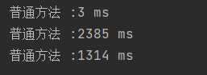


### 反射操作泛型

- **Java采用泛型擦除的机制来引入泛型，Java中的泛型仅仅是给编译器javac使用的，确保数据的安全性和免去强制类型转换问题，但是，一旦编译完成，所有和泛型有关的类型全部擦除**
- **为了通过反射操作这些类型，Java新增了ParemeterizedType，GeneriArrayType，TypeVariable 和 WildcardType 几种类型来代表不能被归一到Class类中的类型但是又和原始类型齐名的类型**


- **ParameterizedType：表示一种参数化类型，比如Collection<String> **
- **GeneriArrayType：表示一种元素类型是参数化类型或者类型变量的数组类型**
- **TypeVariable：是各种类型变量的公共父接口**
- **WildcardType：代表一种通配符类型表达式**


## 反射操作注解

- **getAnnotations**
- **getAnnotation**


### 练习：ORM

- 什么是ORM
  - **Object relationship Mapping --> 对象关系映射**


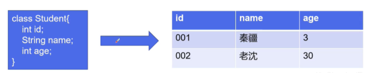

- **类和表结构对应**
- **属性和字段对应**
- **对象和记录对应**
- **要求：利用注解和反射完成类和表结构的映射关系**


```java
public class Test12 {

    public static void main(String[] args) throws ClassNotFoundException, NoSuchFieldException {

        Class c1 = Student2.class;
        Annotation[] annotations = c1.getDeclaredAnnotations();
        for (Annotation annotation : annotations) {
            System.out.println(annotation);
        }
        //获得注解的具体值
        Table1 table = (Table1) c1.getAnnotation(Table1.class);
        System.out.println(table.value());

        //获得类指定的注解
        Field1 f = c1.getDeclaredField("name").getAnnotation(Field1.class);
        System.out.println(f.columnName());
        System.out.println(f.type());
        System.out.println(f.length());
    }
}


@Table1("db-student")
class Student2{
    @Field1(columnName = "db-id",type = "int",length = 3)
    private  int id;
    @Field1(columnName = "db-",type = "in",length = 2)
    private  int age;
    @Field1(columnName = "db",type = "it",length = 1)
    private String name;

    public Student2() {
    }

    public Student2(int id, int age, String name) {
        this.id = id;
        this.age = age;
        this.name = name;
    }

    public int getId() {
        return id;
    }

    public void setId(int id) {
        this.id = id;
    }

    public int getAge() {
        return age;
    }

    public void setAge(int age) {
        this.age = age;
    }

    public String getName() {
        return name;
    }

    public void setName(String name) {
        this.name = name;
    }

    @Override
    public String toString() {
        return "Student2{" +
                "id=" + id +
                ", age=" + age +
                ", name='" + name + '\'' +
                '}';
    }
}


//类名注解
@Target(ElementType.TYPE)
@Retention(RetentionPolicy.RUNTIME)
@interface Table1{
    String value();
}

//属性注解
@Target(ElementType.FIELD)
@Retention(RetentionPolicy.RUNTIME)
@interface Field1{
    String columnName();
    String type();
    int length();
}
```


```java
public class Test09 {
    public static void main(String[] args) throws ClassNotFoundException, InstantiationException, IllegalAccessException, NoSuchMethodException, InvocationTargetException {
        //获得class对象
        Class c1 = Class.forName("reflectionStudy.User");


        //构造对象
        //User user = (User) c1.newInstance();
        User user = (User) c1.getDeclaredConstructor().newInstance();
        System.out.println(user);
        user = (User) c1.getDeclaredConstructor(String.class,int.class,int.class).newInstance("QQ",1,2);
        System.out.println(user);

        //反射调用普通方法 invoke(对象,参数);
        Method setName = c1.getMethod("setName", String.class);
        setName.invoke(user,"in");
        System.out.println(user.toString());

        //反射调用属性  不能调用私有属性，需要关掉安全检查
        Method name = c1.getDeclaredMethod("name");
        name.setAccessible(true);//true 为关掉安全检测
        name.invoke(user, "ii");
        System.out.println(user.getName().toString());
    }
}
```


```JAVA
class Person{
    public String name;

    public Person(){

    }
    public Person(String name) {
        this.name = name;
    }

    public String getName() {
        return name;
    }

    public void setName(String name) {
        this.name = name;
    }

    @Override
    public String toString() {
        return "Person{" +
                "name='" + name + '\'' +
                '}';
    }
}

class Student extends Person{
    public Student(){
        this.name = "学生";
    }
}
class Teacher extends Person{
    public Teacher(){
        this.name = "老师";
    }
}
```

