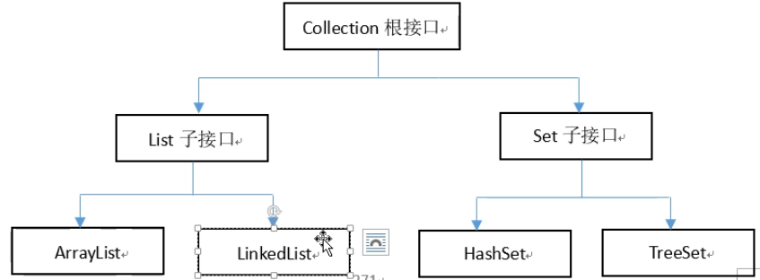
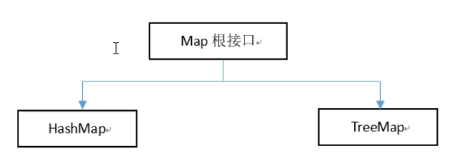
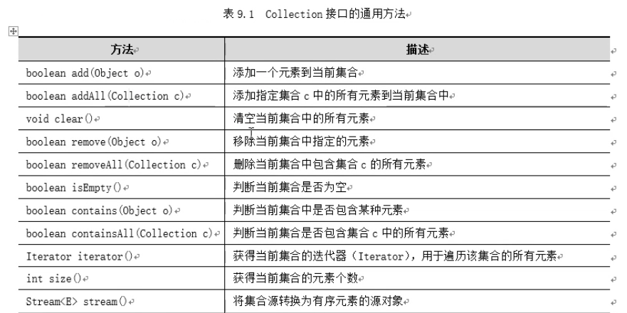
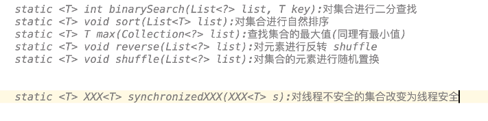
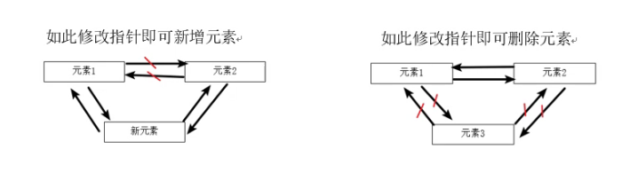
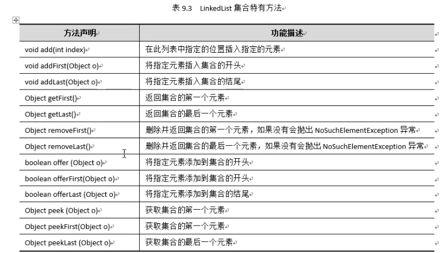
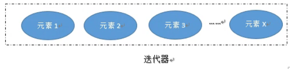
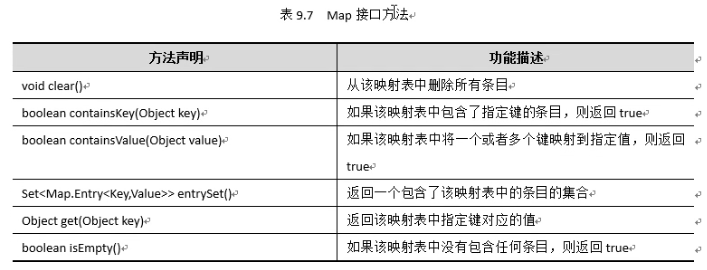
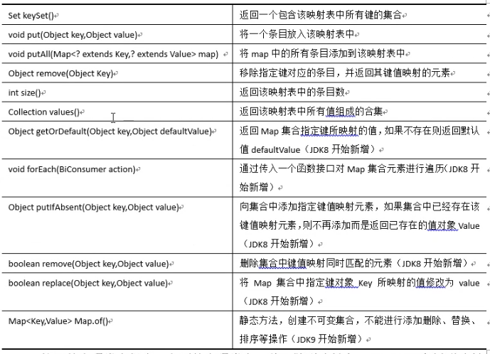

#集合

​	集合是Java中存放对象的容器，存放于java.util 包中。提到容器不难想到数组，集合类和数组的不同之处是，数组的长度是固定的，集合的长度是可变的。


## 集合基础知识

​	集合按照其存储结构可以分为 单列集合Collection 和 双列集合Map 两大类：

### Collection

​	(1)Collection:单列集合的根接口，Java中没有提供这个接口的直接实现类。但是却让其被继承产生了两个子接口，就是Set 和 List 。 

​	Set是一个无序集合，不能包含重复的元素。Set接口的主要实现类有HashSet 和 TreeSet； 

​	List是一个有序集合，可以包含重复的元素，可以通过索引访问进行方式。List接口的主要实现类有ArrayList 和 LinkedList。 





### Map

​	双列集合的根接口,所谓双列是指Map集合中存储的每一个元素都包括键(key)和值(value)两个要 “列”。键(key) 值(value)之间具有映射关系，通过指定的键(key)即可查找到对应的值(value)，例如根据一个学生的学号就能找到对应的学生。Map不能包含重复的key,但是可以包含相同的value. Map的主要实现类有HashMap和TreeMap.双列集合Map的体系结构。




# Collection双列根接口

​	Collection中定义了单列集合的一些通用方法，Collection根接口下的List子接口以及Set子接口下的所有实现类都适用。







​	


## List接口以及其实现类

​	实现了List接口的对象又称为List集合，List集合中存放的对象是有序的，可以重复的，所谓有序是指元素的存入顺序与取出顺序是一致的。List集合中的元素线性排列，通过索引访问集合中的元素。

​	List接口的实现类主要有ArrayList和LinkedList， 前者底层采用可变长度的数组，查找速
度快，但增删效率比较低，后者采用链表的结构，增删效率高，但查找速度较慢。

​	使用List时，通常声明List类型，可以通过不同的实现类来实例化集合。代码如下：

​		List<E> list = new ArrayList<E>();

​		List<E> list = new LinkedList<E>();

当具体调用到 ArrayList 或者 ListedList的具体库时，不能在使用List接口		

​		ArrayList<E> list = new ArrayList<E>();

​		ListedList<E> list = new LinkedList<E>();

​	在上面的代码中，E可以是合法的Java数据类型。例如，如果集合中的元素为字符串类
型，那么E可以修改为String，也可以是自定义类型，后面进泛型集合时会详细讲解。


###  ArrayList集合

​	ArrayList是应用最广泛的一一个集合，它是List接口中的一个实现类。ArrayList 集合底层是采用数组来保存元素，可以当做是一个长度可变的数组,并且允许同时保存不同类型的元素，包括null,可以根据索引对集合进行快速的随机访问，查找效率高，但每次添加或删除元素时都会导致重新创建新的数组，往ArrayList集合指定位置插入或删除数据时，还会伴随着后面数据的移动，添加或删除元素的速度较慢，效率较低。

​	ArrayList集合中大部分方法都是从Collection集合中继承过来的，通过下面的例子来学习一下如何使用Arraylist集合方法的各种操作。

```
System.out.println("ArrayList集合的定义方式");
ArrayList list = new ArrayList(); //方法一
//List list = new ArrayList();    //方法二

System.out.println("------计算长度集合---------");
System.out.println(list.size());

System.out.println("------添加元素---------");
list.add("学生1");//下标为0
list.add("学生2");//下表为1
list.add("学生3");//下标为2
System.out.println(list.size());

System.out.println("------利用下标取出集合中的元素---------");
System.out.println(list.get(1));
String student1 = (String) list.get(1);
System.out.println(student1);


System.out.println("------集合的遍历---------");
for (int i = 0; i <list.size() ; i++) {
    System.out.println((String)list.get(i));
}

System.out.println("-----插入的下标 在索引为0处插入----");
list.add(0,"张无忌是第一个同学");
for (int i = 0; i <list.size() ; i++) {
    System.out.println((String)list.get(i));
}

System.out.println("----插入的下标 在索引为0处修改-----");
list.set(1,"张无忌2是第二个同学");
for (int i = 0; i < list.size(); i++) {
    System.out.println((String)list.get(i));
}

System.out.println("-----查找元素(返回Boolean)-----");
System.out.println(list.contains("学生3"));//true

System.out.println("-----删除元素(可以利用下标/或者利用 元素值)--------");
list.remove(2);
list.remove("张无忌2");
for (int i = 0; i < list.size(); i++) {
    System.out.println((String)list.get(i));
}
System.out.println("-----清空集合--------");
list.clear();
System.out.println(list.size());
System.out.println(list.isEmpty()); //判断集合是否为空
```

```
ArrayList集合的定义方式
------计算长度集合---------
0
------添加元素---------
3
------利用下标取出集合中的元素---------
学生2
学生2
------集合的遍历---------
学生1
学生2
学生3
-----插入的下标 在索引为0处插入----
张无忌是第一个同学
学生1
学生2
学生3
----插入的下标 在索引为0处修改-----
张无忌是第一个同学
张无忌2是第二个同学
学生2
学生3
-----查找元素(返回Boolean)-----
true
-----删除元素(可以利用下标/或者利用 元素值)--------
张无忌是第一个同学
张无忌2是第二个同学
学生3
-----清空集合--------
0
true
```


### LinkedList集合

​	LinkedList类采用链表结构保存对象，这种结构的优点是便于向集合中插入和删除对象。该集合内部采用包含有两个Node（节点)类型的first和last属性维护了一个双向循环链表，链表中的每一个元素都引用了它的前一个元素和后一个元素，相当于每个元素前后都有一个指针，分别指向前一个元素和后一个元素，集合中的所有元素因此彼此相连。当需要在两个元素中间插入一个新元素时，最需要简单地修改元素之间的指针即可，删除集合中的一个元素也是类似的道理。






```
public static void main(String[] args) {
    //创建LinkedList 集合
    LinkedList linkedList = new LinkedList();
    // 添加元素
    linkedList.add("学生1");
    linkedList.add("学生2");
    linkedList.add("学生3");
    linkedList.add("学生4");
    System.out.println(linkedList); //输出集合中的元素
    linkedList.offer("后面添加的学生"); //向集合尾部添加元素
    linkedList.push("前面添加的学生"); //向集合头部添加元素
    System.out.println(linkedList);
    System.out.println(linkedList.get(1));
    //获取元素
    Object object = linkedList.peek(); //获取集合的第一个元素
    System.out.println(object); //输出集合的第一个元素
    System.out.println(linkedList);

    object =  linkedList.peekFirst(); //获取集合第一个元素
    System.out.println(object);
    System.out.println(linkedList);

    //删除元素
    linkedList.remove(); //删除集合第一个元素
    linkedList.pollLast();//删除集合最后一个元素
    System.out.println(linkedList);

    linkedList.offerLast("stu");
    System.out.println(linkedList);
}
```


### Iterator迭代器

​	迭代器是一个对象，用来遍历并选择序列中的对象（元素），而用户不必知道或关心该序列低层的结构。 简单理解成迭代器想象成为一个里面放置若干物件的容器，这些物件从第一个开始接一个前后线性排列。只是需要从第一个开始往后移动。

​	所有的集合类都实现了Iterator 接口，这是一个用于遍历集合中元素的接口，主要包
含以下三种方法:
	1.lterator iterator():返回一个Iterator 迭代器对象，Iterator 将准备好返回一个序列的第
一个元素。通俗地讲,集合调用了这个方法后就会将所有元素“封装”进上述的“容器”中，所有元素就成为了容器中有序排列的一个个“物件”。
	2.boolean hasNext():是否还有下一个元素。。
	3.Object next():返回下一个元素。。
思考:为什么next 方法返回类型是object呢?。
	这是为了可以接受任意类型的对象，那么返回的时候，不知道是什么类型的就定义为Object。


```
ArrayList list = new ArrayList();
list.add("计算机网络");
list.add("操作系统");
list.add("java编程思想");
list.add("java核心技术");
list.add("java语言程序设计");
System.out.println(list);
Iterator it = list.iterator();
while(it.hasNext()){ //遍历迭代器
    String book = (String) it.next();
    System.out.println(book);
}
```

​	对于迭代器的遍历,还要想象迭代器内部有个指针,初始时指向迭代器内的第一个元素的前面一位(null), 如图9.3所示，第一次调用next()方法时，指针从第一个对象的前面一位(null) 往后移动第一个对象(相当于移动了一位),并返回第一个对象，以后每调用一次next()方法,指针就会往后移一位,并且返回往后移一位后指向的那个对象。

​	

​	抛出了ConcurrentModificationException 并发修改异常。这是因为调用集合的remove方法删除了一个元素后导致迭代器的预期迭代次数改变，这种变化对迭代器是不可控的，从而迭代不准了。怎样避免这种错误呢?

​	一个办法是集合删除元素后如果后面不需要继续迭代，则调用break退出循环即可;

​	**第二个办法是不要使用集合的remove方法， 而是使用迭代器本身的remove方法，这个方法将使得预期的迭代次数变化对于迭代器来讲是可控的。上例中将list.remove(obj)改为it.remove()即可避免异常。**





### Foreach循环

​	Iterator对集合进行遍历用起来还是比较繁琐，Java后来提供了一个更加简洁的foreach
循环结构大大简化了遍历工作，foreach循环也称增强的for循环，可以用来处理集合中的每
个元素而不用考虑集合的索引。。


```
ArrayList list  = new ArrayList();
list.add("苹果");
list.add("香蕉");
list.add("西瓜");
list.add("葡萄");
for(Object object : list){
    System.out.println(object); //输出集合中的元素
}

String []fruits = {"t1","t2","t3"};
for(String fruit : fruits){
    System.out.println(fruit); //输出集合中的元素
}
```


## Set接口以及实现类

​	Set接口继承自Collection 接口，是一个用于存储和处理无重复元素的高效数据结构。
Set接口规定了存储的元素是不可重复的，无序的，无序是指集合元素的存储顺序与取出顺
序是不一定相同的，不可重复是指在一个Set 集合中，不能存在元素e1和e2,使得e1.equals(e2)的返回值为true。Set接口的三个具体实现类是:**散列类HashSet**,**链式散列类LinkedHashSet**和**树形集TreeSet**,本章重点介绍HashSet和TreeSet,其中HashSet通过元素的哈希值来确定其存储位置，存取与查找方便，TreeSet通过二叉树来存储元素，可以实现对集合中的元素排序。


### HashSet集合

​	HashSet实现了Set接口，当一个元素存入HashSet时首先会调用Object类的hashCode()方法来确定存储位置，然后判断该位置有没元素存在，如果没有就直接存入，如果该位置已经有对象，则调用equals()方法判断是否相等，如果不相等就存入，覆盖原有的对象，否则舍弃该对象，这种机制保证了HashSet中不会出现重复元素。 


```
Set set = new HashSet();
//HashSet  set = new HashSet();
set.add("beijing");
set.add("shanghai");
set.add("shenzhen");
set.add("guangz");
set.add(100);

for (Object object: set) {
    System.out.print(object + " ");
}
```

**输出**

```
100 shanghai shenzhen beijing guangz 
```


### ThreeSet集合

​	空---------


# Map单列接口及其实现类

​	Map接口提供了通过键快速获取、删除和更新键/值对的功能。Map (映射表)将值和键一起保存，如学校里通常将学生的学号做为键，学生的姓名作为值，学号和姓名一起保存，通过学生这个键就可以查找到学生的姓名这个值。键的作用类似索引，在List中，索引是整数;而在Map中，键可以是任意类型的对象，映射表中不能有重复的键，每个键都对应一个值。一个键和它的对应值构成一个条目（一个键值对)并保存在映射表中。






## HashMap集合

​	HashMap集合是Map接口的一- 个实现类,它存储的每一个 元素都是键值对<Key,Value>, 键和值均可以是任意类型,键和值都允许为空,但最多只允许一条 记录的键为null, HashMap集合的键不能重复，HashMap 集合的元素是无序的。HashMap集合根据键的HashCode值存储数据，具有很快的访问速度，不支持线程同步。
	对于键值对<Key,Value> , HashMap内部会将其封装成一个对应的 Entry<Key,Value>对象，即Entry<Key,Value> 对象是键值对<Key,Value>的组织形式。Entry<Key,Value>对象的getKey()方法返回键，getValue()方返回值。 
	对于每个Entry<Key,Value>对象而言，JVM 都会为其生成一个hashcode值。HashMap 在存储键值对Entry<Key,Value>的时候，会根据Key的hashcode值，以某种映射关系，决定应当将这对键值Entry<Key,Value>存储在HashMap中的什么位置上;当通过Key值取数据的时候，根据Key值的hashcode和内部映射条件，直接定位到Key对应的Value值存放在什么位置，可以非常高效地将Value值取出。

```
public static void main(String[] args) {
   //创建HashMap对象
    HashMap map = new HashMap();
    map.put("1","张无忌");
    map.put("6","李寻欢");
    map.put("3","韦小宝");
    map.put("4","韦小宝");
    map.put("1","李白");
    System.out.println(map);
    //查看键值对是否存在
    System.out.println(map.containsKey("1"));
    //获取指定键值对的映射值
    System.out.println(map.get("1"));
    //获取集合中键对象和值对象集合
    Set keys = map.keySet();
    System.out.println(keys);
    Collection values = map.values();
    System.out.println(values);

    //替换指定键值对的值
    map.replace("4","大佬");
    //删除指定键值对的元素
    map.remove("1");
    System.out.println(map);
    System.out.println(map.size());
}
```


## ThreeMap集合

​	空 ------


# 泛型集合


## ArrayList

```
public static void main(String[] args) {
    ArrayList<String> list = new ArrayList<String>();//定义了一个String类型的泛型集合
    list.add("孙悟空");
    list.add("奥特曼");
    //list.add(007); //这个存储不进去出现编译时异常
    list.add("007"); //必须要用String类型才可以
    
    //查找单个元素
    String hero = list.get(2);
    System.out.println(hero);
    
    //遍历
    for (String obj:list){
        System.out.println(obj);//遍历泛型集合时无需强制转换
    }
   
    System.out.println("-----------------------------");
    //创建四个学生对象
    Student stu1 = new Student("张无忌",18);
    Student stu2 = new Student("李寻欢",21);
    Student stu3 = new Student("白部曲",22);
    Student stu4 = new Student("考你老",22);
    List<Student>students = new ArrayList<Student>();//创建Student类型的泛型集合
    
    //添加学生对象元素到ArrayList集合
    students.add(stu1);
    students.add(stu2);
    students.add(stu3);
    students.add(stu4);
    Teacher teacher = new Teacher("张三","教室");
  //  students.add(teacher);
    System.out.println("集合的长度是:" + students.size());
    
    //查找单个元素
    Student stu = students.get(2);  //无需强转
    System.out.println("学生姓名:" + stu.getName()+ ", 学生年龄:" +stu.getAge());
    System.out.println("---------------------");

    // 遍历
    for(Student student:students){ //同样遍历时也无须强转
        //不会再出现类型转换异常了,因为泛型集合中只有Student 类型
        System.out.println(student.getAge() + " " + student.getName());
    }
```

## HashSet

```
public static void main(String[] args) {
    //创建了一个Set的集合对象
    Set<Student> set = new HashSet<Student>();
    Student stu1  =new Student("张无忌",18);
    Student stu2  =new Student("李寻欢",21);
    Student stu3  =new Student("李白",22);
    Student stu4  =new Student("张三",23);
    Teacher tea1  =new Teacher("张三","教室");
    set.add(stu1);
    set.add(stu2);
    set.add(stu3);
    set.add(stu4);
    //set.add(tea1); //教师类型无法存入这个集合
    System.out.println("------------遍历----------");
    for(Student a:set){ //无需强转类型
        System.out.println(a);
    }
```

```
007
孙悟空
奥特曼
007
-----------------------------
集合的长度是:4
学生姓名:白部曲, 学生年龄:22
---------------------
18 张无忌
21 李寻欢
22 白部曲
22 考你老
```


## HashMap


```
 public static void main(String[] args) {
        Map<String, Student>students  = new HashMap<String, Student>();
        //创建学生对象
        Student stu1 = new Student("张无忌",18);
        Student stu2 = new Student("李寻欢",21);
        Student stu3 = new Student("李白",22);
        Student stu4 = new Student("白居易",22);
        //创建教师对象
        Teacher teal = new Teacher("张三","教师");
        //添加元素
        students.put("101",stu1);
        students.put("102",stu2);
        students.put("103",stu3);
        students.put("104",stu4);
//      students.put("105",teal);//类型不匹配无法存入
        Student student = students.get("102"); //无须强转
        System.out.println(student.getAge() + " " + student.getName());

        Set<String> set = students.keySet();   //遍历健
        System.out.println("------遍历1--------");
        for (String key:set){
            Student value = students.get(key);
            System.out.println(key + " " + value.getName() + " " + value.getAge());
        }

        Collection<Student>  studs = students.values();
        System.out.println("-------遍历2---------");
        for (Student stu:studs){
            System.out.println(stu.getAge() + " " + stu.getName() + " " + stu);
        }

        System.out.println("-------遍历3 ---------");
        Set<Map.Entry<String,Student>> stus = students.entrySet(); //返回键值对的集合
        for(Map.Entry entry:stus){
            System.out.println(entry.getKey() + " |||" + entry.getValue());
        }

    }
```


# Student类

```
public class Student {
    private String name;
    private int age;

    public Student(){

    } 

    public Student(String name, int age) {
        super();
        this.name = name;
        this.age = age;
    }

    public String getName() {
        return name;
    }
    public void setName(String name) {
        this.name = name;
    }
    public int getAge() {
        return age;
    }
    public void setAge(int age) {
        this.age = age;
    }

    @Override
    public String toString(){
        return "姓名:"+this.name+",年龄:"+this.age;
    }
}

```


# Teacher类

```
public class Teacher {
    private String tname;
    private String title;
    public String getTname() {
        return tname;
    }
    public void setTname(String tname) {
        this.tname = tname;
    }
    public String getTitle() {
        return title;
    }
    public void setTitle(String title) {
        this.title = title;
    }
    public Teacher(String tname, String title) {
        super();
        this.tname = tname;
        this.title = title;
    }
    public Teacher() {

    }
    public String toString(){
        return "教师姓名:"+this.tname+",职称:"+this.title;
    }

}
```