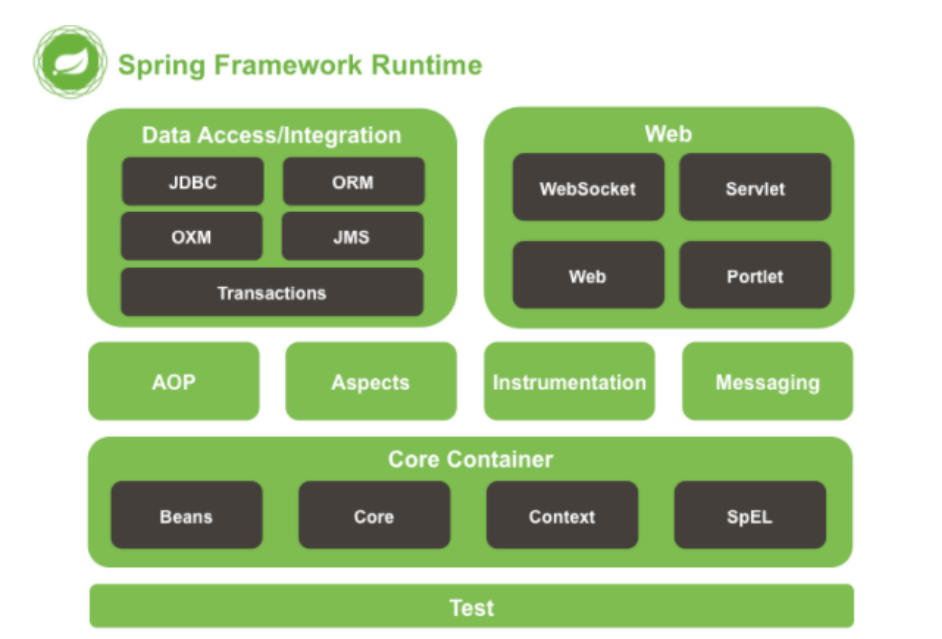
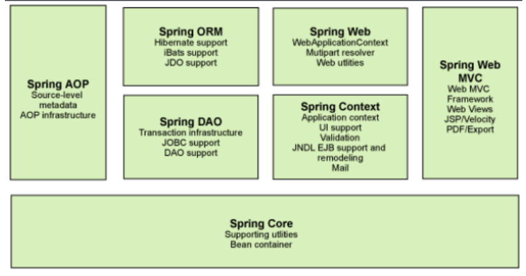
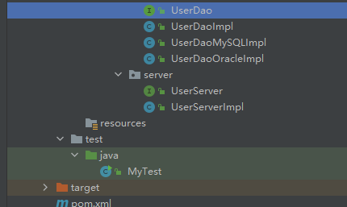
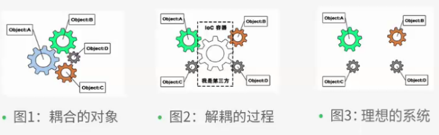
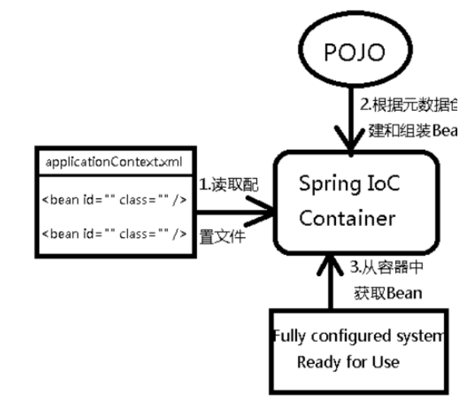

# 1、Spring概述


## **1.1** **简介**

* Spring : 春天 --->给软件行业带来了春天
* 2002年，Rod Jahnson首次推出了Spring框架雏形interface21框架。
* 2004年3月24日，Spring框架以interface21框架为基础，经过重新设计，发布了1.0正式版。
* Rod Johnson的学历 , 他是悉尼大学的博士，然而他的专业不是计算机，而是音乐学。
* Spring理念 : 使现有技术更加实用 . 本身就是一个大杂烩 , 整合现有的框架技术


* **SSH ： struts + spring +   hibernate**
* SSM :  Spring + SpringMVC + Mybatis


官网 : http://spring.io/

官方下载地址 : https://repo.spring.io/libs-release-local/org/springframework/spring/

GitHub : https://github.com/spring-projects


## **1.2** **优点**

Spring是一个开源免费的框架 , 容器 .

Spring是一个轻量级的框架 , 非侵入式的 .

**控制反转 IoC ,  面向切面 Aop**

对事物的支持 , 对框架的支持

一句话概括：Spring**是一个轻量级的控制反转(IoC )和面向切面(AOP)的容器（框架）。**

*[inversion](javascript:;) [of](javascript:;) [control](javascript:;)*       (Aspect Oriented Programming)

 


## 1.3组成





**Spring 框架是一个分层架构，由 7 个定义良好的模块组成。Spring 模块构建在核心容器之上，核心容器定义了创建、配置和管理 bean 的方式**




组成 Spring 框架的每个模块（或组件）都可以单独存在，或者与其他一个或多个模块联合实现。每个模

块的功能如下：

* **核心容器**：核心容器提供 Spring 框架的基本功能。核心容器的主要组件是 `**BeanFactory**` ，它是工厂模式的实现。 `BeanFactory` 使用控制反转（IOC） 模式将应用程序的配置和依赖性规范与实际的应用程序代码分开。
* **Spring 上下文**：Spring 上下文是一个配置文件，向 Spring 框架提供上下文信息。Spring 上下文包括企业服务，例如 JNDI、EJB、电子邮件、国际化、校验和调度功能。
* **Spring AOP**：通过配置管理特性，Spring AOP 模块直接将面向切面的编程功能 , 集成到了 Spring框架中。所以，可以很容易地使 Spring 框架管理任何支持 AOP的对象。Spring AOP 模块为基于Spring 的应用程序中的对象提供了事务管理服务。通过使用 Spring AOP，不用依赖组件，就可以将声明性事务管理集成到应用程序中。
* **Spring DAO**：JDBC DAO 抽象层提供了有意义的异常层次结构，可用该结构来管理异常处理和不同数据库供应商抛出的错误消息。异常层次结构简化了错误处理，并且极大地降低了需要编写的异常代码数量（例如打开和关闭连接）。Spring DAO 的面向 JDBC 的异常遵从通用的 DAO 异常层次结构。
* **Spring ORM**：Spring 框架插入了若干个 ORM 框架，从而提供了 ORM 的对象关系工具，其中包括 JDO、Hibernate 和 iBatis SQL Map。所有这些都遵从 Spring 的通用事务和 DAO 异常层次结构。
* **Spring Web 模块**：Web 上下文模块建立在应用程序上下文模块之上，为基于 Web 的应用程序提供了上下文。所以，Spring 框架支持与 Jakarta Struts 的集成。Web 模块还简化了处理多部分请求以及将请求参数绑定到域对象的工作。
* **Spring MVC 框架**：MVC 框架是一个全功能的构建 Web 应用程序的 MVC 实现。通过策略接口，MVC 框架变成为高度可配置的，MVC 容纳了大量视图技术，其中包括 JSP、Velocity、Tiles、iText和 POI。 


## 1.4拓展

**Spring Boot与Spring Cloud**

* Spring Boot 是 Spring 的一套快速配置脚手架，可以基于Spring Boot 快速开发单个微服务;

* Spring Cloud是基于Spring Boot实现的；

* Spring Boot专注于快速、方便集成的单个微服务个体，Spring Cloud关注全局的服务治理框架；

* Spring Boot使用了约束优于配置的理念，很多集成方案已经帮你选择好了，能不配置就不配置 ,

* Spring Cloud很大的一部分是基于Spring Boot来实现，Spring Boot可以离开Spring Cloud独立使用开发项目，但是Spring Cloud离不开Spring Boot，属于依赖的关系。

* SpringBoot在SpringClound中起到了承上启下的作用，如果你要学习SpringCloud必须要学习SpringBoot。


# 2、IOC基础


## 2.1 实现分析



**Dao层：**

```java
public interface UserDao {
    public void getUser();
}
```

```java
public class UserDaoImpl implements UserDao {

    @Override
    public void getUser() {
        System.out.println("UserDaoImpl");
    }
}
```

```java
public class UserDaoMySQLImpl implements UserDao{
    @Override
    public void getUser() {
        System.out.println("UserDao");
    }
}
```

**Server层：**

```java
public interface UserServer {
    public void getUser();
}
```

```java
public class UserServerImpl implements UserServer{
    private UserDao  userServer;
    public void setUserDao( UserDao userServer){
            this.userServer = userServer;
    }
    @Override
    public void getUser() {
        userServer.getUser();
    }
}
```

**测试类：**

```java
public class MyTest {
    public static void main(String[] args) {
        UserServerImpl userServer = new UserServerImpl();
        userServer.setUserDao(new UserDaoOracleImpl());
        userServer.getUser();
    }
}
```

**以往程序是主动创建对象!控制权在程序员手上!（主动创建对象）**

**在使用了set注入后，程序不再具有主动性，而是变成了被动的接受对象!**

这种思想，从本质上解决了问题，程序员不用再去管理对象的创建了。

**系统的耦合性大大降低性**，可以更加专注的在业务的实现上!这是IOC的原型!


## 2.2 IOC本质

**控制反转IoC(Inversion of Control)**，是一种设计思想，**DI(依赖注入)是实现IoC的一种方法**，也有人认
为DI只是IoC的另一种说法。没有IoC的程序中 , 我们使用面向对象编程 , 对象的创建与对象间的依赖关系
完全硬编码在程序中，对象的创建由程序自己控制，控制反转后将对象的创建转移给第三方，个人认为
所谓控制反转就是：获得依赖对象的方式反转了。





**IoC是Spring框架的核心内容**，使用多种方式完美的实现了IoC，可以使用XML配置，也可以使用注解，
新版本的Spring也可以零配置实现IoC。

Spring容器在初始化时先读取配置文件，根据配置文件或元数据创建与组织对象存入容器中，程序使用
时再从Ioc容器中取出需要的对象。




**采用XML方式配置Bean的时候，Bean的定义信息是和实现分离的**，而**采用注解**的方式可以把两者合为
一体，Bean的定义信息直接以注解的形式定义在实现类中，从而达到了零配置的目的。

**控制反转是一种通过描述（XML或注解）并通过第三方去生产或获取特定对象的方式。在Spring中实现**
**控制反转的是IoC容器，其实现方法是依赖注入（Dependency Injection,DI）。**


# 3、HelloSpring


## 3.1 导入Jar包 

注 : spring 需要导入commons-logging进行日志记录 . 我们利用maven , 他会自动下载对应的依赖项


## 3.2、编写代码


1. 编写一个Hello实体类

```java
public class Hello {

    private String str;

    public Hello() {
    }

    public Hello(String str) {
        this.str = str;
    }

    public String getStr() {
        return str;
    }

    public void setStr(String str) {
        this.str = str;
    }

    @Override
    public String toString() {
        return "Hello{" +
                "str='" + str + '\'' +
                '}';
    }
}

```

2. 编写我们的spring文件 , 这里我们命名为beans.xml

```xml
<?xml version="1.0" encoding="UTF-8"?>
<beans xmlns="http://www.springframework.org/schema/beans"
       xmlns:xsi="http://www.w3.org/2001/XMLSchema-instance"
       xsi:schemaLocation="http://www.springframework.org/schema/beans
        https://www.springframework.org/schema/beans/spring-beans.xsd">
    <!-- Use Spring new create  a object , in spring this object  be  called  Bean
       类型  变量名 = new 类型();
       Hello hello = new Hello();

       id = 变量
       class = new 的对象
       property 相当于给对象中的属性设置一个值!

    -->
    <bean id="hello" class="com.compare.pojo.Hello">
        <property name="str" value="Spring"></property>
    </bean>
</beans>
```


3. 我们可以去进行测试了 

```java
public class MyTest {
    public static void main(String[] args) {
        //获取Spring 的上下文对象！
        ApplicationContext context = new ClassPathXmlApplicationContext("beans.xml");
        //我们的对象现在都在Spring中的管理了，我们要使用，直接去里面取出来就可以！
        Hello hello = (Hello) context.getBean("hello");
        System.out.println(hello.toString());
    }
}
```


## 3.3、思考

* Hello 对象是谁创建的 ? 【 hello 对象是由Spring创建的 】
* Hello 对象的属性是怎么设置的 ? 【hello 对象的属性是由Spring容器设置的 】这个过程就叫控制反转 :
* 控制 : 谁来控制对象的创建 , 传统应用程序的对象是由程序本身控制创建的 , 使用Spring后 , 对象是由Spring来创建的
  反转 : 程序本身不创建对象 , 而变成被动的接收对象 .
  依赖注入 : 就是利用set方法来进行注入的.
* <font color='red'>IOC是一种编程思想，由主动的编程变成被动的接收</font>
  可以通过newClassPathXmlApplicationContext去浏览一下底层源码 。


​                                                                                                                                                                                                                                                                                                                                                                                                                                                                                                                                                                                                                                                                                                                                                                                                                                                                                                                                                                                                                                                                                                                                                                                                                                                                                                                                                                                                                                                                                                                                                                                                                                                                                                                                                                                                                                                                                                                                                                                                                                                                                                                                                                                                                                                                                                                                                                                                                                                                                                                                                                                                                                                                                                                                                                                                                                                                                                                                                                                                                                                                                                                                                                                                                                                                                                                                                                                                                                                                                                                                                                                                                                                                                                                                                                                                                                                                                                                                                                                                                                                                                                                                                                                                                                                                                                                                                                                                                                                                                                                                                                                                                                                                                                                                                                                                                                                                                                                                                                                                                                                                                                                                                                                                                                                                                                                                                                                                                                                                                                                                                                                                                                                                                                                                                                                                                                                                                                                                                                                                                                                                                                                                                                                                                                                                                                                                                                                                                                                                                                                                                                                                                                                                                                                                                                                                                                                                                                                                                                                                                                                                                                                                                                                                                                                                                                                                                                                                                                                                                                                                                                                                                                                                                                                                                                                                                                                                                                                                                                                                                                                                                                                                                                                                                                                                                                                                                                                                                                                                                                                                                                                                                                                                                                                                                                                                                                                                                                                                                                                                                                                                                                                                                                                                                                                                                                                                                                                                                                                                                                                                                                                                                                                                                                                                                                                                                                                                                                                                                                                                                                                                                                                                                                                                                                                                                                                                                                                                                                                                                                                                                                                                                                                                                                                                                                                                                                                                                                                                                                                                                                                                                                                                                                                                                                                                                                                                                                                                                                                                                                                                                                                                                                                                                                                                                                                                                                                                                                                                                                                                                                                                                                                                                                                                                                                                                                                                                                                                                                                                                                                                                                                                                                                                                                                                                                                                                                                                                                                                                                                                                                                                                                                                                                                                                                                                                                                                                                                                                                                                                                                                                                                                                                                                                                                                                                                                                                                                                                                                                                                                                                                                                                                                                                                                                                                                                                                                                                                                                                                                                                                                                                                                                                                                                                                                                                                                                                                                                                                                                                                                                                                                                                                                                                                                                                                                                                                                                                                                                                                                                                                                                                                                                                                                                                                                                                                                                                                                                                                                                                                                                                                                                                                                                                                                                                                                                                                                                                                                                                                                                                                                                                                                                                                                                                                                                                                                                                                                                                                                                                                                                                                                                                                                                                                                                                                                                                                                                                                                                                                                                                                                                                                                                                                                                                                                                                                                                                                                                                                                                                                                                                                                                                                                                                                                                                                                                                                                                                                                                                                                                                                                                                                                                                                                                                                                                                                                                                                                                                                                                                                                                                                                                                                                                                                                                                                                                                                                                                                                                                                                                                                                                                                                                                                                                                                                                                                                                                                                                                                                                                                                                                                                                                                                                                                                                                                                                                                                                                                                                                                                                                                                                                                                                                                                                                                                                                                                                                                                                                                                                                                                                                                                                                                                                                                                                                                                                                                                                                                                                                                                                                                                                                                                                                                                                                                                                                                                                                                                                                                                                                                                                                                                                                                                                                                                                                                                                                                                                                                                                                                                                                                                                                                                                                                                                                                                                                                                                                                                                                                                                                                                                                                                                                                                                                                                                                                                                                                                                                                                                                                                                                                                                                                                                                                                                                                                                                                                                                                                                                                                                                                                                                                                                                                                                                                                                                                                                                                                                                                                                                                                                                                                                                                                                                                                                                                                                                                                                                                                                                                                                                                                                                                                                                                                                                                                                                                                                                                                                                                                                                                                                                                                                                                                                                                                                                                                                                                                                                                                                                                                                                                                                                                                                                                                                                                                                                                                                                                                                                                                                                                                                                                                                                                                                                                                                                                                                                                                                                                                                                                                                                                                                                                                                                                                                                                                                                                                                                                                                                                                                                                                                                                                                                                                                                                                                                                                                                                                                                                                                                                                                                                                                                                                                                                                                                                                                                                                                                                                                                                                                                                                                                                                                                                                                                                                                                                                                                                                                                                                                                                                                                                                                                                                                                                                                                                                                                                                                                                                                                                                                                                                                                                                                                                                                                                                                                     

# 4、IOC创建对象方式

扫描xml配置文件，拆解xml文件，反射创建实体类，放入ioc容器。

## 4.1通过无参构造方法来创建


## 4.2.通过有参构造方法来创建

```java
 <!-- 方式一：通过下标    -->
<bean id="user" class="com.compare.pojo.User">
     <constructor-arg index="0" value="SDk"></constructor-arg>
<constructor-arg index="1" value="SDk"></constructor-arg>
</bean>
```

```java
 <!--  方式二：通过属性类型  想同类型时，取按照顺序进行赋值 -->
    <bean id="user" class="com.compare.pojo.User">
        <constructor-arg type="java.lang.String" value="TenXun"></constructor-arg>
        <constructor-arg type="java.lang.String" value="Bilibli"></constructor-arg>
    </bean>
```

```java
 <!--  方式三：通过变量名进行赋值    -->
 <bean id="user" class="com.compare.pojo.User">
    <constructor-arg name="str" value="TenXun"></constructor-arg>
    <constructor-arg name="string" value="Bilibli"></constructor-arg>
 </bean>
```


结论：在配置文件加载的时候。其中管理的对象都已经初始化了！


# 5、Spring 配置

## 5.1 别名

alias 设置别名 , 为bean设置别名 , 可以设置多个别名

```xml
<bean id="user" class="com.compare.pojo.User">
    <constructor-arg name="str" value="TenXun"></constructor-arg>
    <constructor-arg name="string" value="Bilibli"></constructor-arg>
</bean>

<!--    为user取别名为user2-->
<alias name="user" alias="user2"></alias>
```


## 5.2. Bean的配置 

```xml
<!--bean就是java对象,由Spring创建和管理-->
<!--
id 是bean的标识符,要唯一,如果没有配置id,name就是默认标识符
如果配置id,又配置了name,那么name是别名 name可以设置多个别名,可以用逗号,分号,空格隔开
如果不配置id和name,可以根据applicationContext.getBean(.class)获取对象;
class是bean的全限定名=包名+类名
-->
<bean id="hello2" name="hello1 h2,h3;h4" class="com.compare.pojo.User">
    <constructor-arg name="str" value="TenXun"></constructor-arg>
    <constructor-arg name="string" value="Bilibli"></constructor-arg>
    <property name="str" value="Spring"/>
</bean>
```


## 5.3. import

团队的合作通过import来实现 

```xml
<import resource="{path}/beans.xml"/> 
```


# 6、依赖注入（DI）


依赖注入（Dependency Injection,DI）。
依赖 : 指Bean对象的创建依赖于容器 . Bean对象的依赖资源 .
注入 : 指Bean对象所依赖的资源 , 由容器来设置和装配 .


## 6.1 构造器注入

我们在之前的案例4已经详细讲过了


## 6.2 set方法注入 (重点)


要求被注入的属性 , 必须有set方法 , set方法的方法名由 set + 属性首字母大写 , 如果属性是boolean类型, 没有set方法 , 是 is 。


测试pojo类 :

```java
public class Address {
    private String address;
    public String getAddress() {
        return address;
    }
    public void setAddress(String address) {
        this.address = address;
    }
    @Override
    public String toString() {
        return "Address{" +
                "address='" + address + '\'' +
                '}';
    }
}
```


```java
public class Student {
    private String name;
    private Address address;
    private String[] books;
    private List<String> hobbys;
    private Map<String, String> card;
    private Set<String> games;
    private String wife;
    private Properties info;

    public Student() {

    }
    
    public Student(String name) {

    }
    
    public String getName() {
        return name;
    }

    public void setName(String name) {
        this.name = name;
    }

    public Address getAddress() {
        return address;
    }

    public void setAddress(Address address) {
        this.address = address;
    }

    public String[] getBooks() {
        return books;
    }

    public void setBooks(String[] books) {
        this.books = books;
    }

    public List<String> getHobbys() {
        return hobbys;
    }

    public void setHobbys(List<String> hobbys) {
        this.hobbys = hobbys;
    }

    public Map<String, String> getCard() {
        return card;
    }

    public void setCard(Map<String, String> card) {
        this.card = card;
    }

    public Set<String> getGames() {
        return games;
    }

    public void setGames(Set<String> games) {
        this.games = games;
    }

    public String getWife() {
        return wife;
    }

    public void setWife(String wife) {
        this.wife = wife;
    }

    public Properties getInfo() {
        return info;
    }

    public void setInfo(Properties info) {
        this.info = info;
    }

    @Override
    public String toString() {
        return "Student{" +
                "name='" + name + '\'' +
                ", address=" + address.toString() +
                ", books=" + Arrays.toString(books) +
                ", hobbys=" + hobbys +
                ", card=" + card +
                ", games=" + games +
                ", wife='" + wife + '\'' +
                ", info=" + info +
                '}';
    }
}
```


注入：

```xml
<?xml version="1.0" encoding="UTF-8"?>
<beans xmlns="http://www.springframework.org/schema/beans"
       xmlns:xsi="http://www.w3.org/2001/XMLSchema-instance"
       xsi:schemaLocation="http://www.springframework.org/schema/beans http://www.springframework.org/schema/beans/spring-beans.xsd">

    <bean id="address" class="com.company.pojo.Address"></bean>

    <bean id="student" class="com.company.pojo.Student">
        <!--  值注入   value    -->
        <property name="name" value="小明"></property>

        <!--  bean 注入 ref     -->
        <property name="address" ref="address"></property>

        <!--  数组注入      -->
        <property name="books">
            <array>
                <value>书名一</value>
                <value>书名二</value>
                <value>书名三</value>
            </array>
        </property>

        <!-- List注入-->
        <property name="hobbys">
            <list>
                <value>听歌</value>
                <value>看电影</value>
                <value>爬山</value>
                <value>游泳</value>
            </list>
        </property>

        <!--  Map注入-->
        <property name="card">
            <map>
                <entry key="中国邮政" value="123123123123"></entry>
                <entry key="中国建设" value="123123123123"></entry>
            </map>
        </property>

        <!--  set注入  -->
        <property name="games">
            <set>
                <value>lol</value>
                <value>BoB</value>
                <value>CoC</value>
            </set>
        </property>

        <!--   Null注入     -->
        <property name="wife">
            <null></null>
        </property>

        <!--  Properties注入    -->
        <property name="info">
            <props>
                <prop key="学号">419450230</prop>
                <prop key="性别">男</prop>
                <prop key="姓名">小明</prop>
            </props>
        </property>
        
    </bean>


</beans>
```

测试类：

```java
public class MyTest {
    public static void main(String[] args) {
        ApplicationContext applicationContext = new ClassPathXmlApplicationContext("beans.xml");
        Student student = (Student) applicationContext.getBean("student");
        System.out.println(student.toString());
    }
}
```


## 6.3 拓展注入实现

User.java ： 【注意：这里没有有参构造器！】

```JAVA
 public class User {

    private String name;
    private int age;

    public String getName() {
        return name;
    }

    public User() {
    }

    public User(String name, int age) {
        this.name = name;
        this.age = age;
    }

    public void setName(String name) {
        this.name = name;
    }

    public int getAge() {
        return age;
    }

    public void setAge(int age) {
        this.age = age;
    }

    @Override
    public String toString() {
        return "User{" +
                "name='" + name + '\'' +
                ", age=" + age +
                '}';
    }
}
```


1、P命名空间注入 : 需要在头文件中假如约束文件

2、c 命名空间注入 : 需要在头文件中假如约束文件

```xml
   <!--P(属性: properties)命名空间 , 属性依然要设置set方法-->
    <bean id="user" class="com.company.pojo.User" p:age="15" p:name="小明"></bean>

    <!--C(构造: Constructor)命名空间 , 属性依然要设置set方法-->
    <bean id="user1" class="com.company.pojo.User" c:age="18" c:name="小红"></bean>
```

发现问题：爆红了，刚才我们没有写有参构造！

解决：把有参构造器加上，这里也能知道，c 就是所谓的构造器注入！

```xml
   xmlns:p="http://www.springframework.org/schema/p"
   xmlns:c="http://www.springframework.org/schema/c"
```


## 6.4 Bean的作用域

在Spring中，那些组成应用程序的主体及由Spring IoC容器所管理的对象，被称之为bean。

简单地讲，bean就是由IoC容器初始化、装配及管理的对象 。


几种作用域中，request、session作用域仅在基于web的应用中使用（不必关心所采用的是什么web应用框架），只能用在基于web的Spring ApplicationContext环境。


#### 6.4.1 Singleton

当一个bean的作用域为Singleton，那么Spring IoC容器中只会存在一个共享的bean实例，并且所有对bean的请求，只要id与该bean定义相匹配，则只会返回bean的同一实例。Singleton是单例类型，就是在创建起容器时就同时自动创建了一个bean的对象，不管你是否使用，他都存在了，每次获取到的对象都是同一个对象。注意，Singleton作用域是Spring中的缺省作用域。要在XML中将bean定义成

singleton，可以这样配置：

```xml
<bean id="ServiceImpl" class="cn.csdn.service.ServiceImpl" scope="singleton">
```


#### 6.4.2 Prototype

当一个bean的作用域为Prototype，表示一个bean定义对应多个对象实例。Prototype作用域的bean会导致在每次对该bean请求（将其注入到另一个bean中，或者以程序的方式调用容器的getBean()方法）时都会创建一个新的bean实例。Prototype是原型类型，它在我们创建容器的时候并没有实例化，而是当我们获取bean的时候才会去创建一个对象，而且我们每次获取到的对象都不是同一个对象。根据经验，对有状态的bean应该使用prototype作用域，而对无状态的bean则应该使用singleton作用域。在XML中将bean定义成prototype，可以这样配置：

```xml
<bean id="account" class="com.foo.DefaultAccount" scope="prototype"/>
```


#### 6.4.3 Request

当一个bean的作用域为Request，表示在一次HTTP请求中，一个bean定义对应一个实例；即每个HTTP请求都会有各自的bean实例，它们依据某个bean定义创建而成。该作用域仅在基于web的SpringApplicationContext情形下有效。考虑下面bean定义：

```xml
<bean id="loginAction" class=cn.csdn.LoginAction" scope="request"/>
```


针对每次HTTP请求，Spring容器会根据loginAction bean的定义创建一个全新的LoginActionbean实例，且该loginAction bean实例仅在当前HTTP request内有效，因此可以根据需要放心的更改所建实例的内部状态，而其他请求中根据loginAction bean定义创建的实例，将不会看到这些特定于某个请求的状态变化。当处理请求结束，request作用域的bean实例将被销毁。


#### 6.4.4 Session

当一个bean的作用域为Session，表示在一个HTTP Session中，一个bean定义对应一个实例。该作用域仅在基于web的Spring ApplicationContext情形下有效。考虑下面bean定义：

```xml
<bean id="userPreferences" class="com.foo.UserPreferences" scope="session"/>
```


**针对某个HTTP Session，Spring容器会根据userPreferences bean定义创建一个全新的userPreferences bean实例，且该userPreferences bean仅在当前HTTP Session内有效。与request作用域一样，可以根据需要放心的更改所创建实例的内部状态，而别的HTTP Session中根据userPreferences创建的实例，将不会看到这些特定于某个HTTP Session的状态变化。当HTTP Session最终被废弃的时候，在该HTTP Session作用域内的bean也会被废弃掉。**


# 7、Bean的自动装配

* 自动装配是使用spring满足bean依赖的一种方法

* spring会在应用上下文中为某个bean寻找其依赖的bean。


Spring中bean有三种装配机制，分别是：

1. 在xml中显式配置；

2. 在java中显式配置；

3. <font color='red'>隐式的bean发现机制和自动装配。</font>

  这里我们主要讲第三种：自动化的装配bean。

Spring的自动装配需要从两个角度来实现，或者说是两个操作：

1. 组件扫描(component scanning)：spring会自动发现应用上下文中所创建的bean； 

2. 自动装配(autowiring)：spring自动满足bean之间的依赖，也就是我们说的IoC/DI； 

   

组件扫描和自动装配组合发挥巨大威力，使的显示的配置降低到最少。
  <font color='red'>   推荐不使用自动装配xml配置 , 而使用注解 。</font>


## 7.1byName


**autowire byName (按名称自动装配)**

1. 修改bean配置，增加一个属性 autowire="byName" 

2. 再次测试，结果依旧成功输出！

3. 我们将 cat 的bean id修改为 catXXX

4. 再次测试， 执行时报空指针java.lang.NullPointerException。因为按byName规则找不对应set方

法，真正的setCat就没执行，对象就没有初始化，所以调用时就会报空指针错误。

> ```xml
> <bean id="user" class="com.compare.pojo.User" autowire="byName"></bean>
> ```


**<font color='red'>小结</font>：**

当一个bean节点带有 autowire byName的属性时。

1. 将查找其类中所有的set方法名，例如setCat，获得将set去掉并且首字母小写的字符串，即cat。 

2. 去spring容器中寻找是否有此字符串名称id的对象。

3. 如果有，就取出注入；如果没有，就报空指针异常。


## 7.2byType


> ```xml
> <bean id="user" class="com.compare.pojo.User" autowire="byType"></bean>
> ```

