## 7.3byType

**autowire byType (按类型自动装配)**

使用autowire byType首先需要保证：同一类型的对象，在spring容器中唯一。如果不唯一，会报不唯一的异常。

> **NoUniqueBeanDefinitionException**

> ```xml
> <bean id="user" class="com.compare.pojo.User" autowire="byType"></bean>
> ```

1. 将user的bean配置修改一下 ： autowire="byType"

2. 测试，正常输出
3. 在注册一个cat 的bean对象！

```xml
    <bean id="cat" class="com.compare.pojo.Cat"></bean>
    <bean id="cat2" class="com.compare.pojo.Cat"></bean>
    <bean id="dog" class="com.compare.pojo.Dog"></bean>
```

4. 测试，报错：NoUniqueBeanDefinitionException

5. 删掉cat2，将cat的bean名称改掉！测试！

  按类型装配，所以并不会报异常，也不影响最后的结果。甚至将id属性去掉，也不影响结果。
  这就是按照类型自动装配！

  


<font color='red'>小结</font> : 

* byname: 保证bean的id唯一，并且bean需要和自动注入的属性的set方法一致！
* bytype：保证bean的class唯一，并且bean需要和自动注入的属性类型一致


## 7.4 使用注解


jdk1.5开始支持注解，spring2.5开始全面支持注解。

准备工作： 

* xml文件配置映入context文件：

```xml
<?xml version="1.0" encoding="UTF-8"?>
<beans xmlns="http://www.springframework.org/schema/beans"
    xmlns:xsi="http://www.w3.org/2001/XMLSchema-instance"
    xmlns:context="http://www.springframework.org/schema/context"
    xsi:schemaLocation="http://www.springframework.org/schema/beans
        http://www.springframework.org/schema/beans/spring-beans.xsd
        http://www.springframework.org/schema/context
        http://www.springframework.org/schema/context/spring-context.xsd">

    <context:annotation-config/>

</beans>
```


### 7.4.1 @Autowired

### 7.4.2 @Qualifier

* @Autowired是按类型自动转配的，不支持id匹配。(但在加上 @Qualifier("xxx") 即可进行id匹配)

* @Autowired是根据类型自动装配的，加上@Qualifier则可以根据byName的方式自动装配

* @Qualifier不能单独使用。

  

* ```java
  @Autowired(required = false)
  @Qualifier("cat2")
  private Cat cat;
  ```

  

@Autowired(required=false) 说明： false，对象可以为null；true，对象必须存对象，不能为null。

```java
//如果允许对象为null，设置required = false,默认为true 
@Autowired(required = false) private Cat cat;
```


科普 ： 

> <font color='red'>@Nullable</font>:   字段标记 注解，说明这个字段可以为null


### 7.4.3 @Resource

* @Resource如有指定的name属性，先按该属性进行byName方式查找装配；
* 其次再进行默认的byName方式进行装配；
* 如果以上都不成功，则按byType的方式自动装配。

```java
@Resource(name = "dog")
private Dog dog1;
```


> <font color='red'>结论：先进行byName查找，失败；再进行byType查找，成功。</font>


<font color='red'>小结：</font> @Autowired与@Resource异同：

1. 都可以用来装配bean。可以写在字段上，或写在setter方法上。

2. @Autowired默认按类型装配（属于spring规范），默认情况下必须要求依赖对象必须存在，如果要允许null 值，可以设置它的required属性为false，如：@Autowired(required=false) ，如果想使用名称装配可以结合@Qualififier注解进行使用

3. @Resource（属于J2EE复返），默认按照名称进行装配，名称可以通过name属性进行指定。如果没有指定name属性，当注解写在字段上时，默认取字段名进行按照名称查找，如果注解写在setter方法上默认取属性名进行装配。 当找不到与名称匹配的bean时才按照类型进行装配。但是需要注意的是，如果name属性一旦指定，就只会按照名称进行装配。

   

   

   **作用相同都是用注解方式注入对象，但执行顺序不同。**

   @Autowired先byType，@Resource先 byName。


# 8、使用注解开发

在Spring4之后，要使用注解开发，必须导入aop包


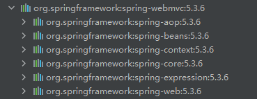


使用注解需要导入context约束，增加注解的支持

```xml
<?xml version="1.0" encoding="UTF-8"?>
<beans xmlns="http://www.springframework.org/schema/beans"
    xmlns:xsi="http://www.w3.org/2001/XMLSchema-instance"
    xmlns:context="http://www.springframework.org/schema/context"
    xsi:schemaLocation="http://www.springframework.org/schema/beans
        http://www.springframework.org/schema/beans/spring-beans.xsd
        http://www.springframework.org/schema/context
        http://www.springframework.org/schema/context/spring-context.xsd">

    <context:annotation-config/>

</beans>
```


## 8.1 Bean的实现

我们之前都是使用 bean 的标签进行bean注入，但是实际开发中，我们一般都会使用注解！


1. 配置扫描哪些包下的注解

   ```xml
   <context:component-scan base-package="com.compare"></context:component-scan>
   ```

   <font color='red'>配置`component--scan ` 是扫描@component 扫描包下的注解，就不用配置 `annotation-config`驱动支持</font>

   

2. 在指定包下编写类，增加注解

```java
// 等价于   <bean id="user" class="com.compare.pojo.User"></bean>
// @Component 组件
@Component
public class User {
    @Value("小明")
   public String  name;
}
```

3. 测试 ： ClassPathXmlApplicationContext("applicationContext.xml");  进行测试


## 8.2属性注入

使用注解注入属性

1. 可以不用提供set方法，直接在直接名上添加@value("值")

   ```java
   @Value("秦疆") 
   // 相当于配置文件中 <property name="name" value="秦疆"/> 
   public String name;
   ```

   

2. 如果提供了set方法，在set方法上添加@value("值");

```java
public String name;

@Value("秦疆")
public void setName(String name) {
    this.name = name;
}
```


## 8.3衍生注解

注解，就是替代了在配置文件当中配置步骤而已！更加的方便快捷！
<font color='red'>@Component三个衍生注解</font>
为了更好的进行分层，Spring可以使用其它三个注解，功能一样，目前使用哪一个功能都一样。
@Controller：web层
@Service：service层
@Repository：dao层
写上这些注解，就相当于将这个类交给Spring管理装配了！


## 8.4自动装配注解 

在Bean的自动装配已经讲过了，可以回顾！


## 8.5作用域

@scope

* singleton：默认的，Spring会采用单例模式创建这个对象。关闭工厂 ，所有的对象都会毁。

  

* prototype：多例模式。关闭工厂 ，所有的对象不会销毁。内部的垃圾回收机制会回收

```java
@Component
@Scope("singleton")
public class User {
    @Value("小明")
   public String  name;
}
```


<font color='red'>小结: </font>XML与注解比较

* XML可以适用任何场景 ，结构清晰，维护方便

* 注解不是自己提供的类使用不了，开发简单方便

   

  

  <font color='red'>xml与注解整合开发 </font>：推荐最佳实践

  * xml管理Bean

  * 注解完成属性注入

  * 使用过程中， 可以不用扫描，扫描是为了类上的注解

    

```xml
<context:annotation-config/>
```

作用：
进行注解驱动注册，从而使注解生效
用于激活那些已经在spring容器里注册过的bean上面的注解，也就是显示的向Spring注册
如果不扫描包，就需要手动配置bean
如果不加注解驱动，则注入的值为null！


## 8.6基于Java类配置

JavaConfig 原来是 Spring 的一个子项目，它通过 Java 类的方式提供 Bean 的定义信息。

在 Spring4 的版本， JavaConfig 已正式成为 Spring4 的核心功能 。


测试：1. 编写一个实体类，User


```java
//将这个类标注为Spring的一个组件，放到容器中！ 
	public class User { 
	public String name = "小明"; 
}
```

<font color='red'>Configuration</font>

2. 新建一个config配置包，编写一个MyConfig配置类

```java
//代表这是一个配置类
@Configuration
@ComponentScan("com.compare.pojo")
@Import(MyConfig2.class) //导入合并其他配置类，类似于配置文件中的 Import 标签
public class MyConfig {

    //通过方法注册一个bean，
    // 这里的返回值就Bean的类型 class属性，方法名就是bean的id id属性！
    @Bean
    public User getUser() {
        return new User(); //返回要注入到Bean的对象

    }
}
```


3.测试  <font color='red'>` AnnotationConfigApplicationContext()`</font>

```java
public class MyTest {
    public static void main(String[] args) {
     ApplicationContext myConfig = new AnnotationConfigApplicationContext(MyConfig.class);
        User getUser = myConfig.getBean("getUser", User.class);
        System.out.println(getUser.toString());
    }
}
```


# 9、代理模式


<font color='red'>**AOP的底层机制是动态代理**</font>


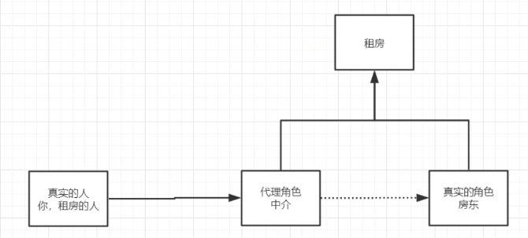


## 9.1静态代理


静态代理角色分析：

* 抽象角色：一般使用接口或者抽象类来实现
* 真实角色：被代理的角色
* 代理角色：代理真实角色；代理真实角色后一般会进行一些附属操作
* 客户：访问代理角色的人 


代码步骤：

1. 接口

   ```java
   /**
    * 抽象角色 ： 一般使用接口或者抽象类来实现
    */
   public interface Rent {
       public void rent();
   }
   ```

2. 真实角色

   ```java
   public class Host implements Rent{
       @Override
       public void rent() {
           System.out.println("出租房间");
       }
   }
   ```

3. 代理角色

   ```java
   /**
    * 代理角色： 中介
    */
   public class Proxy implements Rent{
   
       private Host host;
   
       public Proxy(Host host) {
           this.host = host;
       }
   
       @Override
       public void rent() {
           seeHome();
           host.rent();
           buying();
       }
       public void seeHome(){
           System.out.println("看房子");
       }
       public void buying (){
           System.out.println("签合同");
       }
   }
   ```

4. 客户端访问

```java
/**
 * 客户： 一般是客户找代理
 */
public class Client {
    public static void main(String[] args) {
        Proxy proxy = new Proxy(new Host());
        proxy.rent();
    }
}
```


<font color='red'>**静态代理的好处**</font>

* 真实角色更加纯粹 ,不再去关注一些公共的事情 .
* 公共的业务由代理来完成 . 实现了业务的分工 ,
* 公共业务发生扩展时 ，更加集中和方便 .

缺点 :

*  类多了 , 多了代理类 , 工作量变大了 . 开发效率降低 .


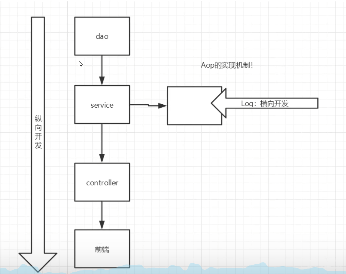


## 9.2动态代理


* 动态代理的角色和静态代理的一样 。

* 动态代理的代理类是动态生成 ， 静态代理的代理类是提前写好

* 动态代理分为两类 : 一类是基于接口动态代理 , 一类是基于类的动态代理

  * 基于接口的动态代理----JDK动态代理

  * 基于类的动态代理--cglib

  * 现在用的比较多的是 javasist 来生成动态代理 。

    ```xml
    开放源代码JBoss 应用服务器项目(有别于Tomcat)，通过Javassist对字节码操作为JBoss实现动态"AOP"框架。
    ```


JDK的原生代码来实现动态代理，其余的道理都是一样的！
 JDK的动态代理需要了解两个类


 核心 : <font color='red'>InvocationHandler </font>和 <font color='red'>Proxy </font>
 【InvocationHandler：调用处理程序】

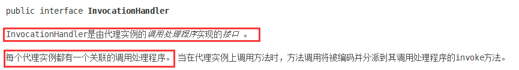


```java
Object invoke(Object proxy, 方法 method, Object[] args)； 
//参数 
//proxy - 调用该方法的代理实例 
//method -所述方法对应于调用代理实例上的接口方法的实例。方法对象的声明类将是该方法声明的接口，它可以是代理类继承该方法的代理接口的超级接口。
//args -包含的方法调用传递代理实例的参数值的对象的阵列，或null如果接口方法没有参数。原始 类型的参数包含在适当的原始包装器类的实例中，例如java.lang.Integer或java.lang.Boolean 。
```


【Proxy : 代理】

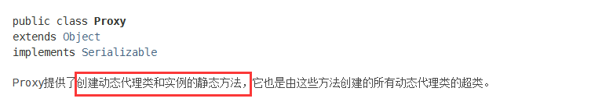

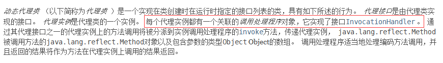


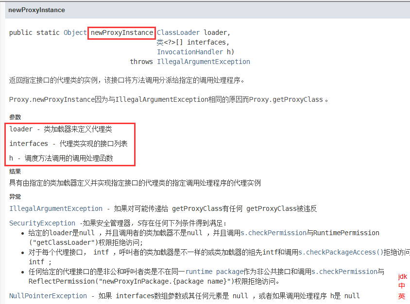


```java
//生成代理类 
public Object getProxy(){ 
    return Proxy.newProxyInstance(this.getClass().getClassLoader(), 														rent.getClass().getInterfaces(), this);
}
```


<font color='red'>**核心：一个动态代理 , 一般代理某一类业务 , 一个动态代理可以代理多个类，代理的是接口！**</font>


1.调用处理程序：

```java
public class ProxyInvocationHandler implements InvocationHandler {
    //被代理的接口
    private  Rent rent;

    public void setRent(Rent rent) {
        this.rent = rent;
    }

    //生成得到代理类
    public Object getProxy(){
        return Proxy.newProxyInstance(this.getClass().getClassLoader(),rent.getClass().getInterfaces(),this);
    }

    //处理代理代理实例，并返回结果
    @Override
    public Object invoke(Object proxy, Method method, Object[] args) throws Throwable {

        //动态代理的实例，本质是反射
        Object result = method.invoke(rent, args);
        return result;
    }
}
```


2.测试

```java
public class Client {
    public static void main(String[] args) {
        //真实角色
        Host host = new Host();
        //处理程序，每个代理实例都有一个关联的调用处理程序。
        ProxyInvocationHandler pih = new ProxyInvocationHandler();
        //通过处理程序，处理需要调用的接口对象
        pih.setRent(host);
        //通过处理程序的方法生成代理类
        Rent proxy = (Rent) pih.getProxy();
        proxy.rent();
    }
}
```


<font color='red'>**深化理解：** </font>

1.调用处理程序：

```java
public class ProxyInvocationHandler implements InvocationHandler {

    //被代理的接口
    private Object target;

    public void setTarget(Object target) {
        this.target = target;
    }

    //生成得到代理类
    public Object getProxy(){
        return Proxy.newProxyInstance(this.getClass().getClassLoader(),target.getClass().getInterfaces(),this);
    }

    //处理代理代理实例，并返回结果
    @Override
    public Object invoke(Object proxy, Method method, Object[] args) throws Throwable {
        log(method.getName());
        //动态代理的实例，本质是反射
        Object result = method.invoke(target, args);
        return result;
    }


    public void log (String msg){
        System.out.println("[debug]" + msg+ "方法");
    }
}
```


2.测试

```java
public class Client {
    public static void main(String[] args) {
        UserService userService = new UserServiceImpl();
        ProxyInvocationHandler pih = new ProxyInvocationHandler();
        pih.setTarget(userService);
        UserService proxy = (UserService) pih.getProxy();
        proxy.add();
    }
}
```


动态代理的好处：

* 可以使得我们的真实角色更加纯粹 . 不再去关注一些公共的事情 .
* 公共的业务由代理来完成 . 实现了业务的分工 ,
* 公共业务发生扩展时变得更加集中和方便 .
* 一个动态代理 , 一般代理某一类业务
* 一个动态代理可以代理多个类，代理的是接口！


# 10、AOP


## 10.1 定义

AOP（Aspect Oriented Programming）意为：面向切面编程。

通过<font color='red'>预编译</font>方式和运行期<font color='red'>动态代理</font>实现程序功能的统一维护的一种技术。AOP是OOP的延续，是软件开发中的一个热点，也是Spring框架中的一个重要内容，是函数式编程的一种衍生范型。利用AOP可以对业务逻辑的各个部分进行隔离，从而使得业务逻辑各部分之间的耦合度降低，提高程序的可重用性，同时提高了开发的效率。


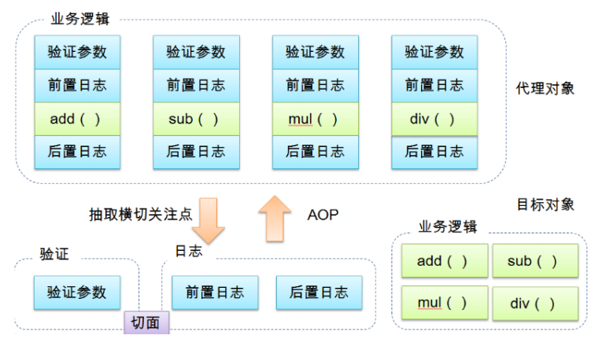


## 10.2 AOP在Spring

<font color='red'>**提供声明式事务；允许用户自定义切面**</font>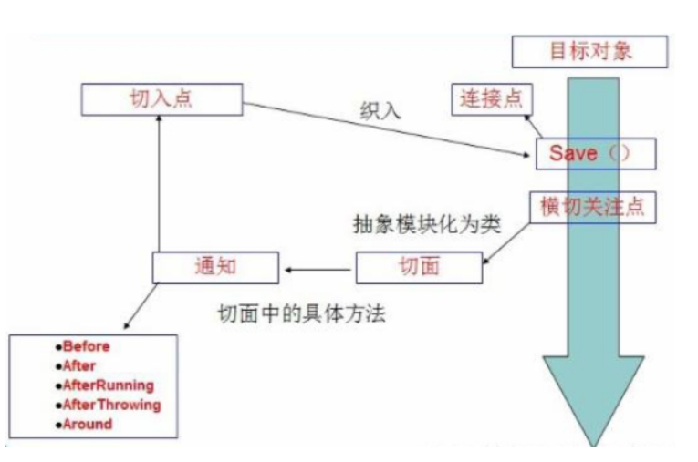

* 横切关注点：跨越应用程序多个模块的方法或功能。

  即是，与业务逻辑无关的，但是需要关注的部分，就是横切关注点。如日志 , 安全 , 缓存 , 事务等等 ....

* 切面（ASPECT）：<font color='red'>横切关注点</font> 被模块化 的特殊对象。即，它是一个**类**。

* 通知（Advice）：切面必须要完成的工作。即，它是类中的一个**方法**。

* 目标（Target）：被通知对象。

* 代理（Proxy）：向目标对象应用通知之后创建的对象。

* 切入点（PointCut）：切面通知 执行的 “地点”的定义。

* 连接点（JointPoint）：与切入点匹配的执行点。


在 AOP 思想中，功能主要有两点

* 核⼼功能（核⼼业务功能，如对数据的增删改查等） 

* 辅助功能（⾮核⼼业务功能，如⽇志记录，性能统计等等）

   核⼼功能因此也称作切点，辅助功能因此成为切⾯。


> **SpringAOP中，通过Advice定义横切逻辑，Spring中支持5种类型的Advice:**


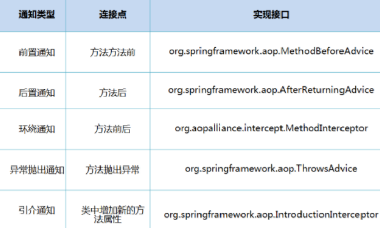


既AOP在不改变原有代码的情况下，去增加新的功能。


## 10.3Spring实现AOP

**<font color='red'>使用AOP需要导入依赖</font>**

```xml
 <dependency>
        <groupId>org.aspectj</groupId>
        <artifactId>aspectjweaver</artifactId>
        <version>1.9.4</version>
</dependency>     
```


**<font color='red'>方式一</font>**：使用Spring的API接口 【主要是Spring API 接口实现】


增强类 , 我们编写两个 , 一个前置增强 一个后置增强

```java
public class AfterAdvice implements AfterReturningAdvice {
    /**
     * @param returnValue  返回结果
     */
    @Override
    public void afterReturning(Object returnValue, Method method, Object[] args, Object target) throws Throwable {
        System.out.println("执行了" + method.getName() + "方法，返回了" + returnValue);
    }
}
```


```java
public class Log implements MethodBeforeAdvice {

    /**
     * @param method 要执行的目标对象的方法
     * @param args   参数
     * @param target  目标对象
     */
    @Override
    public void before(Method method, Object[] args, Object target) throws Throwable {
        System.out.println(target.getClass().getName() + "的 " + method.getName() + "方法被执行了");

    }
}
```


在xml文件中注册，实现AOP切入，注意导入约束。

```xml
<bean id="userService" class="com.compare.service.UserServiceImpl"></bean>


<!--    方式一 ：使用原生Spring API接口-->
<bean id="log" class="com.compare.log.Log"></bean>
<bean id="afterLog" class="com.compare.log.AfterAdvice"></bean>
<!-- 配置aop：需要导入aop的约束    -->
<aop:config>
    <!-- 切入点  表达式：expression:表达式 execution(修饰词 返回值 类 方法名 参数)-->
    <aop:pointcut id="pointcut" expression="execution(* com.compare.service.UserServiceImpl.*(..))"/>
    <!-- 执行环绕增强    -->
    <aop:advisor advice-ref="log" pointcut-ref="pointcut"></aop:advisor>
    <aop:advisor advice-ref="afterLog" pointcut-ref="pointcut"></aop:advisor>
</aop:config>
```


Aop的重要性 : 主要是思想的理解 。
Spring的Aop就是将公共的业务 (日志 , 安全等) 和领域业务结合起来 , 当执行领域业务时 , 将会把公共业务加进来 . 实现公共业务的重复利用 . 领域业务更纯粹 , 程序员专注领域业务 , 其本质还是动态代理 .


**<font color='red'>方式二</font>**：自定义类来实现AOP 【主要是切面定义】


**切入类**：

```java
public class DiyPointCut {

    public void before (){
        System.out.println("======== 方法执行前 ========");
    }
    public void after() {
        System.out.println("========= 方法执行后 ========");
    }
}
```


在spring中配置

```xml
方式二：自定义类
<bean id="diy" class="com.compare.diy.DiyPointCut"></bean>
<aop:config>
    <!--    自定义切面 ref要引用的类        -->
    <aop:aspect ref="diy">
        <!-- 切入点-->
        <aop:pointcut id="pointcut" expression="execution(* com.compare.service.UserServiceImpl.*(..))"/>
        <!--通知-->
        <aop:before method="before" pointcut-ref="pointcut"></aop:before>
        <aop:after method="after" pointcut-ref="pointcut"></aop:after>
    </aop:aspect>
</aop:config>
```


**<font color='red'>方式三</font>**：使用注解方式实现


注解实现的增强类

```java
@Component
@Aspect //标注这个类是一个切面
public class AnnotationPointCut {

    @Before("execution(* com.compare.service.UserServiceImpl.*(..))")
    public void before(){
        System.out.println("======== 方法执行前 ==11======");
    }

    @After("execution(* com.compare.service.UserServiceImpl.*(..))")
    public void after(){
        System.out.println("======== 方法执行后 ==22======");
    }
    
    @Around("execution(* com.compare.service.UserServiceImpl.*(..))")
    public void around(ProceedingJoinPoint jp) throws Throwable {
        System.out.println("环绕前");
        System.out.println("签名:"+jp.getSignature());
        //执行目标方法 proceed
        Object proceed = jp.proceed();
        System.out.println("环绕后");
        System.out.println(proceed);
    }   
}
```


在Spring配置文件中，注册bean，并增加支持注解的配置

```xml
<!--方式三 注解 -->
<bean id="annotation" class="com.compare.diy.AnnotationPointCut"></bean>
<!--开启注解支持！ JDK 默认  cglib-->
<aop:aspectj-autoproxy proxy-target-class="false"></aop:aspectj-autoproxy>


<!--在 @Component ==  
<bean id="annotation" class="com.compare.diy.AnnotationPointCut"></bean>
注解下
-->
<context:annotation-config/>
<context:component-scan base-package="com.compare"></context:component-scan>
```


**aop:aspectj-autoproxy**

声明自动为spring容器中那些配置@aspect切面的bean创建代理，织入切面。

当然，spring 在内部依旧采用 AnnotationAwareAspectJAutoProxyCreator进行自动代理的创建工作


```xml
<!--开启注解支持！ JDK 默认  cglib-->
<aop:aspectj-autoproxy proxy-target-class="false"/>
```


**aop中aspect和advisor的区别**

spring AOP配置aspect（切面）有两种方式:一种是利用注解的方式配置，一种是利用XML的方式配置。

我们的配置是这样的<aop:aspect>,还有另外一种<aop:advisor>也可以配置AOP。但跟aspect有所不同。

在面向切面编程时，我们一般会用<aop:aspect>，<aop:aspect>定义切面（包括通知（前置通知，后置通知，返回通知等等）和切点（pointcut））

在进行事务管理时，我们一般会用<aop:advisor>,<aop:advisor>定义通知其(通知器跟切面一样，也包括通知和切点)。


<aop:advisor>大多用于事务管理。

<aop:aspect>大多用于日志、缓存。


如果用<aop:advisor>配置切面的话也可以配置，但切面类跟aspect有所不同，需要实现接口，比如：

```java
@Component
public class SysAdvisor implements MethodBeforeAdvice,AfterAdvice,AfterReturningAdvice {

    public void afterReturning(Object returnValue, Method method, Object[] args, Object target) throws Throwable {
        System.out.println(method.getName()+"刷拉完毕");
    }


    public void before(Method method, Object[] args, Object target) throws Throwable {
        System.out.println(method.getName()+"一大刷拉");
    }
}
```

实现了前置通知和返回通知接口。然后在配置文件中跟<aop:aspect>类似

```xml
<aop:config>
        <aop:pointcut id="pointcut" expression="execution(public * com.example.controller.*Controller.*(..))"/>
        <aop:advisor advice-ref="sysAdvisor" pointcut-ref="pointcut"/>
 </aop:config
```

定义切点和切面类即可。不用像aspect那样定义通知。但大多数使用<aop:advisor>都是用于事务管理。


# 11、整合MyBatis

<font color='red'>**测试MyBatis**</font>

步骤：

1. 导入相关jar包

   ```xml
   <dependencies>
       <dependency>
           <groupId>junit</groupId>
           <artifactId>junit</artifactId>
           <version>4.12</version>
       </dependency>
   
       <dependency>
           <groupId>org.mybatis</groupId>
           <artifactId>mybatis</artifactId>
           <version>3.5.2</version>
       </dependency>
   
       <dependency>
           <groupId>mysql</groupId>
           <artifactId>mysql-connector-java</artifactId>
           <version>5.1.47</version>
       </dependency>
       
       <dependency>
           <groupId>org.springframework</groupId>
           <artifactId>spring-webmvc</artifactId>
           <version>5.1.10.RELEASE</version>
       </dependency>
       
       <dependency>
           <groupId>org.springframework</groupId>
           <artifactId>spring-jdbc</artifactId>
           <version>5.1.10.RELEASE</version>
       </dependency>
       
       <dependency>
           <groupId>org.mybatis</groupId>
           <artifactId>mybatis-spring</artifactId>
           <version>2.0.2</version>
       </dependency>
   
       <dependency>
           <groupId>org.aspectj</groupId>
           <artifactId>aspectjweaver</artifactId>
           <version>1.9.4</version>
       </dependency>
   
       <dependency>
           <groupId>org.projectlombok</groupId>
           <artifactId>lombok</artifactId>
           <version>1.18.10</version>
       </dependency>
   
   </dependencies>
   
   <!--在build中配置resources，来防止我们资源导出失败的问题-->
   <build>
       <resources>
           <resource>
               <directory>src/main/java</directory>
               <includes>
                   <include>**/*.properties</include>
                   <include>**/*.xml</include>
               </includes>
               <filtering>true</filtering>
           </resource>
       </resources>
   </build>
   ```

2. 编写配置文件

   ```xml
   <?xml version="1.0" encoding="UTF-8" ?> <!DOCTYPE configuration PUBLIC "-//mybatis.org//DTD Config 3.0//EN"
           "http://mybatis.org/dtd/mybatis-3-config.dtd">
   <configuration>
       <typeAliases>
           <package name="com.compare.pojo"/>
       </typeAliases>
       <environments default="development">
           <environment id="development">
               <transactionManager type="JDBC"/>
               <dataSource type="POOLED">
                   <property name="driver" value="com.mysql.jdbc.Driver"/>
                   <property name="url"
                             value="jdbc:mysql://localhost:3306/mybatis? useSSL=true&amp;useUnicode=true&amp;characterEncoding=utf8&amp;serverTimezone=GMT"/>
                   <property name="username" value="root"/>
                   <property name="password" value="root"/>
               </dataSource>
           </environment>
       </environments>
       <mappers>
           <mapper resource="com/compare/dao/UserMapper.xml"/>
       </mappers>
   </configuration>
   ```

   <font color='red'>**userDao接口编写**</font>

   ```java
   public interface UserMapper {
       public List<User> selectUser();
   }
   ```

   接口对应的Mapper映射文件

   ```xml
   <?xml version="1.0" encoding="UTF-8" ?>
   <!DOCTYPE mapper PUBLIC "-//mybatis.org//DTD Mapper 3.0//EN"
           "http://mybatis.org/dtd/mybatis-3-mapper.dtd">
   <mapper namespace="com.compare.dao.UserMapper">
       <select id="selectUser" resultType="User">
           select * from user;
       </select>
   </mapper>
   ```

3. 测试类：

```java
public class MyTest {
    @Test
    public void test01() throws IOException {
        String resource = "mybatis-config.xml";
        InputStream inputStream = Resources.getResourceAsStream(resource);

        SqlSessionFactory sqlSessionFactory = new SqlSessionFactoryBuilder().build(inputStream);
        SqlSession sqlSession = sqlSessionFactory.openSession();
        UserMapper mapper = sqlSession.getMapper(UserMapper.class);
        List<User> users = mapper.selectUser();
        for (User user : users) {
            System.out.println(user.toString());
        }
    }
}
```


### MyBatis-Spring

**中文文档：**

http://mybatis.org/spring/zh/index.html


Mybatis-Spring会将MyBatis无缝地整合到Spring中。


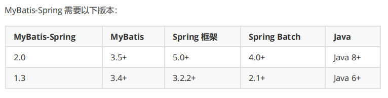


```xml
<dependency> 
    <groupId>org.mybatis</groupId>
    <artifactId>mybatis-spring</artifactId> 
    <version>2.0.2</version> 
</dependency>
```


Spring一起使用 MyBatis:  

Spring 应用上下文中定义至少两样东西：一个<font color='red'>**SqlSessionFactory**</font> 和至少一个<font color='red'>**数据映射器类**</font>。


在 MyBatis-Spring 中，可使用 SqlSessionFactoryBean 来创建 SqlSessionFactory 。 要配置这个工厂 bean，只需要把下面代码放在 Spring 的 XML 配置文件中：

```xml
<bean id="sqlSessionFactory" class="org.mybatis.spring.SqlSessionFactoryBean"> 
    <property name="dataSource" ref="dataSource" /> 
</bean>
```


注意： SqlSessionFactory 需要一个 DataSource （数据源）。 这可以是任意的DataSource ，只需要和配置其它 Spring 数据库连接一样配置它就可以了。

在基础的 MyBatis 用法中，是通过 **SqlSessionFactoryBuilder** 来创建 **SqlSessionFactory**的。 而在 MyBatis-Spring 中，则使用 SqlSessionFactoryBean 来创建在 MyBatis 中，使用 SqlSessionFactory 来创建 SqlSession。获得一个session 之后，可以使用它来执行映射了的语句，提交或回滚连接，最后，当不再需要它的时候，你可以关闭 session。

 **SqlSessionFactory** 有一个唯一的必要属性：用于 **JDBC** 的 **DataSource** 。这可以是任意的DataSource 对象，它的配置方法和其它 Spring 数据库连接是一样的。

一个常用的属性是 **configLocation** ，它用来指定 MyBatis 的 XML 配置文件路径。它在需要修改MyBatis 的基础配置非常有用。通常，基础配置指的是 <settings> 或 <typeAliases> 元素。需要注意的是，这个配置文件并不需要是一个完整的 MyBatis 配置。确切地说，任何环境配置（ <environments> ），数据源（ <DataSource> ）和 MyBatis 的事务管理器（ <transactionManager> ）都会被忽略。 SqlSessionFactoryBean 会创建它自有的 MyBatis环境配置（ Environment ），并按要求设置自定义环境的值。

SqlSessionTemplate 是 MyBatis-Spring 的核心。作为 SqlSession 的一个实现，这意味着可以使用它无缝代替你代码中已经在使用的 SqlSession 。

模板可以参与到 Spring 的事务管理中，并且由于其是线程安全的，可以供多个映射器类使用，你应该总 是用 **SqlSessionTemplate** 来替换 MyBatis 默认的 **DefaultSqlSession** 实现。在同一应用程序中的不同类之间混杂使用可能会引起数据一致性的问题。

可以使用 **SqlSessionFactory** 作为构造方法的参数来创建 **SqlSessionTemplate** 对象。


```xml
<bean id="sqlSession" class="org.mybatis.spring.SqlSessionTemplate"> 
    <constructor-arg index="0" ref="sqlSessionFactory" /> 
</bean>
```


**<font color='red'>整合实现一：</font>**


1. 编写数据源配置

   ```xml
   <!--sqlSessionFactory-->
   <bean id="sqlSessionFactory" class="org.mybatis.spring.SqlSessionFactoryBean">
       <property name="dataSource" ref="dataSource"/>
       <!--绑定MyBatis配置文件-->
       <property name="configLocation" value="classpath:mybatis-config.xml"></property>
       <property name="mapperLocations" value="classpath:com/compare/mapper/*.xml"></property>
   </bean>
   ```

   

2. sqlSessionFactory

   ```xml
   <!--sqlSessionFactory-->
   <bean id="sqlSessionFactory" class="org.mybatis.spring.SqlSessionFactoryBean">
       <property name="dataSource" ref="dataSource"/>
       <!--绑定MyBatis配置文件-->
       <property name="configLocation" value="classpath:mybatis-config.xml"></property>
       <property name="mapperLocations" value="classpath:com/compare/mapper/*.xml"></property>
   </bean>
   ```

3. sqlSessionTemplate

   ```xml
   <!--SqlSessionTemplate就是 SqlSession-->
   <bean id="sqlSession" class="org.mybatis.spring.SqlSessionTemplate">
       <!--只能使用构造方法注入，没有set方法-->
       <constructor-arg index="0" ref="sqlSessionFactory"></constructor-arg>
   </bean>
   ```

4. 增加Dao接口的实现类；私有化sqlSessionTemplate

   ```java
   public class UserMapperImpl implements UserMapper {
   
       //使用操作使用sqlSession来执行
       private SqlSessionTemplate sqlSession;
   
       public void  setSqlSession(SqlSessionTemplate sqlSession) {
           this.sqlSession = sqlSession;
       }
   
       @Override
       public List<User> selectUser() {
           UserMapper mapper = sqlSession.getMapper(UserMapper.class);
           return mapper.selectUser();
       }
   }
   ```

5. 将自己写的实现，注入到Spring中

   ```xml
   <bean id="userMapper" class="com.compare.mapper.UserMapperImpl">
       <property name="sqlSession" ref="sqlSession"></property>
   </bean>
   ```

6. 测试


**<font color='red'>整合实现二：</font>**

dao继承Support类 , 直接利用 getSqlSession() 获得 , 然后直接注入SqlSessionFactory . 比起方式1 , 不
需要管理SqlSessionTemplate , 而且对事务的支持更加友好 . 可跟踪源码查看


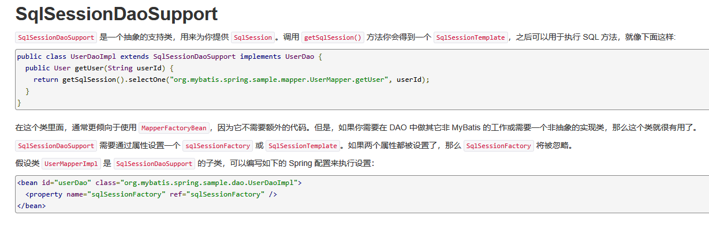

UserMapper的修改


```java
public class UserMapperImpl2 extends SqlSessionDaoSupport implements UserMapper {
    @Override
    public List<User> selectUser() {
        SqlSession sqlSession = getSqlSession();
        UserMapper mapper = sqlSession.getMapper(UserMapper.class);
        return mapper.selectUser();
    }
}
```


bean的配置

```xml
<bean id="userMapper2" class="com.compare.mapper.UserMapperImpl2">
    <property name="sqlSessionFactory" ref="sqlSessionFactory"></property>
</bean>
```


# 12、声明式事务


## 12.1事务

* 事务在项目开发过程非常重要，涉及到数据的一致性的问题，不容马虎！

* 事务管理是企业级应用程序开发中必备技术，用来确保数据的完整性和一致性。

  

  

**<font color='red'>事务就是把一系列的动作当成一个独立的工作单元，这些动作要么全部完成，要么全部不起作用。</font>**


事务四个属性ACID

1. 原子性（atomicity）
* 事务是原子性操作，由一系列动作组成，事务的原子性确保动作要么全部完成，要么完全不起
  作用
2. 一致性（consistency）
  * 一旦所有事务动作完成，事务就要被提交。数据和资源处于一种满足业务规则的一致性状态中
3. 隔离性（isolation）
  * 可能多个事务会同时处理相同的数据，因此每个事务都应该与其他事务隔离开来，防止数据损
    坏 
4.  持久性（durability）
  * 事务一旦完成，无论系统发生什么错误，结果都不会受到影响。通常情况下，事务的结果被写
    到持久化存储器中


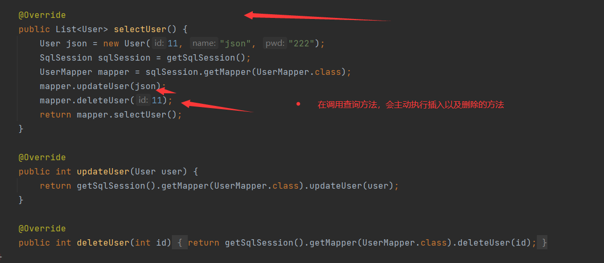


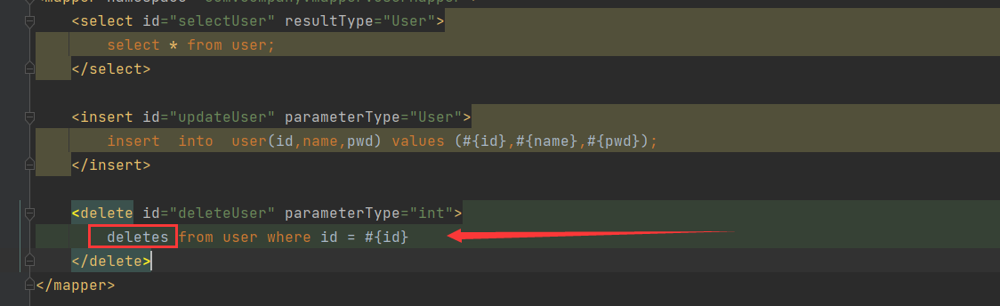


<font color='red'>删除的SQL语句出现错误，程序必然出错，但是插入的数据依旧插入成功，不符合事务的一致性以及原子性</font>

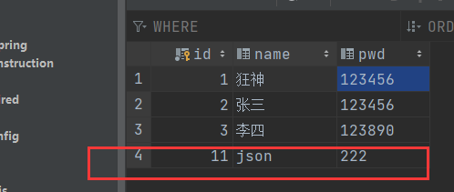


## 12.2事务管理


**编程式事务管理**

* 将事务管理代码嵌到业务方法中来控制事务的提交和回滚
* 缺点：必须在每个事务操作业务逻辑中包含额外的事务管理代码


**声明式事务管理**
一般情况下比编程式事务好用。

* 将事务管理代码从业务方法中分离出来，以声明的方式来实现事务管理。
* 将事务管理作为横切关注点，通过aop方法模块化。Spring中通过Spring AOP框架支持声明式事务管理


Spring事务管理，约束头：tx

```xml
xmlns:tx="http://www.springframework.org/schema/tx" http://www.springframework.org/schema/tx 
http://www.springframework.org/schema/tx/spring-tx.xsd"
```


**事务管理器**

* 无论使用Spring的哪种事务管理策略（编程式或者声明式）事务管理器都是必须的。
* 事务管理器就是 Spring的核心事务管理抽象，管理封装了一组独立于技术的方法。


事务管理器

```xml
<bean id="transactionManager" class="org.springframework.jdbc.datasource.DataSourceTransactionManager">
    <property name="dataSource" ref="dataSource"/>
</bean>
```


## 12.3编程事务


### 3.1 XMl方式

XML配置事务：在applicationContext.xml中添加<font color='red'>**事务管理器**</font>和<font color='red'>**事务管理器模版**</font>的配置

```xml
<bean id="dataSource" class="org.apache.commons.dbcp.BasicDataSource"> 
    <property name="driverClassName" value="com.mysql.jdbc.Driver"></property> 
    <property name="url" value="jdbc:mysql://192.168.75.131:3306/spring-dk"> </property> 	<property name="username" value="root"></property>
    <property name="password" value="root"></property>
</bean> 

<bean class="org.springframework.jdbc.core.JdbcTemplate">
    <property name="dataSource" ref="dataSource"/>
</bean>

<context:component-scan base-package="com.dk"/>

<!-- 事务管理器 --> 
<bean id="transactionManager" class="org.springframework.jdbc.datasource.DataSourceTransactionManager"> 
    <property name="dataSource" ref="dataSource" /> 
</bean> 

<!-- 事务管理的模板 -->
<bean id="transactionTemplate" class="org.springframework.transaction.support.TransactionTemplate">
    <property name="transactionManager" ref="transactionManager" /> 
</bean>
```


### 3.2配置类方式

<font color='red'>**注解方式配置事务管理器和事务管理器模版**</font>


```java
@ComponentScan("com.dk")
public class AppConfig {
    @Bean
    public TransactionTemplate transactionTemplate(DataSourceTransactionManager transactionManager) {
        TransactionTemplate transactionTemplate = new TransactionTemplate();
        transactionTemplate.setTransactionManager(transactionManager);
        return transactionTemplate;
    }

    @Bean
    public DataSourceTransactionManager transactionManager(DataSource dataSource) {
        DataSourceTransactionManager transactionManager = new DataSourceTransactionManager();
        transactionManager.setDataSource(dataSource);
        return transactionManager;
    }

    @Bean
    public JdbcTemplate jdbcTemplate(DataSource dataSource) {
        JdbcTemplate jdbcTemplate = new JdbcTemplate();
        jdbcTemplate.setDataSource(dataSource);
        return jdbcTemplate;
    }

    @Bean
    public DataSource dataSource() {
        BasicDataSource dataSource = new BasicDataSource();
        dataSource.setUrl("jdbc:mysql://192.168.75.131:3306/spring-dk");
        dataSource.setDriverClassName("com.mysql.jdbc.Driver");
        dataSource.setUsername("root");
        dataSource.setPassword("root");
        return dataSource;
    }
}
```


### 3.3编写实现类


```java
@Autowired private UserDAO userDAO;

@Autowired private TransactionTemplate transactionTemplate;

public void transfer(String fromName, String toName, Integer money) { 						transactionTemplate.execute(status -> {
		userDAO.out(fromName, money);// 转出钱 
    	int x = 10; 
    	if(x==10) throw new RuntimeException("出错啦！！");
    	userDAO.in(toName, money);// 收入钱 return null; 
	}); 
}
```


## 12.4声明式事务

声明值事务-基于AspectJ静态代理方式

```xml
<dependency>
    <groupId>org.aspectj</groupId>
    <artifactId>aspectjweaver</artifactId>
    <version>1.9.4</version>
</dependency>
```


### 4.1XML方式

1. applicationContext.xml中配置事务管理器

```xml
<!-- 事务管理的模板 --> 
<bean id="transactionTemplate" class="org.springframework.transaction.support.TransactionTemplate">
    <property name="transactionManager" ref="transactionManager" />
</bean>
```


2. 配置事务的通知

```xml
<!--基于AspectJ 申明式事务XML配置方式--> 
<!-- 定义一个增强 -->
<tx:advice id="txAdvice" transaction-manager="transactionManager">
    <!-- 增强(事务)的属性的配置 -->    
    <tx:attributes>
        <!-- isolation：DEFAULT 事务的隔离级别
            propagation：事务的传播行为
            read-only：false
            不是只读 timeout：-1 
            no-rollback-for：发生哪些异常不回滚
            rollback-for：发生哪些异常回滚事务
 		-->
            <tx:method name="delete" propagation="REQUIRED"/>
            <tx:method name="add" propagation="REQUIRED"/>
            <tx:method name="*" propagation="REQUIRED"/>
        </tx:attributes>
    </tx:advice>
```

3. 配置AOP

还需要导入aop的约束头文件

```xml
<!--配置aop织入事务,定义切面和切点的信息 -->
<aop:config> 
    <!-- 定义切点:哪些类的哪些方法应用增强 -->
    <aop:pointcut id="txPointcut" expression="execution(* com.kuang.dao.*.* (..))"/>
    <!-- 定义切面: -->
    <aop:advisor advice-ref="txAdvice" pointcut-ref="txPointcut"/> 
</aop:config>
```


3. 业务类

   并不需要修改原有的方式

```java
public void transfer(String fromName, String toName, Integer money) { 				   	
    userDAO.out(fromName, money);// 转出钱 
    int x = 10; 
    if(x == 10) throw new RuntimeException("出错啦！"); 
    userDAO.in(toName, money);// 收入钱 
}
```


### 4.2注解方式

1. 编写DataSourceTransactionManager事务管理器。

2. 在<font color='red'>**配置类上配置@EnableTransactionManagement**</font>开启事务。

3. 在<font color='red'>**业务类的方法上加@Transaction**</font>注解


## 12.5事务传播特性

<font color='red'>**spring事务传播特性：**</font>

指的就是当一个事务方法被另一个事务方法调用时，这个事务方法应该如何进行。


spring支持7种事务传播行为：

* propagation_requierd：如果当前没有事务，就新建一个事务，如果已存在一个事务中，加入到这个事务中，这是最常见的选择。

* propagation_supports：支持当前事务，如果没有当前事务，就以非事务方法执

* propagation_mandatory：使用当前事务，如果没有当前事务，就抛出异常。

* propagation_required_new：新建事务，如果当前存在事务，把当前事务挂

* propagation_not_supported：以非事务方式执行操作，如果当前存在事务，就把当前事务挂起。

* propagation_never：以非事务方式执行操作，如果当前事务存在则抛出异常。

* propagation_nested：如果当前存在事务，则在嵌套事务内执行。如果当前没有事务，则执行与propagation_required类似的操作

<font color='red'>**Spring 默认的事务传播行为是 PROPAGATION_REQUIRED，它适合于绝大多数的情况。**</font>


<font color='red'>**总结：**</font> 假设 **方法A** (如果A中有事务，默认的传播行为是required)中调用了 **方法B**； <font color='red'>**转播性是关注方法B**</font>

[1]<font color='red'>**B不需要事务**</font>(显示定义不需要事务是避免受到传播性影响，既避免受到A的影响) 

* PROPAGATION_NEVER：A没有事务，B就非事务执行 ， A有事务，B就抛出异常
* PROPAGATION_NOT_SUPPORTED：A没有事务，B就非事务执行，A有事务就直接挂起，然后B非事务执行

[2]<font color='red'>**B可有可无的事务 **</font>

* PROPAGATION_SUPPORTS: A有事务，B就用A的事务（组合后），A没有事务，B就非事务执行。

[3]<font color='red'>**B必须有事务**</font>

* PROPAGATION_REQUIRES_NEW：A有没有事务，B都新建事务，如果A有事务，A事务挂起。
* PROPAGATION_NESTED: A如果没有事务，B就新建一个事务；A如果有事务，就在当前事务中嵌套其他事务。（嵌套事务， A方法出错回滚时，B方法也回滚。 B方法出错进行回滚，A方法不需要进行回滚）。<font color='red'>**父影响子，子不影响父**</font>
* PROPAGATION_REQUIRED: 如果没有，就新建一个事务；如果有，就加入当前事务。（无论谁出错都一起进行回滚）
* PROPAGATION_MANDATORY: A如果没有事务，就抛出异常；A如果有事务，B就使用A的事务。


